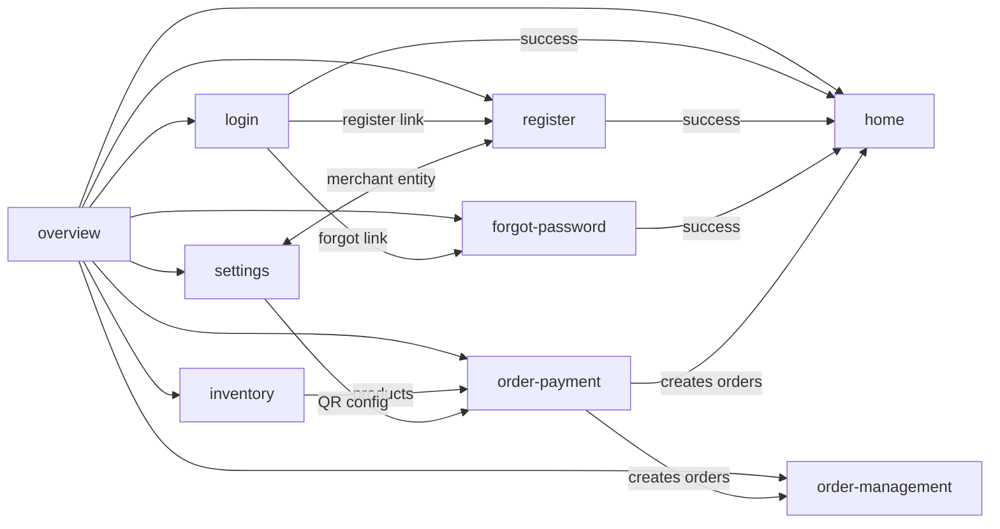

# PRD Cross-File Mapping

## When to Apply

Use this skill when the request involves:

- Cross-file links and dependencies between PRD markdown files
- Shared displayed fields across multiple screens/modules
- Impact analysis (field change -> affected screens/files)
- Consistency checks (enum mismatch, required/optional conflict, scope conflict)
- Canonical field contract for FE/BE alignment
- Upstream/downstream dependency mapping between modules

## Required Inputs

- `target_dir` (required, default: `XPOS/XPOS PRD/xpos-app`): directory containing PRD `.md` files.
- `overview_file` (optional): path to the overview/index `.md` file within `target_dir` (e.g. `xpos-app-overview.md`).
- `include_files[]` (optional): restrict analysis to these files only.
- `exclude_files[]` (optional): skip these files (e.g. pipeline outputs, stateful-ux-map).

## Source-of-Truth Rules

- PRD markdown is the only source of truth.
- Citation-first: every factual row must include `source_file` + `source_anchor` + `evidence_excerpt`.
- Do not infer behavior from free text when anchor evidence is missing.
- Mark undefined or ambiguous items as `UNSPECIFIED`.
- Approved PRD anchors (same as comp-extraction):
  - `User Flow`
  - `User Story` (`Business Rule`, `Acceptance Criteria`)
  - `Wireframe > Mo ta man hinh`
  - `Thiet ke Database`
  - `Non-functional requirement`
  - `Pham vi san pham` (`In Scope (MVP)`, `Out of Scope & Roadmap`)

## Execution Workflow

Run these steps sequentially. Each step builds on the previous output.

### Step 1 -- File-Purpose Registry

Read every `.md` file in `target_dir`. For each file produce:

| Field | Description |
|-------|-------------|
| `file` | filename |
| `purpose` | one-line summary of what the file defines |
| `key_entities` | database entities or logical objects defined |
| `entry_points` | how users arrive at this screen |

### Step 2 -- Explicit Links and Flow References

Scan each file for:

- Markdown links to other files: `[label](./other-file.md)`
- Flow references by name without link: "chuyen den man hinh Trang chu"
- User Story cross-references: "module Thiet lap", "file Hang hoa"

Produce a table:

| source_file | target_file | link_type | evidence_excerpt |
|-------------|-------------|-----------|------------------|

`link_type`: `markdown_link` | `flow_reference` | `us_reference`

### Step 3 -- Upstream/Downstream Dependency Graph

From Step 2 links, classify each relationship:

| provider_file | consumer_file | relationship | evidence |
|---------------|---------------|-------------|----------|

`relationship`: `provides_entity` | `provides_config` | `provides_entry_point` | `provides_data_for_display` | `creates_data_consumed_by`

### Step 4 -- Shared Field Catalog

Scan database entity tables and wireframe descriptions across all files. Extract fields that appear in 2+ files:

| canonical_field | db_key | appears_in_files | type | required | meaning |
|-----------------|--------|-------------------|------|----------|---------|

### Step 5 -- Cross-Display Mapping

For each shared field, map where it is entered vs where it is displayed/used:

| field | entry_file | entry_context | display_file | display_context | evidence |
|-------|------------|---------------|--------------|-----------------|----------|

### Step 6 -- Supporting-Info Relationships

Map which file provides supplementary information for another:

| provider_file | consumer_file | relationship_summary | evidence |
|---------------|---------------|----------------------|----------|

### Step 7 -- Impact Map

For each shared field, list what happens when it changes:

| field_changed | change_location | affected_files | impact_description | evidence |
|---------------|----------------|----------------|--------------------|----------|

### Step 8 -- Inconsistency Detection

Compare field definitions across files. Flag:

- Enum value mismatches (e.g. `CASH, QR` vs `CASH, VNPAY_QR`)
- Required/optional conflicts (e.g. `address` Not Null vs Optional)
- Scope conflicts (e.g. feature listed as Roadmap in one file but MVP in another)
- Entity name mismatches (e.g. "Merchandise" vs "Product")

| conflict_id | conflict_type | file_a | definition_a | file_b | definition_b | evidence_a | evidence_b |
|-------------|---------------|--------|-------------|--------|-------------|------------|------------|

### Step 9 -- Canonical Field Contract

Resolve all alias drift. For each shared field, propose one standard:

| canonical_field | aliases | canonical_type | canonical_enum | required | owner_module | evidence |
|-----------------|---------|---------------|---------------|----------|-------------|----------|

Rules:
- One canonical name per concept.
- Enum values must be explicit and consistent.
- Owner module = the file where the field is first created/defined.
- If PRD conflicts exist, flag them and propose resolution with rationale.

### Step 10 -- Presentation Layer

Structure the final output for fast scanning:

1. Start with a **Priority Findings** summary: high-impact inconsistencies and critical dependencies (max 5-7 bullet points).
2. Include a **compact mermaid dependency diagram** showing file relationships.
3. Then present the full detail tables in section order.
4. End with Assumptions & Unspecified.

#### Priority Findings Format

Use this template. Each bullet must reference a conflict ID or dependency and state the risk or action needed:

```markdown
## Priority Findings

- **[C-001] merchant.address requiredness mismatch** -- register.md says Not Null, settings.md says Optional. Resolve before DB migration. Owner: register.md.
- **[C-002] payment_method enum drift** -- order-payment uses `QR`, order-management uses `VNPAY_QR`. Align to `VNPAY_QR` (explicit vendor). Affects: order-management display, reports.
- **[C-003] forgot-password scope conflict** -- login.md marks Roadmap, overview links as MVP. Clarify with PM.
- **Critical dependency: order-payment <- inventory + settings** -- order-payment cannot function without product data (inventory) and QR config (settings). Both are upstream blockers.
- **Alias drift: `method` vs `payment_type`** -- same concept, two names across files. Canonical: `payment_method`. See Canonical Field Contract.
```

#### Mermaid Dependency Diagram Format

Generate a compact LR flowchart. Group nodes by function. Use edge labels for relationship type. Example for xpos-app:

````markdown

````

Rules for diagram generation:
- Use short node labels (filename without `.md`).
- Edge labels describe the relationship, not the data.
- Keep to one diagram; if the PRD has 15+ files, group minor files into a subgraph.
- The diagram is a summary aid, not a replacement for the tables.

## Output Contract

### Markdown Output (always)

Sections in fixed order:

1. **Priority Findings** -- max 5-7 bullet points: critical inconsistencies, high-impact dependencies, unresolved aliases.
2. **Dependency Diagram** -- compact mermaid graph of file relationships.
3. **File Registry** -- table from Step 1.
4. **Cross-File Links** -- table from Step 2.
5. **Upstream/Downstream Map** -- table from Step 3.
6. **Shared Field Catalog** -- table from Step 4.
7. **Cross-Display Mapping** -- table from Step 5.
8. **Supporting Relationships** -- table from Step 6.
9. **Impact Map** -- table from Step 7.
10. **Inconsistency Report** -- table from Step 8.
11. **Canonical Field Contract** -- table from Step 9.
12. **Assumptions & Unspecified** -- explicit list of missing/ambiguous PRD inputs.

### JSON Output (when user requests)

Required top-level keys:

```json
{
  "meta": {
    "target_dir": "",
    "generated_at": "",
    "schema_version": "1.0"
  },
  "files": [],
  "links": [],
  "dependencies": [],
  "shared_fields": [],
  "cross_display": [],
  "supporting_relations": [],
  "impact_rules": [],
  "conflicts": [],
  "canonical_field_contract": [],
  "assumptions_unspecified": [],
  "quality_gates": {
    "citation_coverage": "",
    "conflict_count": 0,
    "unresolved_alias_count": 0,
    "unspecified_count": 0
  }
}
```

### Canonical Field Contract -- JSON Entry Schema

Each entry in `canonical_field_contract[]` must follow this structure:

```json
{
  "canonical_field": "order.payment_method",
  "aliases": ["method", "payment_type"],
  "canonical_type": "enum",
  "canonical_enum": ["CASH", "VNPAY_QR"],
  "required": true,
  "owner_module": "order-payment.md",
  "resolution": "Standardize on VNPAY_QR (explicit vendor prefix) over QR (ambiguous)",
  "conflict_refs": ["C-002"],
  "evidence": [
    { "file": "order-payment.md", "anchor": "Thiet ke Database > Order", "excerpt": "method ENUM(CASH, QR)" },
    { "file": "order-management.md", "anchor": "Thiet ke Database > Order", "excerpt": "payment_type ENUM(CASH, VNPAY_QR)" }
  ]
}
```

Field definitions:

| key | type | required | description |
|-----|------|----------|-------------|
| `canonical_field` | string | yes | Dot-notation standard name (e.g. `entity.field`) |
| `aliases` | string[] | yes | All other names found in PRD for the same concept |
| `canonical_type` | string | yes | Proposed standard type: `string`, `number`, `boolean`, `enum`, `datetime` |
| `canonical_enum` | string[] | conditional | Required when `canonical_type` is `enum`; lists all valid values |
| `required` | boolean | yes | Proposed standard requiredness |
| `owner_module` | string | yes | File where the field is first created/defined |
| `resolution` | string | conditional | Required when aliases exist or conflict; explains rationale |
| `conflict_refs` | string[] | optional | References to conflict IDs from Inconsistency Report |
| `evidence` | object[] | yes | Array of `{ file, anchor, excerpt }` citations |

## Quality Gates

All outputs must pass these gates. If any gate fails, include a **Gap Report** section listing each failure.

### Citation Gate

- **100% citation coverage** on all factual rows across every table.
- Each row must include at minimum: `source_file` + `source_anchor`.
- Recommended: include `evidence_excerpt` (short quote from PRD).
- If evidence cannot be found for a claim, mark the row `UNSPECIFIED` and move to Assumptions.

### Consistency Gate

- Every shared field must have consistent `type` and `required` values across files, or be flagged in the Inconsistency Report.
- Enum values must match across all references, or produce a conflict row.
- Scope (MVP/Roadmap) must align between overview and module files, or produce a conflict row.
- Entity names must match, or produce a conflict row with alias mapping.

### Alias Resolution Gate

- No unresolved alias fields in the final output.
- Every field that appears under 2+ different names must have a `canonical_field` entry in the Canonical Field Contract.
- If a canonical resolution cannot be determined from PRD evidence, mark as `UNSPECIFIED` with a proposed resolution and rationale.

### Readability Gate (inspired by ui-ux-pro-max)

- **Deterministic section order**: sections always appear in the fixed order listed in Output Contract.
- **Evidence near claims**: no orphan statements -- every claim has its citation in the same row or directly adjacent.
- **Prioritized findings first**: Priority Findings section appears before any detail table.
- **Concise summaries**: Priority Findings uses bullet points, not paragraphs.
- **Stable naming**: within a single output, the same concept uses the same name. Mixed aliases are only shown in the Canonical Field Contract mapping column.
- **Scannable structure**: headings and tables are readable in plain markdown without rendering.

## Seed Data (xpos-app baseline)

The following seeds were extracted from the initial analysis of `XPOS/XPOS PRD/xpos-app`. Use them as a validation baseline when running this skill on xpos-app. New runs should reproduce and extend these findings.

### Seed: Known Cross-Links

| source_file | target_file | link_type | summary |
|-------------|-------------|-----------|---------|
| xpos-app-overview.md | register.md, login.md, forgot-password.md, home.md, inventory-management.md, order-payment.md, order-management.md, settings.md | markdown_link | Hub file links to all 8 PRD modules |
| inventory-management.md | order-payment.md | markdown_link | US-020: locked products hidden from order screen |
| settings.md | order-payment.md | markdown_link | US-030: qr_active=OFF hides VNPAY QR method |
| login.md | home.md | flow_reference | "chuyen den man hinh Trang chu" after login |
| login.md | register.md | flow_reference | "Dang ky ngay" link |
| login.md | forgot-password.md | flow_reference | "Quen mat khau?" link |
| register.md | home.md | flow_reference | Step 6: "Vao trang chu" |
| forgot-password.md | home.md | flow_reference | Step 5: "login thang vao man hinh Trang chu" |
| order-payment.md | settings.md | us_reference | US-023: "QR sinh ra tu config o module Thiet lap" |
| home.md | order-management.md | flow_reference | Recent Orders tap navigates to order detail |

### Seed: Upstream/Downstream Dependencies

```
xpos-app-overview.md (hub)
    +-- login.md <-> register.md, forgot-password.md
    |       +-- (success) -> home.md
    +-- home.md (nav) -> inventory-management, order-payment, order-management, settings
    +-- order-payment.md <- inventory-management.md (products), settings.md (QR config)
    |       +-- (creates) -> orders -> home.md (stats), order-management.md (history)
    +-- settings.md <-> register.md (Merchant entity)
```

### Seed: Shared Field Catalog

| canonical_field | db_key | appears_in | type | required | meaning |
|-----------------|--------|------------|------|----------|---------|
| user.phone_number | phone_number | login, register, forgot-password, settings | string(10) | Yes | User identifier; read-only in settings |
| merchant.name | merchant_name | register, home, settings, order-payment | string(255) | Yes | Store name; shown in Home header and Bill |
| merchant.business_type | business_type | register, settings | enum(9) | Yes | Business category |
| merchant.address | address | register, settings | string(500) | **CONFLICT** | Business address |
| merchant.tax_code | tax_code | register, settings | string(20) | Optional | Tax code |
| product.code | p_code | inventory, order-payment, order-management | string | Yes, unique | Product code; immutable after creation |
| product.name | p_name | inventory, order-payment, order-management | string | Yes | Product name |
| product.price | p_price | inventory, order-payment | number | Yes | Selling price |
| product.image_url | p_image | inventory, order-payment | string(url) | Optional | Product image path |
| product.is_active | status | inventory | boolean | Yes | Open/locked; locked hides from order-payment |
| order.code | order_code | order-payment, home, order-management | string | Yes, unique | Transaction code |
| order.total_amount | total_amount | order-payment, home, order-management | number | Yes | Order total (VND) |
| order.created_at | created_at | order-payment, home, order-management | datetime | Yes | Order timestamp |
| order.payment_method | method / payment_type | order-payment, order-management | enum | Yes | **CONFLICT**: CASH,QR vs CASH,VNPAY_QR |
| order.payment_status | payment_status | order-payment, home | enum | Yes | PENDING / PAID; only PAID counts in Home stats |
| order.items[].unit_price | historical_price | order-payment, order-management | number | Yes | Snapshot price at sale time |
| qr.merchant_code | qr_m_code | settings, order-payment | string | Conditional | VNPAY merchant code |
| qr.terminal_code | qr_terminal | settings, order-payment | string | Conditional | VNPAY terminal code |
| qr.is_active | qr_active | settings, order-payment | boolean | Yes | QR payment on/off |

### Seed: Known Conflicts

| conflict_id | conflict_type | file_a | definition_a | file_b | definition_b |
|-------------|---------------|--------|-------------|--------|-------------|
| C-001 | required_mismatch | register.md | merchant.address: Not Null | settings.md | merchant.address: Optional |
| C-002 | enum_mismatch | order-payment.md | method: CASH, QR | order-management.md | payment_type: CASH, VNPAY_QR |
| C-003 | scope_mismatch | login.md | forgot-password: Roadmap | xpos-app-overview.md | forgot-password: MVP (linked as PRD) |
| C-004 | entity_name_mismatch | order-payment.md | FK to "Merchandise" | inventory-management.md | entity defined as products (no "Merchandise" table name) |

### Seed: Impact Rules

| field_changed | change_location | affected_files | impact |
|---------------|----------------|----------------|--------|
| merchant.name | register / settings | home (header), order-payment (bill) | Store name display updates |
| product.price / product.name | inventory | order-payment (picker), order-management (line items) | Product display changes |
| product.is_active (lock) | inventory | order-payment | Product disappears from order screen |
| qr.is_active (OFF) | settings | order-payment | VNPAY_QR method hidden |
| qr.merchant_code / qr.terminal | settings | order-payment | QR payload content changes |
| order.payment_status (PAID) | order-payment (IPN) | home | Revenue and order count KPI affected |

