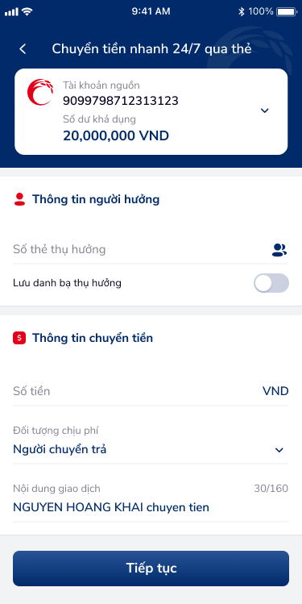
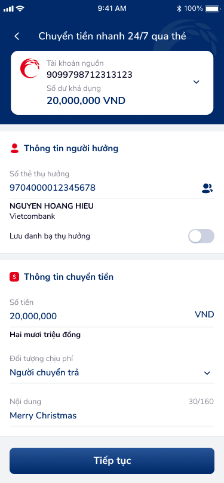

# SCR-THE-001 — Chuyển tiền nhanh 24/7 qua thẻ › Form nhập thông tin

> `SCR-THE-001` · form · 3 artboards (CTNST_1, CTNST_2, CTNST_3)

## 1. User Flow

| Bước | Hành động | Kết quả |
|:-----|:----------|:--------|
| 1 | Chọn "Chuyển tiền nhanh 24/7 qua thẻ" từ menu | Hiển thị form nhập thông tin |
| 2 | Xem thông tin tài khoản nguồn (số TK, số dư khả dụng) | Card hiển thị: 9099798712313123, 20,000,000 VND |
| 3 | Nhập hoặc chọn số thẻ thụ hưởng | Input field "Số thẻ thụ hưởng" + icon ic_contact |
| 4 | Tap ic_contact → mở overlay Danh bạ thụ hưởng | Bottom sheet danh sách beneficiary + search |
| 5 | Chọn người hưởng từ danh bạ | Tự điền: 9704000012345678, NGUYEN HOANG HIEU, Vietcombank |
| 6 | Toggle "Lưu danh bạ thụ hưởng" | Switch on/off |
| 7 | Nhập số tiền | Hiển thị: 20,000,000, chữ: Hai mươi triệu đồng |
| 8 | Chọn đối tượng chịu phí (dropdown) | Mặc định: Người chuyển trả |
| 9 | Nhập nội dung giao dịch | Counter 30/160 ký tự |
| 10 | Tap "Tiếp tục" | Chuyển sang SCR-THE-002 |

## 2. User Story

| US | Mô tả | AC |
|:---|:------|:---|
| US-001 | Người dùng chuyển tiền nhanh 24/7 qua số thẻ ngân hàng | AC1: Xem được số dư tài khoản nguồn. AC2: Nhập hoặc chọn số thẻ thụ hưởng. AC3: Hệ thống validate và hiển thị tên người hưởng + ngân hàng. |
| US-002 | Người dùng chọn người hưởng từ danh bạ | AC1: Tap icon danh bạ → mở overlay. AC2: Tìm kiếm theo tên. AC3: Chọn → tự điền thông tin. |
| US-003 | Người dùng nhập thông tin chuyển tiền | AC1: Nhập số tiền → hiển thị bằng chữ. AC2: Chọn đối tượng chịu phí. AC3: Nhập nội dung giao dịch (max 160 ký tự). |

## 3. Mô tả màn hình

### Variant 1: Form trống (CTNST_1)

- Header: gradient xanh navy, title "Chuyển tiền nhanh 24/7 qua thẻ", nút back trắng
- Card tài khoản nguồn: icon Co-opBank đỏ, số TK 9099798712313123, Số dư khả dụng, 20,000,000 VND, dropdown chọn TK
- Section "Thông tin người hưởng": icon ic_human_tit, input "Số thẻ thụ hưởng" + ic_contact, toggle "Lưu danh bạ thụ hưởng"
- Section "Thông tin chuyển tiền": icon ic_money_tit, input "Số tiền" + VND, dropdown "Đối tượng chịu phí" (Người chuyển trả), input "Nội dung giao dịch" (30/160)
- CTA: "Tiếp tục" (nền xanh navy, text trắng, full-width)

### Variant 2: Overlay Danh bạ thụ hưởng (CTNST_2)

- Full-screen overlay "Danh bạ thụ hưởng" + icon close (X)
- Search bar "Tìm kiếm" với icon kính lúp
- Danh sách beneficiary: avatar bank logo + tên + số TK + tên ngân hàng
  - Anh Thang — 01293123123123167 — Vietcombank
  - Anh Tuấn VCB — 01293123123133333 — Vietcombank
  - Anh Văn Mỹ — 01293123123678901 — Vietinbank
  - Bác Đức Family — 01293123123120890 — Techcombank
  - Bác Khánh Tuấn — 01293123123120890 — BIDV
  - Chị Giang Tú — 01293123123133333 — Vietcombank
  - Chị Linh Vũ — BIDV - 01293123123678901
  - Chị Uyên Coop — BIDV - 01293123123678901

### Variant 3: Form đã fill (CTNST_3)

- Giống Variant 1 nhưng đã điền đầy đủ:
  - Số thẻ thụ hưởng: 9704000012345678
  - Tên: NGUYEN HOANG HIEU, Vietcombank
  - Số tiền: 20,000,000, Hai mươi triệu đồng
  - Đối tượng chịu phí: Người chuyển trả
  - Nội dung: Merry Christmas (30/160)

## 4. Database / API

| Entity | Fields | Constraints |
|:-------|:-------|:------------|
| TransferRequest | source_account, card_number, beneficiary_name, bank_name, amount, fee_bearer, content | card_number: 16 digits, amount > 0, content max 160 chars |
| Beneficiary | name, card_number, bank_name, is_saved | Unique per user |

## 5. NFR

| Loại | Yêu cầu |
|:-----|:--------|
| Bảo mật | Che một phần số tài khoản nguồn khi cần |
| Hiệu năng | Danh bạ load < 2s, search real-time |
| Trải nghiệm | Số tiền tự format VND, hiển thị bằng chữ, counter nội dung |
