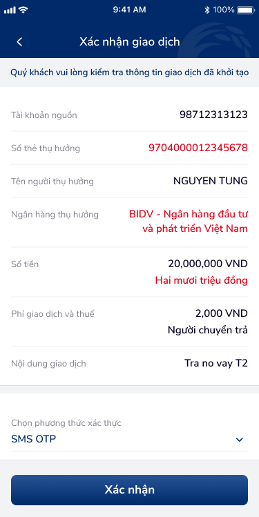
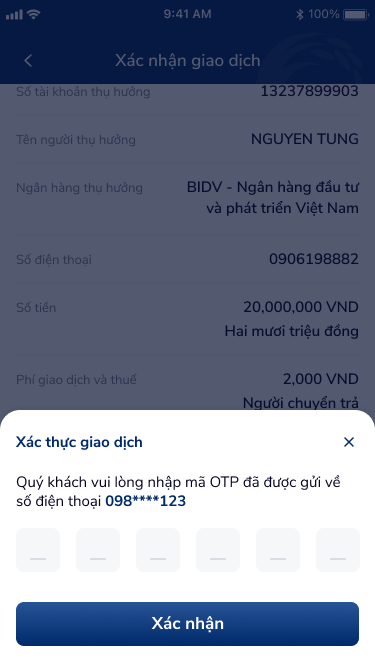

# SCR-THE-002 — Chuyển tiền nhanh 24/7 qua thẻ › Xác nhận giao dịch

> `SCR-THE-002` · confirm · 2 artboards (CTNST_4, CTNST_5)

## 1. User Flow

| Bước | Hành động | Kết quả |
|:-----|:----------|:--------|
| 1 | Từ SCR-THE-001 tap "Tiếp tục" | Hiển thị màn xác nhận giao dịch |
| 2 | Review thông tin: TK nguồn, số thẻ, tên người hưởng, ngân hàng, số tiền, phí, nội dung | Dạng readonly list |
| 3 | Chọn phương thức xác thực (dropdown) | Mặc định: SMS OTP |
| 4 | Tap "Xác nhận" | Mở overlay OTP |
| 5 | Nhập 6 chữ số OTP | 6 ô input riêng biệt |
| 6 | Tap "Xác nhận" trên OTP overlay | Xử lý giao dịch → SCR-THE-003 |

## 2. User Story

| US | Mô tả | AC |
|:---|:------|:---|
| US-004 | Người dùng xác nhận thông tin trước khi thực hiện giao dịch | AC1: Hiển thị đầy đủ thông tin: TK nguồn, thẻ thụ hưởng, tên, ngân hàng, số tiền (số + chữ), phí, nội dung. AC2: Cho phép quay lại chỉnh sửa. |
| US-005 | Người dùng xác thực giao dịch bằng OTP | AC1: Chọn phương thức xác thực. AC2: Nhập OTP → hệ thống verify. AC3: Hiển thị số điện thoại nhận OTP (che bớt). |

## 3. Mô tả màn hình

### Variant 1: Xác nhận giao dịch — qua thẻ (CTNST_4)

- Header: gradient xanh navy, title "Xác nhận giao dịch", nút back
- Banner: "Quý khách vui lòng kiểm tra thông tin giao dịch đã khởi tạo"
- Thông tin giao dịch (readonly rows):
  - Tài khoản nguồn: 98712313123
  - Số thẻ thụ hưởng: 9704000012345678 (màu đỏ/highlight)
  - Tên người thụ hưởng: NGUYEN TUNG
  - Ngân hàng thụ hưởng: BIDV - Ngân hàng đầu tư và phát triển Việt Nam (màu đỏ, multi-line)
  - Số tiền: 20,000,000 VND + Hai mươi triệu đồng (chữ đỏ)
  - Phí giao dịch và thuế: 2,000 VND + Người chuyển trả
  - Nội dung giao dịch: Tra no vay T2
- Section phương thức xác thực: dropdown "SMS OTP"
- CTA: "Xác nhận" (full-width, xanh navy)

### Variant 2: Xác nhận + OTP overlay — qua số điện thoại (CTNST_5)

- Background dimmed: màn xác nhận phía sau
- Thông tin bổ sung variant này: Số tài khoản thụ hưởng: 13237899903, Số điện thoại: 0906198882
- Bottom sheet "Xác thực giao dịch":
  - Icon close (X) góc phải
  - Text: "Quý khách vui lòng nhập mã OTP đã được gửi về số điện thoại 098****123"
  - 6 ô OTP (44×44px mỗi ô, spacing 16px)
  - CTA: "Xác nhận" (full-width, xanh navy)

## 4. Database / API

| Entity | Fields | Constraints |
|:-------|:-------|:------------|
| OTPVerification | phone_masked, otp_code, expires_at, attempts | 6 digits, max 3 attempts, 60s timeout |
| TransactionConfirm | all fields from TransferRequest + fee, auth_method | readonly display |

## 5. NFR

| Loại | Yêu cầu |
|:-----|:--------|
| Bảo mật | OTP che số điện thoại (098****123), hết hạn 60s, max 3 lần nhập |
| Hiệu năng | Gửi OTP < 3s |
| Trải nghiệm | Cảnh báo rõ trước khi xác nhận, thông tin đầy đủ để review |
