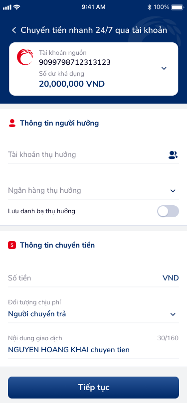
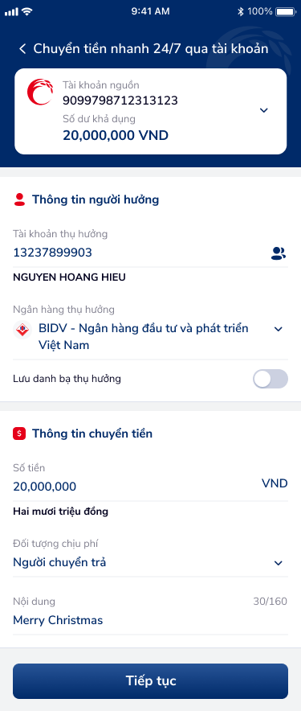
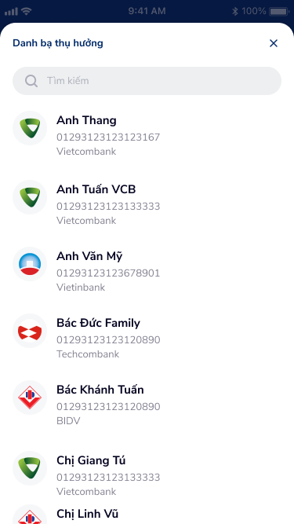
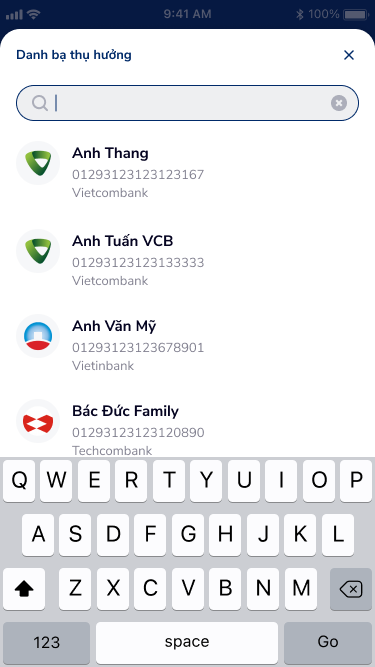
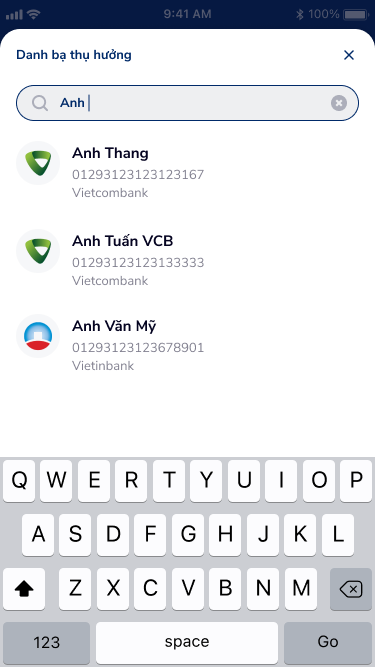
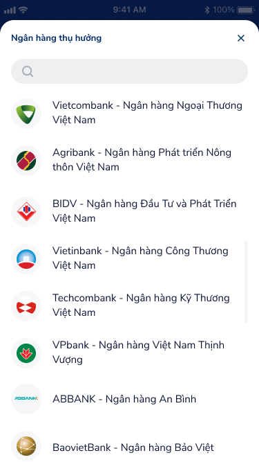

# SCR-CB-001 — Chuyển tiền nhanh 24/7 qua tài khoản › Form nhập thông tin

> `SCR-CB-001` · form · 6 artboards (2 states + 3 overlay danh bạ + 1 overlay ngân hàng)

## 1. Mô tả chức năng

Màn hình form nhập thông tin chuyển tiền nhanh 24/7 liên ngân hàng qua số tài khoản. Cho phép người dùng nhập đầy đủ thông tin người hưởng (tài khoản, ngân hàng) và thông tin chuyển tiền (số tiền, phí, nội dung). Hỗ trợ chọn từ danh bạ thụ hưởng và chọn ngân hàng thụ hưởng qua overlay.

## 2. Wireframe

### State 1: Form trống (mặc định)

### State 2: Form đã điền đầy đủ

### Overlay: Danh bạ thụ hưởng — trạng thái mặc định

### Overlay: Danh bạ thụ hưởng — bàn phím active, chưa tìm kiếm

### Overlay: Danh bạ thụ hưởng — tìm kiếm "Anh"

### Overlay: Ngân hàng thụ hưởng

## 3. Luồng người dùng (User Flow)

1. User mở màn hình → thấy tài khoản nguồn đã chọn (balance card: 9099798712313123, số dư 20,000,000 VND)
2. Nhập thông tin người hưởng:
   - Nhập số tài khoản / số thẻ / số điện thoại (placeholder: "Số tài khoản/Số thẻ/Số điện thoại")
   - Hoặc nhấn icon danh bạ (ic_contact 👤) → mở overlay Danh bạ thụ hưởng
   - Overlay danh bạ: search bar + list contacts (Anh Thang, Anh Tuấn VCB, Anh Văn Mỹ, Bác Đức Family, Bác Khánh Tuấn, Chị Giang Tú, Chị Linh Vũ...) + keyboard variants + close X
   - Chọn ngân hàng thụ hưởng: dropdown (drop_blue) → mở overlay Ngân hàng thụ hưởng (Vietcombank, Agribank, BIDV, Vietinbank, Techcombank, VPbank, ABBANK, BaoVietBank...)
   - Hệ thống tự fill tên: "NGUYEN HOANG HIEU"
   - Toggle "Lưu danh bạ thụ hưởng" (OFF mặc định)
3. Nhập thông tin chuyển tiền:
   - Số tiền (VND) — filled state: "20,000,000" + "Hai mươi triệu đồng"
   - Đối tượng chịu phí: dropdown "Người chuyển trả"
   - Nội dung giao dịch (auto-fill: "NGUYEN HOANG KHAI chuyen tien", counter 30/160; filled: "Merry Christmas")
4. Nhấn "Tiếp tục" → chuyển sang SCR-CB-002

## 4. Thành phần UI chính

| # | Component | Mô tả | Ghi chú |
|:---|:---|:---|:---|
| 1 | Header bar | "Chuyển tiền nhanh 24/7 qua tài khoản" + back arrow (white) | Fixed top, dark bg |
| 2 | Balance card | Logo Co-opBank, TK nguồn 9099798712313123, số dư 20,000,000 VND, dropdown | Expandable |
| 3 | Section: Thông tin người hưởng | Input TK thụ hưởng + icon danh bạ, dropdown ngân hàng, toggle lưu danh bạ | Auto-lookup tên |
| 4 | Section: Thông tin chuyển tiền | Input số tiền (VND) + chữ viết, dropdown chịu phí, textarea nội dung (30/160) | Character counter |
| 5 | CTA: Tiếp tục | Full-width button blue | Primary action |
| 6 | Overlay: Danh bạ thụ hưởng | Search bar + list contacts + close X | 3 variants |
| 7 | Overlay: Ngân hàng thụ hưởng | Search bar + list 8+ banks + close X | Picker pattern |

## 5. Quy tắc nghiệp vụ & NFR

- **BR-001:** Tài khoản nguồn phải có số dư khả dụng >= số tiền chuyển
- **BR-002:** Người hưởng có thể nhập bằng số tài khoản, số thẻ, hoặc số điện thoại
- **BR-003:** Nội dung giao dịch tối đa 160 ký tự
- **BR-004:** Phí giao dịch do người chuyển hoặc người nhận trả (dropdown)
- **NFR-001:** Counter text real-time (30/160)
- **NFR-002:** Danh bạ search filtering real-time (keyword "Anh" → 3 results)
- **NFR-003:** Auto-fill tên người hưởng sau khi nhập/chọn số tài khoản

## 6. Kết nối Flow

- **← Từ:** Home / Menu chuyển tiền
- **→ Tới:** SCR-CB-002 (Xác nhận giao dịch) — via "Tiếp tục"
- **↗ Overlay:** Danh bạ thụ hưởng — via ic_contact icon
- **↗ Overlay:** Ngân hàng thụ hưởng — via drop_blue dropdown
