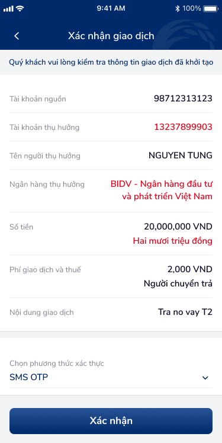

# SCR-CB-002 — Chuyển tiền nhanh 24/7 qua tài khoản › Xác nhận giao dịch

> `SCR-CB-002` · confirm · 2 artboards (1 confirm screen + 1 OTP overlay)

## 1. Mô tả chức năng

Màn hình xác nhận giao dịch chuyển tiền nhanh 24/7 liên ngân hàng. Hiển thị toàn bộ thông tin đã nhập để người dùng kiểm tra trước khi xác thực bằng OTP. Bao gồm OTP bottom sheet overlay.

## 2. Wireframe

### State 1: Màn hình xác nhận thông tin

### Overlay: OTP bottom sheet

## 3. Luồng người dùng (User Flow)

1. User đến từ SCR-CB-001 → thấy toàn bộ thông tin đã nhập
2. Banner: "Quý khách vui lòng kiểm tra thông tin giao dịch đã khởi tạo"
3. Chi tiết giao dịch (8 rows):
   - Tài khoản nguồn: 98712313123
   - Tài khoản thụ hưởng: 13237899903
   - Tên người thụ hưởng: NGUYEN TUNG
   - Ngân hàng thụ hưởng: BIDV - Ngân hàng đầu tư và phát triển Việt Nam
   - Số điện thoại: 0906198882
   - Số tiền: 20,000,000 VND + "Hai mươi triệu đồng"
   - Phí giao dịch và thuế: 2,000 VND — Người chuyển trả
   - Nội dung giao dịch: Tra no vay T2
4. Chọn phương thức xác thực: dropdown "SMS OTP" (1 option)
5. Nhấn "Xác nhận" → mở OTP bottom sheet
6. OTP: "Xác thực giao dịch" + SĐT masked 098****123 + 6 ô digit + "Xác nhận" + close X
7. Nhập OTP đúng → SCR-CB-003

## 4. Thành phần UI chính

| # | Component | Mô tả | Ghi chú |
|:---|:---|:---|:---|
| 1 | Header bar | "Xác nhận giao dịch" + back arrow | Fixed top, dark bg |
| 2 | Info banner | Hướng dẫn kiểm tra thông tin | Gradient bg |
| 3 | Detail list | 8 rows key-value | Read-only |
| 4 | Số tiền + chữ viết | "20,000,000 VND" + "Hai mươi triệu đồng" | Visual confirmation |
| 5 | Phí giao dịch | "2,000 VND" + "Người chuyển trả" | Transparent |
| 6 | Auth dropdown | "SMS OTP" + chevron | 1 option |
| 7 | CTA: Xác nhận | Full-width button | Primary action |
| 8 | OTP bottom sheet | Title + masked SĐT + 6 cells + CTA + close X | Modal |

## 5. Quy tắc nghiệp vụ & NFR

- **BR-001:** Tất cả thông tin phải match với dữ liệu nhập từ form
- **BR-002:** Số tiền hiển thị cả số (20,000,000 VND) và chữ (Hai mươi triệu đồng)
- **BR-003:** Phí giao dịch rõ ràng (2,000 VND)
- **BR-004:** OTP gửi về SĐT đăng ký, mask middle digits (098****123)
- **BR-005:** OTP 6 chữ số
- **NFR-001:** OTP cần resend button + countdown timer (hiện thiếu)
- **NFR-002:** Nếu chỉ 1 phương thức xác thực → nên hiển thị static text

## 6. Kết nối Flow

- **← Từ:** SCR-CB-001 (Form nhập) — via "Tiếp tục"
- **→ Tới:** SCR-CB-003 (Kết quả) — via "Xác nhận" (after OTP)
- **↗ Overlay:** OTP bottom sheet — via "Xác nhận" button
