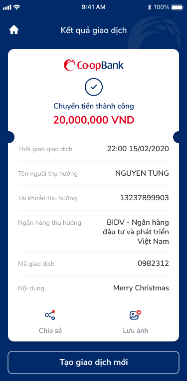

# SCR-CB-003 — Chuyển tiền nhanh 24/7 qua tài khoản › Kết quả giao dịch

> `SCR-CB-003` · result · 1 artboard

## 1. Mô tả chức năng

Màn hình kết quả giao dịch chuyển tiền nhanh 24/7 thành công. Hiển thị biên nhận (receipt) với đầy đủ thông tin giao dịch, cho phép chia sẻ và lưu ảnh.

## 2. Wireframe

### State 1: Giao dịch thành công

## 3. Luồng người dùng (User Flow)

1. User đến từ SCR-CB-002 sau OTP thành công
2. Success state: Co-opBank logo + green checkmark + "Chuyển tiền thành công"
3. Amount highlight: "20,000,000 VND" (xanh lá)
4. Receipt card (7 rows):
   - Thời gian giao dịch: 22:00 15/02/2020
   - Tên người thụ hưởng: NGUYEN TUNG
   - Tài khoản thụ hưởng: 13237899903
   - Ngân hàng thụ hưởng: BIDV - Ngân hàng đầu tư và phát triển Việt Nam
   - Mã giao dịch: 0982312
   - Nội dung: Merry Christmas
5. Actions: Chia sẻ + Lưu ảnh
6. CTA: "Tạo giao dịch mới" → quay lại SCR-CB-001

## 4. Thành phần UI chính

| # | Component | Mô tả | Ghi chú |
|:---|:---|:---|:---|
| 1 | Header bar | "Kết quả giao dịch" + home icon (🏠) | Navigate to home |
| 2 | Success state | Logo + checkmark + "Chuyển tiền thành công" | Positive feedback |
| 3 | Amount highlight | "20,000,000 VND" text lớn success color | Visual emphasis |
| 4 | Receipt card | Rounded + dashed divider + 7 detail rows | Receipt pattern |
| 5 | Actions | Chia sẻ + Lưu ảnh (icons + labels) | Bottom of receipt |
| 6 | CTA: Tạo giao dịch mới | Full-width button | Loop action |

## 5. Quy tắc nghiệp vụ & NFR

- **BR-001:** Mã giao dịch unique và truy vấn được
- **BR-002:** Tên người thụ hưởng phải nhất quán case xuyên suốt (hiện: "NGUYEN TUNG" trên result vs confirm)
- **BR-003:** Biên nhận nên hiển thị phí giao dịch (hiện thiếu — có ở confirm 2,000 VND nhưng không có ở result)
- **NFR-001:** Chia sẻ qua native share sheet
- **NFR-002:** Lưu ảnh render receipt thành image file
- **NFR-003:** Home icon navigate về trang chủ

## 6. Kết nối Flow

- **← Từ:** SCR-CB-002 (Xác nhận) — via OTP success
- **→ Tới:** SCR-CB-001 (Form nhập) — via "Tạo giao dịch mới"
- **→ Tới:** Home — via home icon
