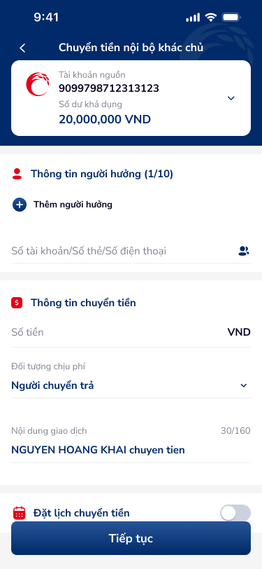
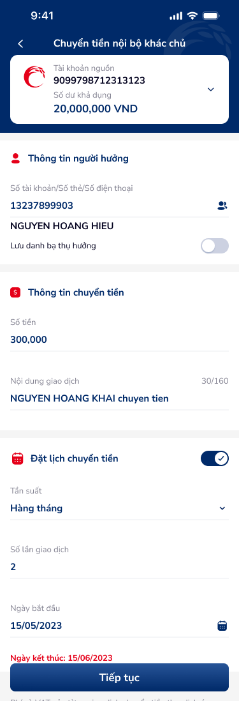
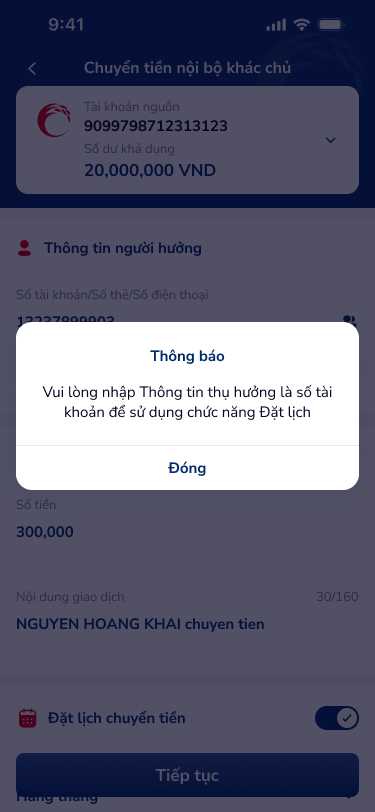
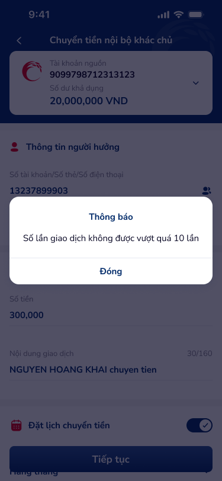

# SCR-CTNBKC-001 — Chuyển tiền nội bộ khác chủ › Form nhập thông tin

> `SCR-CTNBKC-001` · form · 4 artboards (2 states + 2 overlay popups)

## 1. Mô tả chức năng

Màn hình form nhập thông tin chuyển tiền nội bộ khác chủ tài khoản Co-opBank. Cho phép người dùng nhập đầy đủ thông tin giao dịch và tùy chọn đặt lịch chuyển tiền định kỳ.

## 2. Wireframe

### State 1: Form trống (mặc định)

### State 2: Form đã điền + Đặt lịch ON

### Overlay: Popup validation — yêu cầu số tài khoản

### Overlay: Popup validation — giới hạn số lần

## 3. Luồng người dùng (User Flow)

1. User mở màn hình → thấy tài khoản nguồn đã chọn (balance card)
2. Nhập thông tin người hưởng:
   - Nhập số tài khoản / số thẻ / SĐT
   - Hoặc nhấn icon danh bạ (👤) để chọn từ danh bạ thụ hưởng
   - Hệ thống tự fill tên người hưởng (NGUYEN HOANG HIEU)
   - Toggle "Lưu danh bạ thụ hưởng" (OFF mặc định)
3. Nhập thông tin chuyển tiền:
   - Số tiền (VND)
   - Đối tượng chịu phí: dropdown "Người chuyển trả"
   - Nội dung giao dịch (auto-fill pattern: "TEN chuyen tien", 30/160 chars)
4. Tùy chọn: Đặt lịch chuyển tiền (toggle)
   - Khi ON: hiển thị thêm Tần suất, Số lần giao dịch, Ngày bắt đầu/kết thúc
   - Validation: nếu thông tin thụ hưởng không phải số TK → popup "Vui lòng nhập Thông tin thụ hưởng là số tài khoản..."
   - Validation: nếu số lần > 10 → popup "Số lần giao dịch không được vượt quá 10 lần"
5. Nhấn "Tiếp tục" → chuyển sang màn Xác nhận (SCR-CTNBKC-002)

## 4. Thành phần UI chính

| # | Component | Mô tả | Ghi chú |
|:---|:---|:---|:---|
| 1 | Header bar | "Chuyển tiền nội bộ khác chủ" + back arrow | Fixed top |
| 2 | Balance card | Logo Co-opBank, TK nguồn, số dư khả dụng, dropdown arrow | Expandable |
| 3 | Section: Thông tin người hưởng | Counter "(1/10)", input field, contact icon, toggle lưu danh bạ | Auto-lookup |
| 4 | Section: Thông tin chuyển tiền | Số tiền (VND), dropdown chịu phí, textarea nội dung (30/160) | Character counter |
| 5 | Section: Đặt lịch chuyển tiền | Toggle, tần suất dropdown, input số lần, date picker, end date | Conditional show |
| 6 | Annotation: Lưu ý | Info text về phí và VAT | Static text |
| 7 | CTA: Tiếp tục | Full-width button | Primary action |
| 8 | Popup: Thông báo validation | Modal centered, message + "Đóng" | 2 variants |

## 5. Quy tắc nghiệp vụ & NFR

- **BR-001:** Tài khoản nguồn phải có số dư khả dụng >= số tiền chuyển
- **BR-002:** Người hưởng có thể nhập bằng số TK, số thẻ, hoặc SĐT
- **BR-003:** Đặt lịch chuyển tiền yêu cầu thông tin thụ hưởng là số tài khoản (không chấp nhận thẻ/SĐT)
- **BR-004:** Số lần giao dịch đặt lịch tối đa 10 lần
- **BR-005:** Nội dung giao dịch tối đa 160 ký tự
- **BR-006:** Phí và VAT áp dụng theo quy định Co-opBank từng thời kỳ
- **NFR-001:** Counter text real-time (30/160)
- **NFR-002:** Popups modal blocking — user phải dismiss trước khi tiếp tục

## 6. Kết nối Flow

- **← Từ:** Home / Menu chuyển tiền
- **→ Tới:** SCR-CTNBKC-002 (Xác nhận giao dịch) — via "Tiếp tục"
