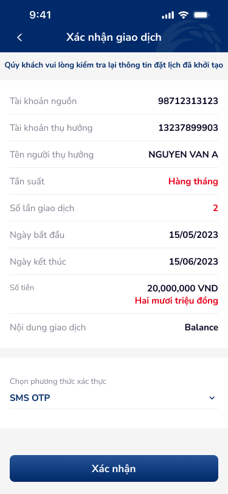
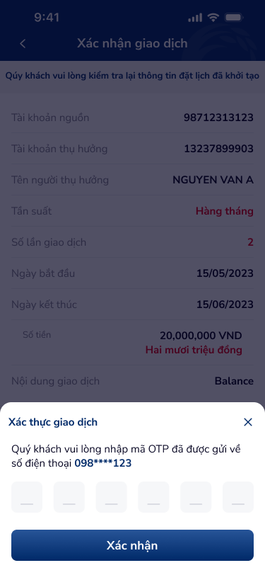

# SCR-CTNBKC-002 — Chuyển tiền nội bộ khác chủ › Xác nhận giao dịch

> `SCR-CTNBKC-002` · confirm · 2 artboards (1 state + 1 overlay OTP)

## 1. Mô tả chức năng

Màn hình xác nhận giao dịch đặt lịch chuyển tiền nội bộ khác chủ. Hiển thị toàn bộ thông tin giao dịch để user kiểm tra trước khi xác thực bằng OTP.

## 2. Wireframe

### State 1: Xác nhận thông tin

### Overlay: OTP bottom sheet

## 3. Luồng người dùng (User Flow)

1. User thấy banner "Quý khách vui lòng kiểm tra lại thông tin đặt lịch đã khởi tạo"
2. Kiểm tra thông tin:
   - Tài khoản nguồn: 98712313123
   - Tài khoản thụ hưởng: 13237899903
   - Tên người thụ hưởng: NGUYEN VAN A
   - Tần suất: Hàng tháng (highlighted)
   - Số lần giao dịch: 2 (highlighted)
   - Ngày bắt đầu/kết thúc: 15/05/2023 — 15/06/2023
   - Số tiền: 20,000,000 VND + "Hai mươi triệu đồng"
   - Nội dung: Balance
3. Chọn phương thức xác thực (dropdown): SMS OTP
4. Nhấn "Xác nhận" → OTP bottom sheet hiện lên:
   - Title: "Xác thực giao dịch"
   - Description: "... mã OTP đã được gửi về số điện thoại 098****123"
   - 6 ô digit input
   - Nút "Xác nhận"
   - Nút X đóng sheet
5. Nhập đủ 6 số OTP → nhấn "Xác nhận" → chuyển sang Kết quả (SCR-CTNBKC-003)

## 4. Thành phần UI chính

| # | Component | Mô tả | Ghi chú |
|:---|:---|:---|:---|
| 1 | Header bar | "Xác nhận giao dịch" + back arrow | Fixed top |
| 2 | Info banner | Gradient blue, text khuyến nghị kiểm tra | Full-width |
| 3 | Detail list | 9 rows key-value pairs | Tần suất + Số lần highlighted (text color) |
| 4 | Số tiền row | Amount + chữ viết (Hai mươi triệu đồng) | Special format |
| 5 | Auth method | Dropdown "SMS OTP" | Expandable |
| 6 | CTA: Xác nhận | Full-width button | Primary action |
| 7 | OTP bottom sheet | Title, description, 6 digit cells, confirm CTA, close X | Modal overlay |

## 5. Quy tắc nghiệp vụ & NFR

- **BR-001:** Số điện thoại hiển thị masked (098****123) theo quy chuẩn PII
- **BR-002:** OTP 6 chữ số, gửi qua SMS
- **BR-003:** Số tiền hiển thị kèm chữ viết (Hai mươi triệu đồng) để xác nhận chính xác
- **BR-004:** Tần suất và Số lần giao dịch highlighted bằng màu khác để thu hút chú ý
- **NFR-001:** OTP bottom sheet phải có close X
- **NFR-002:** OTP cells auto-focus vào ô tiếp theo khi nhập
- **NFR-003:** Back arrow quay về Form, giữ nguyên data đã nhập

## 6. Kết nối Flow

- **← Từ:** SCR-CTNBKC-001 (Form nhập) — via "Tiếp tục"
- **→ Tới:** SCR-CTNBKC-003 (Kết quả giao dịch) — sau OTP success
