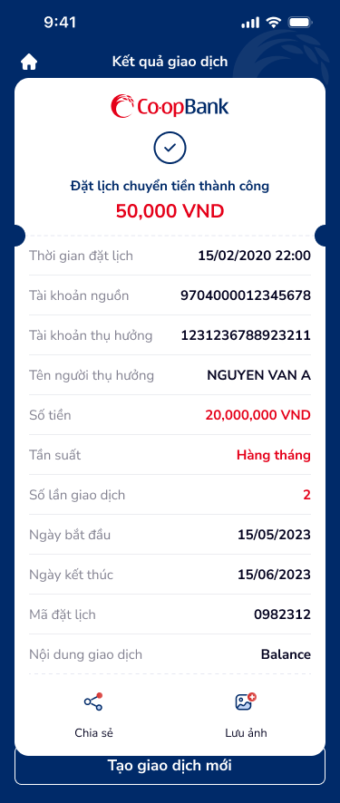

# SCR-CTNBKC-003 — Chuyển tiền nội bộ khác chủ › Kết quả giao dịch

> `SCR-CTNBKC-003` · result · 1 artboard

## 1. Mô tả chức năng

Màn hình kết quả giao dịch đặt lịch chuyển tiền nội bộ khác chủ thành công. Hiển thị biên nhận đầy đủ thông tin giao dịch và các action tiếp theo.

## 2. Wireframe

### State: Đặt lịch thành công

## 3. Luồng người dùng (User Flow)

1. User thấy success state:
   - Logo Co-opBank + dấu tích xanh (checkmark circle)
   - "Đặt lịch chuyển tiền thành công"
   - Số tiền highlighted: 50,000 VND
2. Kiểm tra biên nhận:
   - Thời gian đặt lịch: 15/02/2020 22:00
   - Tài khoản nguồn: 9704000012345678
   - Tài khoản thụ hưởng: 1231236788923211
   - Tên: NGUYEN VAN A
   - Số tiền: 20,000,000 VND
   - Tần suất: Hàng tháng
   - Số lần: 2
   - Ngày bắt đầu/kết thúc
   - Mã đặt lịch: 0982312
   - Nội dung: Balance
3. Actions:
   - Chia sẻ (share icon) — share biên nhận
   - Lưu ảnh (save icon) — save screenshot
   - Tạo giao dịch mới — quay về Form (SCR-CTNBKC-001)
   - Home icon (top-left) — về trang chủ

## 4. Thành phần UI chính

| # | Component | Mô tả | Ghi chú |
|:---|:---|:---|:---|
| 1 | Header bar | "Kết quả giao dịch" + home icon | Dark bg |
| 2 | Success card top | Logo, checkmark, success text, amount | Rounded top |
| 3 | Dash divider | Dashed line separator | Receipt style |
| 4 | Detail list | 11 rows key-value pairs | Số tiền + Tần suất + Số lần highlighted |
| 5 | Card bottom | Share + Save actions | Rounded bottom |
| 6 | CTA: Tạo giao dịch mới | Full-width button | Outside card |

## 5. Quy tắc nghiệp vụ & NFR

- **BR-001:** Mã đặt lịch (0982312) là unique identifier cho giao dịch định kỳ
- **BR-002:** Biên nhận phải hiển thị đầy đủ thông tin đã confirm ở bước trước
- **BR-003:** Share và Lưu ảnh phải capture toàn bộ biên nhận
- **NFR-001:** Card style receipt (rounded corners, dash divider) tạo visual hierarchy rõ ràng
- **NFR-002:** Home icon (top-left) quay thẳng về trang chủ, không quay lại stack
- **NFR-003:** "Tạo giao dịch mới" reset form state hoàn toàn

## 6. Kết nối Flow

- **← Từ:** SCR-CTNBKC-002 (Xác nhận giao dịch) — sau OTP success
- **→ Tới:** SCR-CTNBKC-001 (Form nhập, reset) — via "Tạo giao dịch mới"
- **→ Tới:** Home — via home icon
