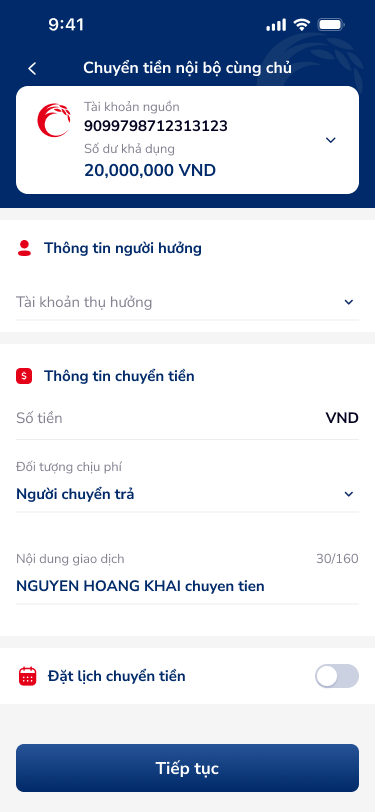
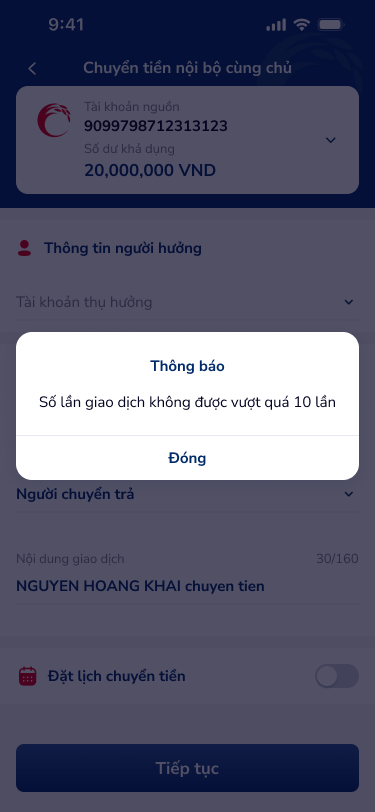
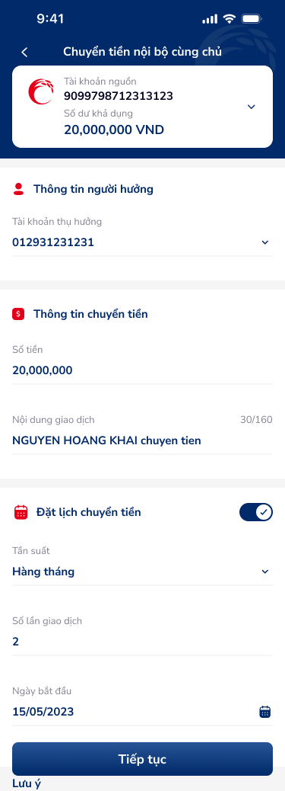
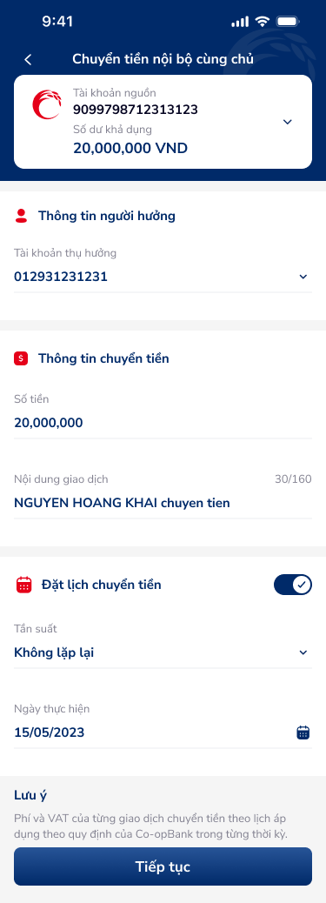

# SCR-CB-001 — Chuyển tiền nội bộ cùng chủ › Form nhập thông tin

## 1. User Flow

| Bước | Hành động | Kết quả |
|:---|:---|:---|
| 1 | Chọn tài khoản nguồn | Hiển thị số dư khả dụng |
| 2 | Chọn tài khoản thụ hưởng (dropdown) | Danh sách tài khoản cùng chủ |
| 3 | Nhập số tiền chuyển | Hiển thị đơn vị VND |
| 4 | Chọn đối tượng chịu phí | Dropdown: Người chuyển trả / Người nhận trả |
| 5 | Nhập nội dung giao dịch | Max 30/160 ký tự |
| 6 | (Tuỳ chọn) Bật đặt lịch chuyển tiền | Toggle ON → hiện thêm fields lịch |
| 6a | Chọn tần suất | Dropdown: Hàng tháng / Không lặp lại |
| 6b | Nhập số lần giao dịch | Số nguyên, tối đa 10 lần |
| 6c | Chọn ngày bắt đầu | Date picker (dd/mm/yyyy) |
| 6d | (Auto) Ngày kết thúc | Tự tính từ tần suất + số lần |
| 7 | Nhấn "Tiếp tục" | Chuyển sang màn xác nhận |

### Luồng ngoại lệ
- Nếu số lần giao dịch > 10 → Popup "Thông báo: Số lần giao dịch không được vượt quá 10 lần" + nút "Đóng"

## 2. User Stories

| US | Mô tả | AC |
|:---|:---|:---|
| US-001 | Là khách hàng, tôi muốn chuyển tiền giữa các tài khoản cùng chủ để quản lý tài chính | AC1: Hiển thị tài khoản nguồn + số dư. AC2: Chọn được tài khoản thụ hưởng cùng chủ. AC3: Nhập số tiền, nội dung. AC4: Nhấn "Tiếp tục" chuyển sang xác nhận |
| US-002 | Là khách hàng, tôi muốn đặt lịch chuyển tiền tự động | AC1: Toggle bật/tắt đặt lịch. AC2: Chọn tần suất. AC3: Nhập số lần. AC4: Chọn ngày bắt đầu. AC5: Auto tính ngày kết thúc |
| US-003 | Là hệ thống, tôi cần validation số lần giao dịch | AC1: Nếu > 10 → hiện popup cảnh báo. AC2: Popup có nút "Đóng" |

## 3. Mô tả màn hình (Wireframe)

| # | Thành phần | Loại | Mô tả |
|:---|:---|:---|:---|
| 1 | Header "Chuyển tiền nội bộ cùng chủ" | Header bar | Tiêu đề + nút back |
| 2 | Balance card | Card | Logo Co-opBank + Tài khoản nguồn (số TK) + Số dư khả dụng (20,000,000 VND) + caret-arrow-down |
| 3 | Thông tin người hưởng section | Section header | Icon người + "Thông tin người hưởng" |
| 4 | Tài khoản thụ hưởng | Dropdown field | Chọn TK thụ hưởng + caret-arrow-down |
| 5 | Thông tin chuyển tiền section | Section header | Icon $ + "Thông tin chuyển tiền" |
| 6 | Số tiền | Text input | Nhập số tiền + suffix "VND" |
| 7 | Đối tượng chịu phí | Dropdown | "Người chuyển trả" + caret-arrow-down |
| 8 | Nội dung giao dịch | Text input | "NGUYEN HOANG KHAI chuyen tien" + counter 30/160 |
| 9 | Đặt lịch chuyển tiền | Toggle row | Icon lịch + text + toggle switch (OFF/ON) |
| 10 | Tần suất | Dropdown (khi toggle ON) | "Hàng tháng" / "Không lặp lại" |
| 11 | Số lần giao dịch | Text input (khi toggle ON) | Nhập số, vd: "2" |
| 12 | Ngày bắt đầu | Date picker (khi toggle ON) | "15/05/2023" + icon lịch |
| 13 | Ngày kết thúc | Text (khi toggle ON, Hàng tháng) | Auto: "15/06/2023" |
| 14 | Ngày thực hiện | Date picker (khi toggle ON, Không lặp lại) | "15/05/2023" + icon lịch |
| 15 | Lưu ý | Annotation text | "Phí và VAT của từng giao dịch chuyển tiền theo lịch áp dụng theo quy định của Co-opBank trong từng thời kỳ." |
| 16 | Nút "Tiếp tục" | Primary button | Full-width, dark blue |
| 17 | Popup cảnh báo | Modal popup | "Thông báo" + "Số lần giao dịch không được vượt quá 10 lần" + "Đóng" |

### Ảnh wireframe

## 4. Database / API

| Entity | Field | Ràng buộc |
|:---|:---|:---|
| Transfer | source_account | FK → Account |
| Transfer | beneficiary_account | FK → Account (cùng chủ) |
| Transfer | amount | decimal, > 0 |
| Transfer | fee_payer | enum: sender/receiver |
| Transfer | description | varchar(160) |
| Transfer | is_scheduled | boolean |
| Schedule | frequency | enum: monthly/once |
| Schedule | count | int, 1-10 |
| Schedule | start_date | date |
| Schedule | end_date | date (calculated) |

## 5. NFR

| # | Loại | Yêu cầu |
|:---|:---|:---|
| NFR-1 | Bảo mật | Dữ liệu tài khoản mã hoá truyền tải |
| NFR-2 | Validation | Số lần giao dịch ≤ 10 (server-side + client-side) |
| NFR-3 | UX | Toggle đặt lịch smooth animation |
| NFR-4 | Hiệu năng | Load danh sách TK thụ hưởng < 2s |
| NFR-5 | Accessibility | Touch target ≥ 44px cho tất cả interactive elements |
