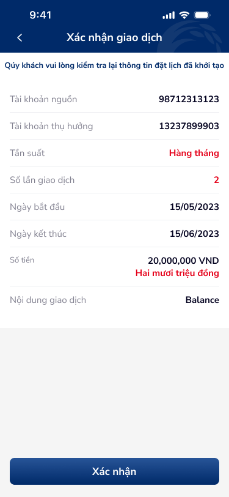

# SCR-CB-002 — Chuyển tiền nội bộ cùng chủ › Xác nhận giao dịch

## 1. User Flow

| Bước | Hành động | Kết quả |
|:---|:---|:---|
| 1 | Xem lại thông tin đặt lịch đã khởi tạo | Hiển thị tất cả thông tin review-only |
| 2 | Kiểm tra: TK nguồn, TK thụ hưởng, Tần suất, Số lần, Ngày, Số tiền, Nội dung | Tất cả read-only |
| 3 | Nhấn "Xác nhận" | Gửi giao dịch → chuyển sang kết quả |

### Luồng ngoại lệ
- Nhấn Back → quay về form nhập (giữ data đã nhập)

## 2. User Stories

| US | Mô tả | AC |
|:---|:---|:---|
| US-004 | Là khách hàng, tôi muốn xem lại thông tin trước khi xác nhận | AC1: Hiển thị đầy đủ tất cả field. AC2: Số tiền hiển thị cả chữ "Hai mươi triệu đồng". AC3: Có nút "Xác nhận" |

## 3. Mô tả màn hình (Wireframe)

| # | Thành phần | Loại | Mô tả |
|:---|:---|:---|:---|
| 1 | Header "Xác nhận giao dịch" | Header bar | Tiêu đề + nút back |
| 2 | Thông báo kiểm tra | Text | "Qúy khách vui lòng kiểm tra lại thông tin đặt lịch đã khởi tạo" |
| 3 | Tài khoản nguồn | Menu item | Label + value: 98712313123 |
| 4 | Tài khoản thụ hưởng | Menu item | Label + value: 13237899903 |
| 5 | Tần suất | Menu item | Label + value highlight: "Hàng tháng" (xanh) |
| 6 | Số lần giao dịch | Menu item | Label + value highlight: "2" (xanh) |
| 7 | Ngày bắt đầu | Menu item | Label + value: 15/05/2023 |
| 8 | Ngày kết thúc | Menu item | Label + value: 15/06/2023 |
| 9 | Số tiền | Menu item (2-line) | "20,000,000 VND" + "Hai mươi triệu đồng" (xanh) |
| 10 | Nội dung giao dịch | Menu item | Label + value: "Balance" |
| 11 | Nút "Xác nhận" | Primary button | Full-width, dark blue |

### Ảnh wireframe

## 4. Database / API

| Entity | Field | Ràng buộc |
|:---|:---|:---|
| (Read-only) | Hiển thị lại data từ form nhập | Không có input mới |

## 5. NFR

| # | Loại | Yêu cầu |
|:---|:---|:---|
| NFR-1 | Bảo mật | Hiển thị đầy đủ số TK (không mask) cho mục đích xác nhận |
| NFR-2 | UX | Số tiền phải hiển thị bằng chữ để tránh nhầm lẫn |
| NFR-3 | UX | Nút "Xác nhận" phải ở vị trí cố định bottom |
