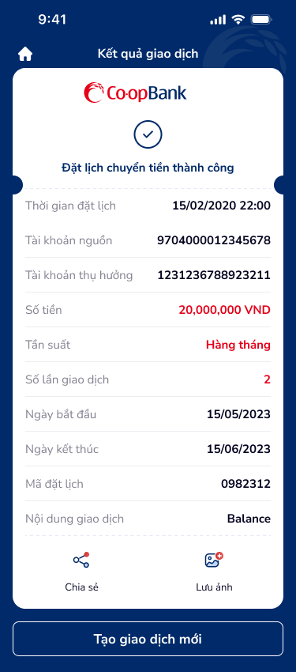

# SCR-CB-003 — Chuyển tiền nội bộ cùng chủ › Kết quả giao dịch

## 1. User Flow

| Bước | Hành động | Kết quả |
|:---|:---|:---|
| 1 | Xem kết quả "Đặt lịch chuyển tiền thành công" | Logo Co-opBank + icon done + thông báo |
| 2 | Xem chi tiết giao dịch (receipt card) | Tất cả thông tin giao dịch |
| 3 | (Tuỳ chọn) Chia sẻ hoặc Lưu ảnh | 2 icon action: Chia sẻ, Lưu ảnh |
| 4 | Nhấn "Tạo giao dịch mới" | Quay về form nhập (new session) |

## 2. User Stories

| US | Mô tả | AC |
|:---|:---|:---|
| US-005 | Là khách hàng, tôi muốn xem biên lai giao dịch thành công | AC1: Hiển thị đầy đủ thông tin. AC2: Có mã đặt lịch. AC3: Có thể chia sẻ/lưu ảnh |
| US-006 | Là khách hàng, tôi muốn tạo giao dịch mới sau khi hoàn tất | AC1: Nút "Tạo giao dịch mới" quay về form nhập |

## 3. Mô tả màn hình (Wireframe)

| # | Thành phần | Loại | Mô tả |
|:---|:---|:---|:---|
| 1 | Header "Kết quả giao dịch" | Header bar | Home icon + tiêu đề |
| 2 | Logo Co-opBank | Image | Centred, branded |
| 3 | Done icon (checkmark) | Icon | Green checkmark circle |
| 4 | "Đặt lịch chuyển tiền thành công" | Success text | Centre-aligned |
| 5 | Thời gian đặt lịch | Receipt row | 15/02/2020 22:00 |
| 6 | Tài khoản nguồn | Receipt row | 9704000012345678 |
| 7 | Tài khoản thụ hưởng | Receipt row | 1231236788923211 |
| 8 | Số tiền | Receipt row | 20,000,000 VND (xanh) |
| 9 | Tần suất | Receipt row | Hàng tháng (xanh) |
| 10 | Số lần giao dịch | Receipt row | 2 (xanh) |
| 11 | Ngày bắt đầu | Receipt row | 15/05/2023 |
| 12 | Ngày kết thúc | Receipt row | 15/06/2023 |
| 13 | Mã đặt lịch | Receipt row | 0982312 |
| 14 | Nội dung giao dịch | Receipt row | Balance |
| 15 | Chia sẻ | Action icon | Share icon + label |
| 16 | Lưu ảnh | Action icon | Save image icon + label |
| 17 | Nút "Tạo giao dịch mới" | Primary button | Full-width, dark blue |

### Ảnh wireframe

## 4. Database / API

| Entity | Field | Ràng buộc |
|:---|:---|:---|
| TransactionResult | schedule_id | UUID |
| TransactionResult | created_at | datetime |
| TransactionResult | status | enum: success |

## 5. NFR

| # | Loại | Yêu cầu |
|:---|:---|:---|
| NFR-1 | UX | Receipt card phải đầy đủ thông tin để screenshot/share |
| NFR-2 | UX | Mã đặt lịch phải unique, dễ đọc |
| NFR-3 | Hiệu năng | Render kết quả < 1s |
