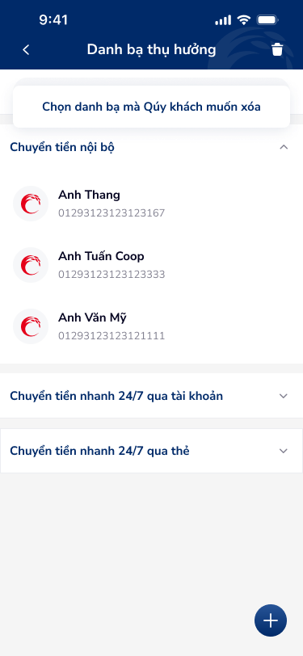
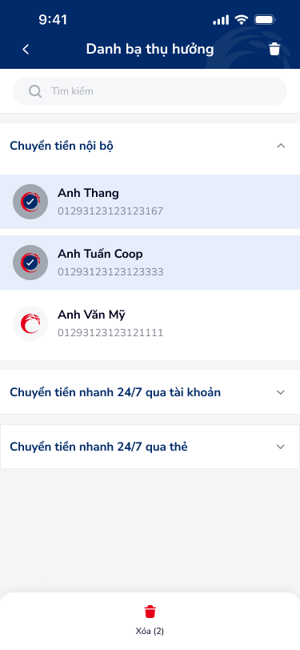
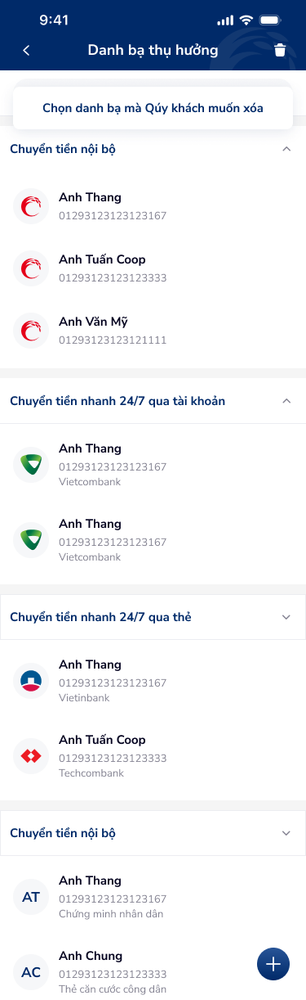
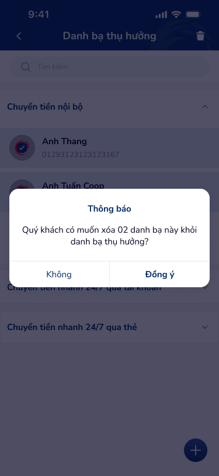

# SCR-DB-001 — Danh bạ thụ hưởng › Danh sách

> `SCR-DB-001` · list · 4 artboards

## 1. User Flow

| Bước | Hành động | Kết quả |
|------|-----------|---------|
| 1 | Mở Danh bạ thụ hưởng | Hiển thị danh sách beneficiaries theo nhóm |
| 2 | Nhấn icon thùng rác (header) | Chuyển sang chế độ chọn xóa, toast hướng dẫn |
| 3 | Chọn 1+ contact (checkbox) | Checkbox tích, hiện nút "Xóa (N)" |
| 4 | Nhấn "Xóa (N)" | Hiện popup xác nhận xóa |
| 5 | Nhấn "Đồng ý" trên popup | Xóa contacts đã chọn, quay về danh sách |
| 6 | Nhấn "Không" trên popup | Hủy xóa, đóng popup |
| 7 | Nhấn FAB (+) | Chuyển sang Thêm mới danh bạ (SCR-DB-004) |
| 8 | Nhấn vào 1 contact | Chuyển sang Chi tiết (SCR-DB-003) |
| 9 | Nhấn vào search bar | Chuyển sang Tìm kiếm (SCR-DB-002) |

## 2. User Story

**US-001:** Là khách hàng, tôi muốn xem danh sách người thụ hưởng đã lưu để dễ dàng chọn khi chuyển tiền.

- AC1: Hiển thị danh sách theo nhóm loại chuyển tiền (nội bộ, 24/7 tài khoản, 24/7 thẻ)
- AC2: Mỗi contact hiển thị tên, số tài khoản, logo ngân hàng
- AC3: Section có thể expand/collapse

**US-002:** Là khách hàng, tôi muốn xóa nhiều beneficiaries cùng lúc.

- AC1: Giao diện multi-select với checkbox
- AC2: Toast hướng dẫn "Chọn danh bạ mà Qúy khách muốn xóa"
- AC3: Popup xác nhận trước khi xóa (destructive action)
- AC4: Hiển thị số lượng contacts đã chọn

## 3. Mô tả màn hình (Wireframe)

### Variants

| # | Variant | Ảnh | Mô tả |
|---|---------|-----|-------|
| 1 | Danh sách mặc định (collapsed) |  | Toast xóa, 3 contacts nội bộ, 2 sections collapsed |
| 2 | Chế độ multi-select |  | Checkbox per contact, nút "Xóa (2)" dưới cùng, bottom nav |
| 3 | Danh sách expanded |  | Tất cả sections expanded, hiện đầy đủ contacts với bank logo |
| 4 | Popup xác nhận xóa |  | Overlay blur + popup "Thông báo" xác nhận xóa |

### Thành phần UI

| Thành phần | Loại | Mô tả |
|------------|------|-------|
| Header | Navigation bar | "Danh bạ thụ hưởng", back arrow, trash icon |
| Toast | Notification banner | Hướng dẫn xóa, nền xanh nhạt |
| Search bar | Text input | Placeholder "Tìm kiếm" |
| Section header | Expandable header | Tên nhóm + chevron expand/collapse |
| Contact row | List item | Avatar/logo + tên + số TK |
| FAB | Floating action button | Icon + circle, góc phải dưới |
| Popup | Modal dialog | Title "Thông báo" + body + 2 buttons |
| Blur overlay | Background overlay | Dim background khi popup hiện |

## 4. Database / Entities

| Entity | Fields | Constraints |
|--------|--------|-------------|
| Beneficiary | id, name, account_number, bank_name, bank_logo, transfer_type, alias | transfer_type IN (nội bộ, 24/7 tài khoản, 24/7 thẻ) |

## 5. NFR

- **Bảo mật:** Xác nhận trước khi xóa (destructive action protection)
- **Hiệu năng:** Lazy load khi expand section
- **Trải nghiệm:** Toast hướng dẫn rõ ràng, popup confirm rõ intent
