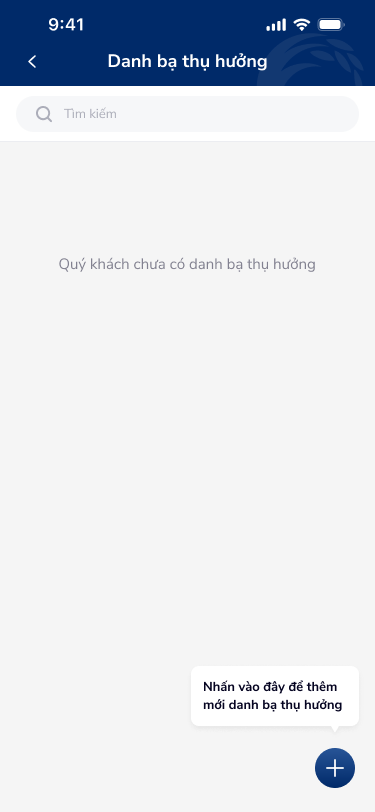
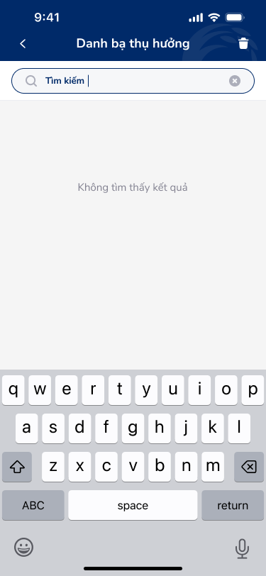
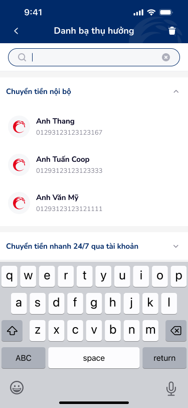
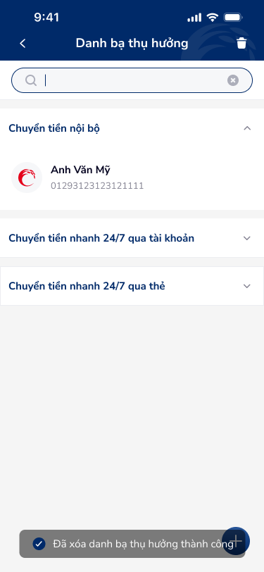

# SCR-DB-002 — Danh bạ thụ hưởng › Tìm kiếm

> `SCR-DB-002` · list · 4 artboards

## 1. User Flow

| Bước | Hành động | Kết quả |
|------|-----------|---------|
| 1 | Tap vào search bar | Focus search, hiện keyboard |
| 2 | Nhập text tìm kiếm | Filter danh sách realtime |
| 3 | Kết quả khớp | Hiển thị contacts phù hợp |
| 4 | Không tìm thấy | Hiện "Không tìm thấy kết quả" |
| 5 | Clear search (x) | Quay về danh sách đầy đủ |
| 6 | Nhấn FAB (+) | Chuyển sang Thêm mới (SCR-DB-004) |

## 2. User Story

**US-003:** Là khách hàng, tôi muốn tìm kiếm nhanh beneficiary theo tên hoặc số tài khoản.

- AC1: Search bar với placeholder "Tìm kiếm"
- AC2: Filter realtime khi nhập
- AC3: Hiện empty state khi chưa có danh bạ
- AC4: Hiện no-results state khi không khớp
- AC5: Annotation hướng dẫn thêm mới khi chưa có danh bạ

## 3. Mô tả màn hình (Wireframe)

### Variants

| # | Variant | Ảnh | Mô tả |
|---|---------|-----|-------|
| 1 | Empty state |  | "Quý khách chưa có danh bạ thụ hưởng" + annotation thêm mới |
| 2 | No results + keyboard |  | "Tìm kiếm |" active + "Không tìm thấy kết quả" + keyboard |
| 3 | Search active + keyboard |  | Focus search, keyboard hiện, danh sách phía trên |
| 4 | Filtered results + toast |  | Kết quả lọc 1 contact + toast "Đã xóa danh bạ thụ hưởng thành công" |

### Thành phần UI

| Thành phần | Loại | Mô tả |
|------------|------|-------|
| Header | Navigation bar | "Danh bạ thụ hưởng", back arrow, trash icon |
| Search bar | Text input | Focus state với clear (x), keyboard |
| Empty state | Illustration + text | "Quý khách chưa có danh bạ thụ hưởng" |
| No results | Text message | "Không tìm thấy kết quả" |
| Annotation | Callout bubble | "Nhấn vào đây để thêm mới danh bạ thụ hưởng" → FAB |
| Toast success | Notification banner | "Đã xóa danh bạ thụ hưởng thành công" + check icon |
| FAB | Floating action button | Icon + circle |

## 4. Database / Entities

| Entity | Fields | Constraints |
|--------|--------|-------------|
| Beneficiary | name, account_number | Search trên name + account_number (LIKE) |

## 5. NFR

- **Hiệu năng:** Search filter \< 300ms
- **Trải nghiệm:** Clear button khi có text, keyboard dismiss on scroll
