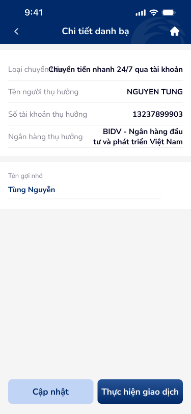
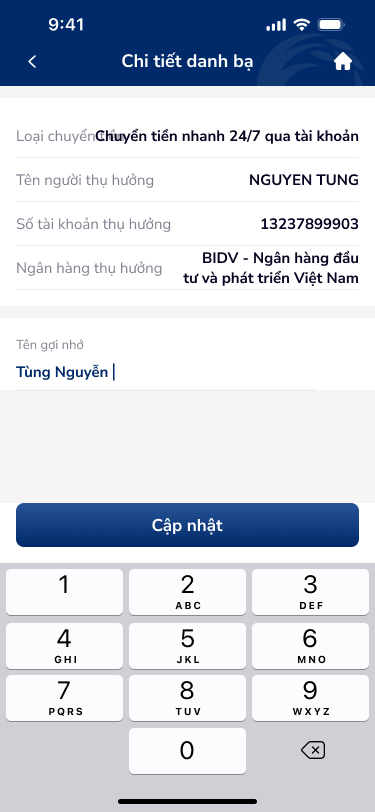
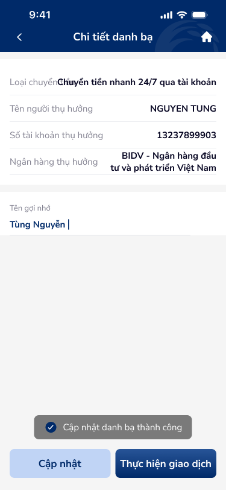

# SCR-DB-003 — Danh bạ thụ hưởng › Chi tiết

> `SCR-DB-003` · detail · 3 artboards

## 1. User Flow

| Bước | Hành động | Kết quả |
|------|-----------|---------|
| 1 | Nhấn vào contact trong danh sách | Hiển thị chi tiết beneficiary |
| 2 | Xem thông tin | Loại chuyển tiền, tên, số TK, ngân hàng, tên gợi nhớ |
| 3 | Nhấn "Cập nhật" | Chuyển chế độ edit, hiện keyboard |
| 4 | Sửa tên gợi nhớ | Edit inline, keyboard hiện |
| 5 | Nhấn "Cập nhật" (edit mode) | Lưu thay đổi, toast "Cập nhật danh bạ thành công" |
| 6 | Nhấn "Thực hiện giao dịch" | Chuyển sang flow chuyển tiền với beneficiary này |

## 2. User Story

**US-004:** Là khách hàng, tôi muốn xem và chỉnh sửa thông tin beneficiary đã lưu.

- AC1: Hiện đầy đủ: loại chuyển tiền, tên, số TK, ngân hàng, tên gợi nhớ
- AC2: Cho phép edit tên gợi nhớ
- AC3: Toast confirm sau khi cập nhật thành công
- AC4: CTA "Thực hiện giao dịch" shortcut chuyển tiền

## 3. Mô tả màn hình (Wireframe)

### Variants

| # | Variant | Ảnh | Mô tả |
|---|---------|-----|-------|
| 1 | View mode |  | Xem chi tiết, 2 CTA dưới cùng |
| 2 | Edit mode + keyboard |  | Edit tên gợi nhớ, keyboard số hiện, 1 CTA |
| 3 | Update success |  | Toast "Cập nhật danh bạ thành công" + 2 CTA |

### Thành phần UI

| Thành phần | Loại | Mô tả |
|------------|------|-------|
| Header | Navigation bar | "Chi tiết danh bạ", back arrow, home icon |
| Info rows | Label-value pairs | 4 rows: loại chuyển tiền, tên, số TK, ngân hàng |
| Tên gợi nhớ | Editable text field | Cho phép sửa |
| CTA Cập nhật | Button secondary | Border button bên trái |
| CTA Thực hiện giao dịch | Button primary | Filled button bên phải |
| Toast success | Notification banner | "Cập nhật danh bạ thành công" |

## 4. Database / Entities

| Entity | Fields | Constraints |
|--------|--------|-------------|
| Beneficiary | transfer_type, beneficiary_name, account_number, bank_name, alias | alias: editable, max 50 chars |

## 5. NFR

- **Bảo mật:** Không cho phép sửa số TK (chỉ tên gợi nhớ)
- **Trải nghiệm:** Toast confirm sau cập nhật, CTA shortcut chuyển tiền
