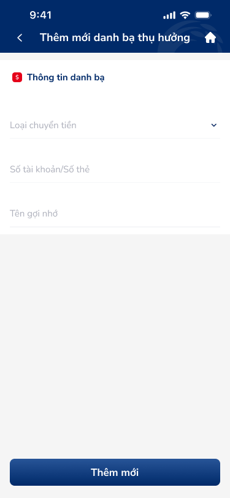
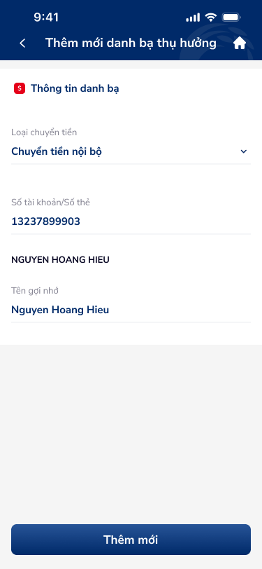
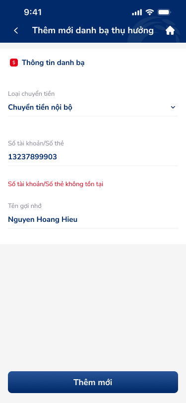
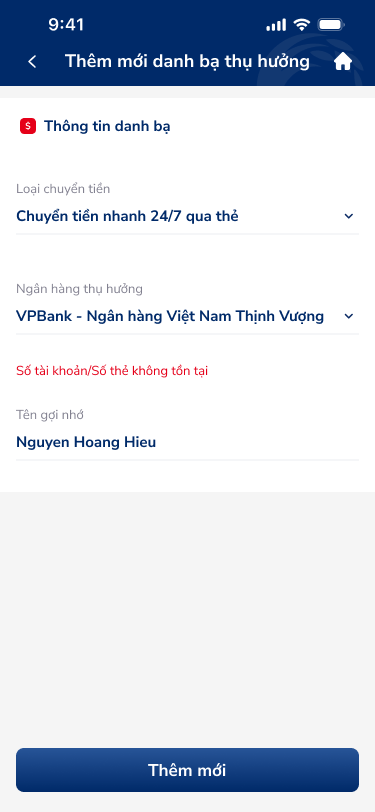

# SCR-DB-004 — Danh bạ thụ hưởng › Form nhập thông tin

> `SCR-DB-004` · form · 4 artboards

## 1. User Flow

| Bước | Hành động | Kết quả |
|------|-----------|---------|
| 1 | Nhấn FAB (+) từ danh sách | Mở form thêm mới |
| 2 | Chọn loại chuyển tiền (dropdown) | Form thay đổi fields theo loại |
| 3 | Nhập số tài khoản/số thẻ | Auto-resolve tên người thụ hưởng |
| 4 | Nếu số TK không tồn tại | Hiện error "Số tài khoản/Số thẻ không tồn tại" |
| 5 | Nhập tên gợi nhớ | Tùy chọn, auto-fill từ tên người thụ hưởng |
| 6 | Chọn ngân hàng (nếu qua thẻ) | Dropdown ngân hàng thụ hưởng |
| 7 | Nhấn "Thêm mới" | Lưu beneficiary, quay về danh sách |

## 2. User Story

**US-005:** Là khách hàng, tôi muốn thêm mới beneficiary để lưu cho lần chuyển tiền sau.

- AC1: Chọn loại chuyển tiền từ dropdown
- AC2: Nhập số TK/thẻ → auto-resolve tên (nếu hợp lệ)
- AC3: Hiện error nếu số TK/thẻ không tồn tại
- AC4: Form dynamic: "qua thẻ" thêm field ngân hàng thụ hưởng
- AC5: Tên gợi nhớ tùy chọn, auto-fill
- AC6: Button "Thêm mới" chỉ enable khi form valid

## 3. Mô tả màn hình (Wireframe)

### Variants

| # | Variant | Ảnh | Mô tả |
|---|---------|-----|-------|
| 1 | Form trống (nội bộ) |  | 3 fields: loại CT, số TK, tên gợi nhớ |
| 2 | Form filled (valid) |  | Auto-resolved "NGUYEN HOANG HIEU" |
| 3 | Form error (nội bộ) |  | Error đỏ "Số tài khoản/Số thẻ không tồn tại" |
| 4 | Form error (qua thẻ) |  | 4 fields: thêm ngân hàng VPBank, error đỏ |

### Thành phần UI

| Thành phần | Loại | Mô tả |
|------------|------|-------|
| Header | Navigation bar | "Thêm mới danh bạ thụ hưởng", back, home |
| Section title | Section header | Icon + "Thông tin danh bạ" |
| Dropdown Loại CT | Select/Picker | "Chuyển tiền nội bộ" / "24/7 qua thẻ" |
| Input Số TK/Thẻ | Text input | Auto-resolve name |
| Auto-resolved name | Display text | Tên đầy đủ (UPPERCASE) |
| Error message | Inline error | Đỏ dưới field |
| Input Tên gợi nhớ | Text input | Tùy chọn |
| Dropdown Ngân hàng | Select/Picker | Chỉ hiện khi "qua thẻ" |
| CTA Thêm mới | Button primary | Full-width dưới cùng |

## 4. Database / Entities

| Entity | Fields | Constraints |
|--------|--------|-------------|
| Beneficiary | transfer_type, account_number, beneficiary_name, bank_name, alias | account_number: validated against bank API |

## 5. NFR

- **Bảo mật:** Validate số TK/thẻ qua bank API trước khi lưu
- **Hiệu năng:** Auto-resolve tên < 2s (Doherty threshold)
- **Trải nghiệm:** Inline error rõ ràng, form dynamic theo loại chuyển tiền
