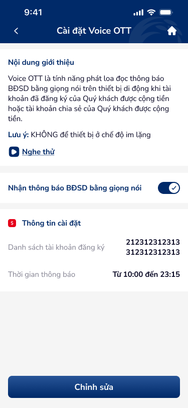
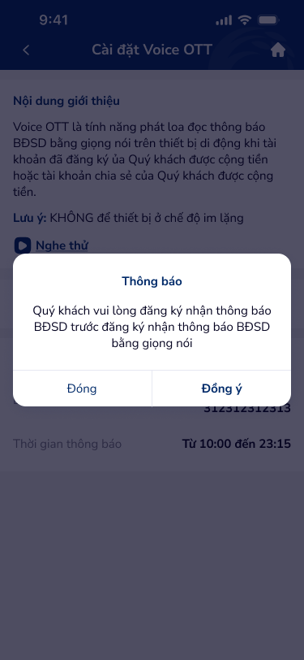
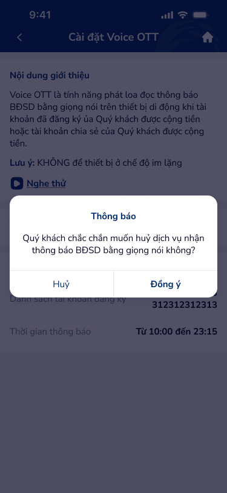
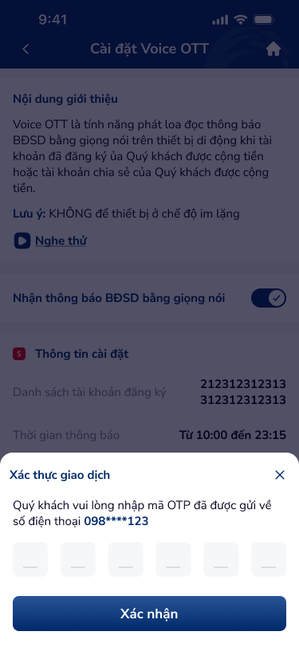
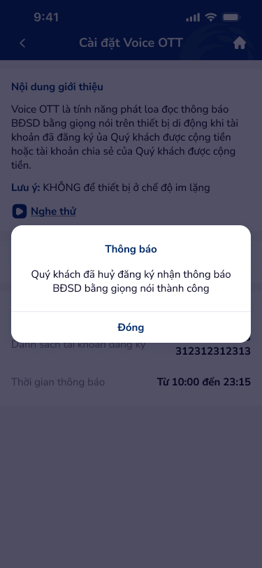

# SCR-VOT-001 — Huỷ Voice OTT › Chi tiết & Xác nhận

**Screen ID:** SCR-VOT-001  
**Section:** Cài đặt Voice OTT › Huỷ Voice OTT  
**Screen Type:** detail (main screen + 4 overlays)  
**Figma Artboards:** 7101 (main), 7100 (overlay: prerequisite popup), 7102 (overlay: confirm popup), 7103 (overlay: OTP bottom-sheet), 7104 (overlay: success popup)  
**Wireframe Images:** `ui/7101-huy-yang-ky-voice.png`, `ui/7100-huy-yang-ky-voice.png`, `ui/7102-huy-yang-ky-voice.png`, `ui/7103-huy-yang-ky-voice.png`, `ui/7104-huy-yang-ky-voice.png`

---

## 1. Overview

Màn hình chi tiết Voice OTT dành cho khách hàng đã đăng ký dịch vụ. Hiển thị thông tin giới thiệu dịch vụ, trạng thái toggle đang ON, danh sách tài khoản đăng ký, và khung giờ thông báo. Luồng huỷ dịch vụ: tap toggle OFF → popup xác nhận → nhập OTP (bottom-sheet) → popup kết quả thành công.

**Product:** Co-opBank Mobile Banking  
**Domain:** Banking / Dịch vụ thông báo  
**Entry Point:** Cài đặt Voice OTT (khi đã đăng ký)

---

## 2. User Story

**Tiêu đề:** Huỷ dịch vụ Voice OTT

**Vai trò:** Khách hàng đã đăng ký Voice OTT

**Kịch bản:**
- **Main state:** "Là khách hàng đã đăng ký Voice OTT, tôi muốn xem trạng thái dịch vụ hiện tại gồm tài khoản đăng ký và khung giờ thông báo."
- **Huỷ flow:** "Là khách hàng, tôi muốn huỷ dịch vụ Voice OTT bằng cách tắt toggle, xác nhận qua dialog, và xác thực OTP."
- **Prerequisite flow:** "Nếu chưa đăng ký nhận thông báo BĐSD, hệ thống yêu cầu thực hiện trước khi sử dụng Voice OTT."

**Acceptance Criteria:**
- Toggle hiển thị trạng thái ON (đã đăng ký)
- Tap toggle OFF → popup confirm "Quý khách chắc chắn muốn huỷ dịch vụ...?"
- Chọn "Đồng ý" → bottom-sheet OTP "Xác thực giao dịch" với 6 ô digit-input, số điện thoại masking
- OTP nhập đúng → popup thành công "Quý khách đã huỷ đăng ký...thành công", CTA "Đóng"
- Hiển thị danh sách tài khoản đăng ký (account numbers)
- Hiển thị khung giờ thông báo hiện tại
- CTA "Chỉnh sửa" navigate sang form cài đặt

---

## 3. Screen Text (OCR)

| # | Text | Location | Type |
|---|------|----------|------|
| 1 | Cài đặt Voice OTT | Header nav bar center | Title |
| 2 | Nội dung giới thiệu | Section header | Section-header |
| 3 | Voice OTT là tính năng phát loa đọc thông báo BĐSD bằng giọng nói trên thiết bị di động khi tài khoản đã đăng ký của Quý khách được cộng tiền hoặc tài khoản chia sẻ của Quý khách được cộng tiền. | Body text | Body |
| 4 | Lưu ý: KHÔNG để thiết bị ở chế độ im lặng | Warning text | Warning |
| 5 | Nghe thử | Inline link action | Link-action |
| 6 | Nhận thông báo BĐSD bằng giọng nói | Toggle label | Toggle-label |
| 7 | Thông tin cài đặt | Section header | Section-header |
| 8 | Danh sách tài khoản đăng ký | Field label | Label |
| 9 | 212312312313 | Account number value | Account-number |
| 10 | 312312312313 | Account number value | Account-number |
| 11 | Thời gian thông báo | Field label | Label |
| 12 | Từ 10:00 đến 23:15 | Time range value | Value |
| 13 | Chỉnh sửa | Primary CTA button | CTA |
| 14 | Thông báo | Popup title (prerequisite & confirm) | Dialog-title |
| 15 | Quý khách vui lòng đăng ký nhận thông báo BĐSD trước đăng ký nhận thông báo BĐSD bằng giọng nói | Dialog body (prerequisite) | Dialog-body |
| 16 | Đóng | Secondary action (prerequisite dialog) | Dialog-action |
| 17 | Đồng ý | Primary action (prerequisite & confirm) | Dialog-action-primary |
| 18 | Quý khách chắc chắn muốn huỷ dịch vụ nhận thông báo BĐSD bằng giọng nói không? | Dialog body (confirm) | Dialog-body |
| 19 | Huỷ | Secondary action (confirm dialog) | Dialog-action |
| 20 | Xác thực giao dịch | Bottom-sheet title | Sheet-title |
| 21 | Quý khách vui lòng nhập mã OTP đã được gửi về số điện thoại 098****123 | OTP instruction | Instruction |
| 22 | Xác nhận | Primary CTA (OTP sheet) | CTA |
| 23 | Quý khách đã huỷ đăng ký nhận thông báo BĐSD bằng giọng nói thành công | Success message | Success |
| 24 | Đóng | Close action (success popup) | Dialog-action |

**Icon Inventory:**
- `back_arrow` — top-left header, navigation (back)
- `home_icon` — top-right header, navigation (home)
- `play_circle` — inline left of "Nghe thử", trigger (audio preview)
- `toggle_on` (44×24) — right of toggle label, trigger (toggle OFF to cancel)
- `section_icon_s` (red) — left of "Thông tin cài đặt", decoration
- `close_x` — top-right of OTP bottom-sheet, close affordance

---

## 4. PRD (Augmented)

### 4.1 Feature Specification

**Feature name:** Quản lý & Huỷ dịch vụ Voice OTT

**Components:**
- **Intro Box (Voice_intro_box):** Nội dung giới thiệu + warning + "Nghe thử" link
- **Toggle Row:** Label "Nhận thông báo BĐSD bằng giọng nói" + Toggle ON/OFF
- **Info Section — Accounts:** Label + danh sách số tài khoản (multi-line)
- **Info Section — Time:** Label "Thời gian thông báo" + time range value
- **Primary CTA:** Button "Chỉnh sửa" (full-width, fixed bottom)
- **Overlay: Prerequisite Popup:** Modal dialog — đăng ký BĐSD trước | "Đóng" / "Đồng ý"
- **Overlay: Confirm Popup:** Modal dialog — xác nhận huỷ | "Huỷ" / "Đồng ý"
- **Overlay: OTP Bottom-Sheet:** Bottom sheet "Xác thực giao dịch" + 6×digit-input + "Xác nhận" CTA
- **Overlay: Success Popup:** Modal dialog — huỷ thành công | "Đóng"

### 4.2 Information Architecture

```
Cài đặt Voice OTT (đã đăng ký) — SCR-VOT-001
├── Nav Bar [back | title | home]
├── Intro Box
│   ├── "Nội dung giới thiệu" section header
│   ├── Body text (Voice OTT description)
│   ├── Warning text (không im lặng)
│   └── "Nghe thử" link action
├── Toggle Row
│   └── Toggle: Nhận thông báo BĐSD [ON state]
├── Info Section: Thông tin cài đặt
│   ├── Account list (2+ account numbers)
│   └── Time range: Từ {HH:mm} đến {HH:mm}
├── CTA: "Chỉnh sửa" [bottom]
└── Overlays (triggered):
    ├── Prerequisite Popup [if BĐSD not setup]
    ├── Confirm Popup [toggle OFF tap]
    ├── OTP Bottom-Sheet [after Đồng ý]
    └── Success Popup [after OTP verify]
```

### 4.3 States

| State | Trigger | UI |
|-------|---------|-----|
| Registered (main) | Entry từ menu | Toggle ON, danh sách tài khoản + giờ, CTA "Chỉnh sửa" |
| Prerequisite warning | Tap toggle (BĐSD chưa setup) | Popup "Đăng ký BĐSD trước" |
| Confirm cancel | Tap toggle OFF (BĐSD ok) | Popup "Chắc chắn muốn huỷ?" |
| OTP input | Tap "Đồng ý" trong confirm | Bottom-sheet OTP 6 digits |
| Success | OTP verified | Popup "Huỷ thành công", Đóng |
| Post-cancel | Tap "Đóng" success | Return đến màn hình (toggle OFF state) |

### 4.4 Business Logic

- Toggle ON = đang đăng ký dịch vụ Voice OTT
- Tap toggle OFF → hệ thống check prerequisite BĐSD trước:
  - Nếu chưa đăng ký BĐSD → popup prerequisite (không tiếp tục huỷ)
  - Nếu đã đăng ký BĐSD → popup confirm cancel
- OTP gửi về SĐT đã đăng ký (hiển thị masking: `098****123`)
- Sau huỷ thành công → dịch vụ deactivated, toggle về OFF
- Account numbers hiển thị không masking (đây là số tài khoản ngân hàng, không phải SĐT)
- Khung giờ từ `Từ {HH:mm} đến {HH:mm}` — nếu rỗng = không giới hạn

### 4.5 NFR (Non-Functional Requirements)

| # | Requirement | Target |
|---|------------|--------|
| NFR-1 | OTP timeout | Hiển thị countdown timer (không thấy trong thiết kế hiện tại) |
| NFR-2 | OTP resend | Nút "Gửi lại OTP" sau timeout |
| NFR-3 | Masking SĐT | 098****123 (4-digit mask, chuẩn banking) |
| NFR-4 | Accessibility | WCAG AA, digit-input cells ≥44px |
| NFR-5 | Security | Không hiển thị OTP, clear input khi back |
| NFR-6 | Loading state | Button loading khi submit OTP |

---

## 5. UX Signal Extensions (Phase 4e)

> _Sinh bởi `ux-signal-inference` skill — scope=screen, domain=banking, output=prd_extension_

**UX Signals detected (từ registry match):**

| Signal | Pattern Group | Tags | DDL Ref (from ux-guidelines.csv) |
|--------|-------------|------|----------------------------------|
| "Thông báo — popup confirm huỷ" | `confirm_dialog` | `confirm_dialog`, `destructive` | **UXG-35** [High] Confirmation Dialogs |
| "Huỷ đăng ký thành công" | success_state | `success_state`, `feedback` | **UXG-34** [Medium] Success Feedback · **UXG-83** [Medium] Confirmation Messages |
| "Xác thực giao dịch — OTP" | otp_auth | `otp_auth`, `security_flow` | **UXG-33** [High] Error Feedback · **UXG-10** [High] Loading States |
| "Lưu ý: KHÔNG..." | warning_notice | `warning_notice` | **UXG-33** [High] Error Feedback |
| "Nghe thử" | media_preview | `media_preview` | **UXG-34** [Medium] Success Feedback (play state) |

**prd_extension flows (Phase 4e inferred):**
- `confirm_dialog` → **Flow**: Trigger (toggle OFF) → Confirm Dialog → [Confirm: continue] / [Cancel: dismiss]. DDL ref: UXG-35
- `otp_auth` → **Flow**: Confirm Dialog Accepted → OTP Input Sheet → [Submit: result] / [Timeout: resend]. DDL ref: UXG-10, UXG-33
- `success_state` → **Flow**: OTP Verified → Success Popup → [Close: return to base]. DDL ref: UXG-34, UXG-83

**prd_extension components (Phase 4e inferred):**
- `confirm_dialog` → Component: **Modal Dialog** — 2 CTA (destructive primary, cancel secondary). DDL ref: UXG-35
- `otp_auth` → Component: **OTP Input** (6-cell, auto-focus, paste support) + **Countdown Timer** + Resend. DDL ref: UXG-10
- `success_state` → Component: **Success Toast/Modal** — positive icon + message + close. DDL ref: UXG-83
- `warning_notice` → Component: **Inline Warning** — highlighted callout. DDL ref: UXG-33

---

## 6. Flow (Navigation)

| Trigger | Action | Destination |
|---------|--------|-------------|
| Back arrow | Navigate back | Cài đặt voice OTT main |
| Home icon | Navigate | Trang chủ |
| "Nghe thử" tap | In-app audio | Audio playback (inline) |
| Toggle OFF (prerequisite) | Show overlay | Prerequisite popup (7100) |
| Toggle OFF (ok) | Show overlay | Confirm popup (7102) |
| Confirm popup "Đồng ý" | Show overlay | OTP bottom-sheet (7103) |
| Confirm popup "Huỷ" | Dismiss overlay | Return to main state |
| OTP "Xác nhận" | API call → Show overlay | Success popup (7104) |
| Success popup "Đóng" | Dismiss + state update | SCR-VOT-001 (toggle OFF) |
| "Chỉnh sửa" button | Navigate | SCR-VOT-002 (form cài đặt) |

---

## 7. Wireframe Screenshots






