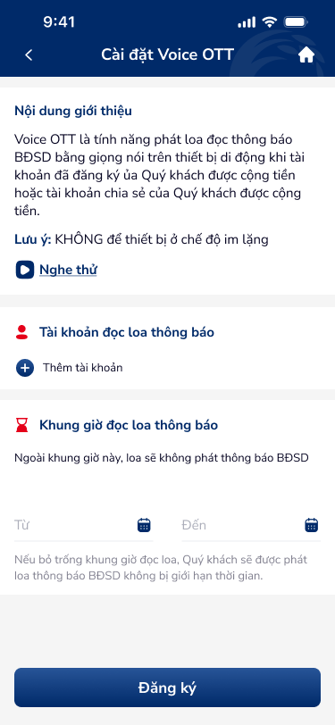

# SCR-VOT-002 — Huỷ Voice OTT › Form cài đặt

**Screen ID:** SCR-VOT-002  
**Section:** Cài đặt Voice OTT › Huỷ Voice OTT  
**Screen Type:** form  
**Figma Artboards:** 7105 (1 artboard)  
**Wireframe Images:** `ui/7105-huy-yang-ky-voice.png`

---

## 1. Overview

Màn hình form cài đặt dịch vụ Voice OTT — thêm tài khoản đọc loa và thiết lập khung giờ thông báo. Được navigate từ SCR-VOT-001 qua CTA "Chỉnh sửa", hoặc là màn hình đăng ký mới khi chưa có cài đặt. Time-picker "Từ/Đến" với calendar icon; nếu để trống = phát loa không giới hạn thời gian. CTA chính là "Đăng ký".

**Product:** Co-opBank Mobile Banking  
**Domain:** Banking / Dịch vụ thông báo  
**Entry Point:** SCR-VOT-001 → "Chỉnh sửa"

---

## 2. User Story

**Tiêu đề:** Cài đặt tài khoản và khung giờ Voice OTT

**Vai trò:** Khách hàng muốn cài đặt/chỉnh sửa Voice OTT

**Kịch bản:**
- **Thêm tài khoản:** "Là khách hàng, tôi muốn thêm tài khoản ngân hàng để nhận đọc loa thông báo số dư."
- **Thiết lập khung giờ:** "Là khách hàng, tôi muốn giới hạn khung giờ đọc loa để không bị làm phiền ngoài giờ làm việc."
- **Không giới hạn giờ:** "Là khách hàng, tôi muốn nhận thông báo 24/7 bằng cách bỏ trống khung giờ."

**Acceptance Criteria:**
- Section "Tài khoản đọc loa thông báo" với "+" Thêm tài khoản
- Section "Khung giờ đọc loa thông báo" với 2 field "Từ" và "Đến" (time-picker)
- Hint text: "Ngoài khung giờ này, loa sẽ không phát thông báo BĐSD"
- Footer hint: "Nếu bỏ trống khung giờ đọc loa, Quý khách sẽ được phát loa thông báo BĐSD không bị giới hạn thời gian."
- CTA "Đăng ký" (full-width, fixed bottom) để save cài đặt

---

## 3. Screen Text (OCR)

| # | Text | Location | Type |
|---|------|----------|------|
| 1 | Cài đặt Voice OTT | Header nav bar center | Title |
| 2 | Nội dung giới thiệu | Section header | Section-header |
| 3 | Voice OTT là tính năng phát loa đọc thông báo BĐSD bằng giọng nói trên thiết bị di động khi tài khoản đã đăng ký của Quý khách được cộng tiền hoặc tài khoản chia sẻ của Quý khách được cộng tiền. | Body text | Body |
| 4 | Lưu ý: KHÔNG để thiết bị ở chế độ im lặng | Warning text | Warning |
| 5 | Nghe thử | Inline link action | Link-action |
| 6 | Tài khoản đọc loa thông báo | Section header (red icon) | Section-header |
| 7 | Thêm tài khoản | Add action link | Link-action |
| 8 | Khung giờ đọc loa thông báo | Section header (red timer icon) | Section-header |
| 9 | Ngoài khung giờ này, loa sẽ không phát thông báo BĐSD | Hint text below section header | Hint |
| 10 | Từ | Time-from field label | Field-label |
| 11 | Đến | Time-to field label | Field-label |
| 12 | Nếu bỏ trống khung giờ đọc loa, Quý khách sẽ được phát loa thông báo BĐSD không bị giới hạn thời gian. | Footer hint | Footer-hint |
| 13 | Đăng ký | Primary CTA button | CTA |

**Icon Inventory:**
- `back_arrow` — top-left header, navigation (back)
- `home_icon` — top-right header, navigation (home)
- `play_circle` — inline left of "Nghe thử", trigger (audio preview)
- `section_icon_person` (red) — left of "Tài khoản đọc loa thông báo", decoration
- `add_circle_plus` — inline left of "Thêm tài khoản", trigger
- `section_icon_timer` (red) — left of "Khung giờ đọc loa thông báo", decoration
- `calendar_from` — inline right of "Từ" field, trigger (open time-picker)
- `calendar_den` — inline right of "Đến" field, trigger (open time-picker)

---

## 4. PRD (Augmented)

### 4.1 Feature Specification

**Feature name:** Form cài đặt Voice OTT (tài khoản + khung giờ)

**Components:**
- **Intro Box (Voice_intro_box):** Nội dung giới thiệu + warning + "Nghe thử" link (shared với SCR-VOT-001)
- **Account Section:**
  - Section header (person icon đỏ) + label "Tài khoản đọc loa thông báo"
  - Row "+ Thêm tài khoản" (plus icon + text link)
  - [Danh sách tài khoản đã thêm — nếu có]
- **Time Section:**
  - Section header (timer icon đỏ) + label "Khung giờ đọc loa thông báo"
  - Hint text: "Ngoài khung giờ này..."
  - Time-picker row: "Từ [__:__][cal]" — "Đến [__:__][cal]"
  - Footer hint: "Nếu bỏ trống..."
- **Primary CTA:** Button "Đăng ký" (full-width, fixed bottom)

### 4.2 Information Architecture

```
Form cài đặt Voice OTT — SCR-VOT-002
├── Nav Bar [back | Cài đặt Voice OTT | home]
├── Intro Box
│   ├── "Nội dung giới thiệu" section header
│   ├── Body text (Voice OTT description)
│   ├── Warning text (không im lặng)
│   └── "Nghe thử" link action
├── Account Section
│   ├── Header: [person-icon] Tài khoản đọc loa thông báo
│   ├── Linked accounts list [if any]
│   └── [+] Thêm tài khoản
├── Time Section
│   ├── Header: [timer-icon] Khung giờ đọc loa thông báo
│   ├── Hint: "Ngoài khung giờ này, loa sẽ không phát..."
│   ├── Time Field: Từ [HH:mm] [calendar]
│   ├── Time Field: Đến [HH:mm] [calendar]
│   └── Footer hint: "Nếu bỏ trống..."
└── CTA: "Đăng ký" [bottom]
```

### 4.3 States

| State | Trigger | UI |
|-------|---------|-----|
| Empty form | Entry mới (chưa có cài đặt) | Account list = rỗng, time fields = trống |
| Editing (from SCR-VOT-001) | Tap "Chỉnh sửa" | Pre-filled với cài đặt hiện tại |
| Account added | Tap "+ Thêm tài khoản" | Account row xuất hiện trong list |
| Time set | Tap calendar icon → picker | HH:mm value điền vào field |
| Submit loading | Tap "Đăng ký" | Button loading state |
| Success | API response | Navigate về SCR-VOT-001 (hoặc success state) |

### 4.4 Business Logic

- Tài khoản đọc loa: có thể thêm nhiều tài khoản ngân hàng của khách
- Khung giờ "Từ" và "Đến": nếu bỏ trống cả 2 → phát loa 24/7
- Nếu chỉ set 1 field → validation error (phải set cả 2)
- "Đăng ký" label mây gây nhầm lẫn nếu đây là màn edit — nên là "Lưu cài đặt"
- Calendar icon trigger: mở time-picker dialog (HH:mm format)
- Intro Box (Nội dung giới thiệu) là shared component, giống hệt SCR-VOT-001

### 4.5 NFR (Non-Functional Requirements)

| # | Requirement | Target |
|---|------------|--------|
| NFR-1 | Time picker format | HH:mm (24-hour), no AM/PM |
| NFR-2 | Account validation | Chỉ cho phép tài khoản của chính khách hàng |
| NFR-3 | Accessibility | WCAG AA, time fields ≥44px touch target |
| NFR-4 | Empty validation | "Đăng ký" disabled khi chưa có tài khoản nào |
| NFR-5 | Time validation | Từ < Đến (không cho phép Từ ≥ Đến) |

---

## 5. UX Signal Extensions (Phase 4e)

> _Sinh bởi `ux-signal-inference` skill — scope=screen, domain=banking, output=prd_extension_

**UX Signals detected (từ registry match):**

| Signal | Pattern Group | Tags | DDL Ref (from ux-guidelines.csv) |
|--------|-------------|------|----------------------------------|
| "Thêm tài khoản" | add_item | `add_item`, `list_management` | **UXG-61** [High] Forms / Submit Feedback |
| "Từ / Đến" (time-picker pair) | time_range_input | `time_range`, `paired_fields` | **UXG-33** [High] Error Feedback · **UXG-80** [Medium] Error Recovery |
| "Nếu bỏ trống..." | optional_field_hint | `optional_field`, `hint_text` | **UXG-79** [Medium] Empty States |
| "Đăng ký" (on edit context) | cta_label_mismatch | `cta_clarity` | **UXG-35** [High] Confirmation Dialogs |
| "Nghe thử" | media_preview | `media_preview` | **UXG-34** [Medium] Success Feedback |

**prd_extension flows (Phase 4e inferred):**
- `add_item` → **Flow**: Empty account list → [+ Thêm tài khoản] → Account Picker (EXT) → Account added to list. DDL ref: UXG-61
- `time_range_input` → **Flow**: Tap calendar icon → Time Picker Overlay → Select time → [Từ field populated]; same for [Đến]. DDL ref: UXG-33
- `cta_label_mismatch` → **Flow**: Save settings → [Đăng ký/Lưu] → Return to detail with updated data. DDL ref: UXG-35

**prd_extension components (Phase 4e inferred):**
- `add_item` → Component: **List + Add Row** — scrollable list với "+ Add" trigger row. DDL ref: UXG-61
- `time_range_input` → Component: **Time Range Picker** — paired fields (Từ/Đến) + validation: Từ < Đến. Error state: UXG-33
- `optional_field_hint` → Component: **Field Helper Text** — "Nếu bỏ trống..." hint below time section. DDL ref: UXG-79
- `cta_label_mismatch` → Component: **Context-aware CTA** — dynamic label based on create vs. edit mode. DDL ref: UXG-35

---

## 6. Flow (Navigation)

| Trigger | Action | Destination |
|---------|--------|-------------|
| Back arrow | Navigate back | SCR-VOT-001 (chi tiết) |
| Home icon | Navigate | Trang chủ |
| "Nghe thử" tap | In-app audio | Audio playback (inline) |
| "+ Thêm tài khoản" | Open picker | Account selection (EXT) |
| Calendar icon "Từ" | Open time-picker | Time picker overlay |
| Calendar icon "Đến" | Open time-picker | Time picker overlay |
| "Đăng ký" button | API call → Save | SCR-VOT-001 (updated) hoặc Success |

---

## 7. Wireframe Screenshots


