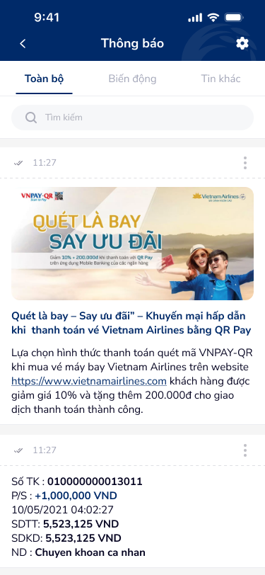
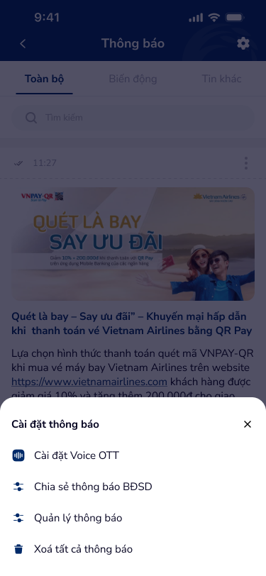

# SCR-DKV-001 — Thông báo › Danh sách

**Section:** Cài đặt Voice OTT / Đăng ký Voice  
**Screen ID:** SCR-DKV-001  
**Screen Type:** list  
**Display Name:** Thông báo › Danh sách  
**Figma Node:** 142:22694 (base), 142:22685 (overlay)

---

## Section 1: Overview

**Mục đích màn hình:**  
Danh sách thông báo của ứng dụng Co-opBank. Là entry point vào luồng Đăng ký Voice OTT thông qua bottom sheet "Cài đặt thông báo" xuất hiện khi nhấn icon cài đặt ở header.

**Người dùng mục tiêu:**  
Khách hàng Co-opBank muốn xem thông báo giao dịch/khuyến mại, hoặc muốn cài đặt Voice OTT lần đầu.

**Luồng trước:**  
Màn hình chính / Tab Thông báo

**Luồng sau:**  
SCR-DKV-002 (Cài đặt Voice OTT – Form đăng ký) qua menu item "Cài đặt Voice OTT"

---

## Section 2: Wireframes

---

## Section 3: Screen Content (OCR)

**Text nodes:**
- Header: "Thông báo"
- Tabs: "Toàn bộ", "Biến động", "Tin khác"
- Search: "Tìm kiếm"
- Notification items: "Quét là bay – Say ưu đãi", "Số TK: 010000000013011", "P/S: +1,000,000 VND", "SDTT: 5,523,125 VND", "SDKD: 5,523,125 VND", "ND: Chuyen khoan ca nhan"
- Bottom sheet title: "Cài đặt thông báo"
- Menu items: "Cài đặt Voice OTT", "Chia sẻ thông báo BĐSD", "Quản lý thông báo", "Xoá tất cả thông báo"

**Icon inventory:**
- `back_arrow` (header-left): navigate back
- `settings_gear` (header-right): trigger → open bottom sheet "Cài đặt thông báo"
- `tab_bar`: filter notifications
- `search_box`: search notifications

---

## Section 4: UX Signals

**Flow:** Notification list → Settings bottom sheet → Voice OTT entry  
**User Story:** Là khách hàng, tôi muốn truy cập cài đặt Voice OTT từ màn hình thông báo để không cần tìm trong menu chính  
**NFR:** Load time < 2s; thông báo hiển thị real-time; bottom sheet animation < 300ms

**UX Context:** Entry point cho tính năng Voice OTT. Bottom sheet cài đặt cung cấp 4 actions: Voice OTT, Chia sẻ, Quản lý, Xoá tất cả. Discoverability phụ thuộc vào icon gear ở header.

---

## Section 5: DDL References

**Component matches:** `app-header-1` (header)  
**UX Laws auto-matched:** N/A (list screen — no auto-trigger laws)  
**Guidelines:** UXG-165 (Touch targets ≥44px), UXG-243 (Visible navigation affordance)  
**Product context:** Banking/Traditional Finance — Security-first, Trust paramount
