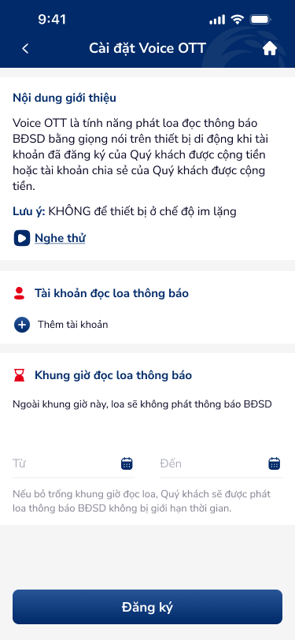
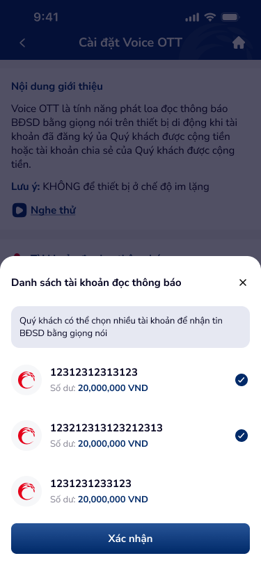

# SCR-DKV-002 — Cài đặt Voice OTT › Form nhập thông tin

**Section:** Cài đặt Voice OTT / Đăng ký Voice  
**Screen ID:** SCR-DKV-002  
**Screen Type:** form  
**Display Name:** Cài đặt Voice OTT › Form nhập thông tin  
**Figma Node:** 142:22701 (base), 142:22737 (overlay: account picker)

---

## Section 1: Overview

**Mục đích màn hình:**  
Form đăng ký Voice OTT. Người dùng cấu hình: (1) Danh sách tài khoản nhận thông báo bằng giọng nói, (2) Khung giờ phát loa thông báo. Overlay bottom sheet hiện khi nhấn "+ Thêm tài khoản" để chọn tài khoản từ danh sách.

**Người dùng mục tiêu:**  
Khách hàng Co-opBank lần đầu đăng ký dịch vụ Voice OTT (nhận thông báo BĐSD qua loa thiết bị).

**Luồng trước:**  
SCR-DKV-001 (menu "Cài đặt Voice OTT")

**Luồng sau:**  
SCR-DKV-003 (Xác nhận đăng ký) sau khi nhấn "Đăng ký"

---

## Section 2: Wireframes

---

## Section 3: Screen Content (OCR)

**Text nodes (form base):**
- Header: "Cài đặt Voice OTT"
- Intro box: "Nội dung giới thiệu", "Nghe thử"
- Section 1: "Tài khoản đọc loa thông báo", "Thêm tài khoản (+)"
- Section 2: "Khung giờ đọc loa thông báo"
- Warning: "Ngoài khung giờ này, loa sẽ không phát thông báo BĐSD"
- Fields: "Từ" (start time), "Đến" (end time)
- Helper: "Nếu bỏ trống khung giờ đọc loa, Quý khách sẽ được phát loa thông báo BĐSD không bị giới hạn thời gian."
- CTA: "Đăng ký"

**Text nodes (account picker overlay):**
- Sheet title: "Danh sách tài khoản đọc thông báo"
- Subtitle: "Quý khách có thể chọn nhiều tài khoản để nhận tin BĐSD bằng giọng nói"
- Account items: "12312312313123", "123212313123212313", "1231231233123"
- Balance: "Số dư: 20,000,000 VND"
- CTA: "Xác nhận"

**Icon inventory:**
- `back_arrow` (header-left): navigate back
- `play_listen` (intro-box): play voice sample
- `add_plus` (account-section): open account picker → `Bottom_sheet_TK`
- `time_picker_from` (schedule-left): pick start time
- `time_picker_to` (schedule-right): pick end time
- `checkboxes` (account-list): multi-select accounts

---

## Section 4: UX Signals

**Flow:** Empty form → Add accounts → Set time → Submit registration  
**User Story:** Là khách hàng, tôi muốn chọn nhiều tài khoản và đặt khung giờ nhận thông báo giọng nói để dịch vụ phù hợp nhu cầu của tôi  
**NFR:** Account picker load < 1s; time picker UX native; form validation inline; CTA disabled khi chưa chọn tài khoản

**UX Laws auto-matched:**
- **Fitts's Law** (trigger: CTA at bottom, time pickers)
- **Hick's Law** (trigger: multi-account selection, choice overload risk)

**UX Context:** Empty state form với "+ Thêm tài khoản". Khung giờ optional (helper text giải thích). Multi-select account picker. CTA "Đăng ký" ở bottom.

---

## Section 5: DDL References

**Component matches:**
- `app-header-1`: header (`activeIndex` state)
- `text-input-1`: time picker fields (states: `value`, `error`, `focused`)
- `otp-input-1`: NOT applicable here (account picker uses checkboxes)

**Guidelines:**
- UXG-165: Touch target ≥44px (Đăng ký CTA, time pickers)
- UXG-243: Form field labels always visible
- UXG-189: Helper text for optional fields

**Product context:** Banking — Trust paramount, Security-first
