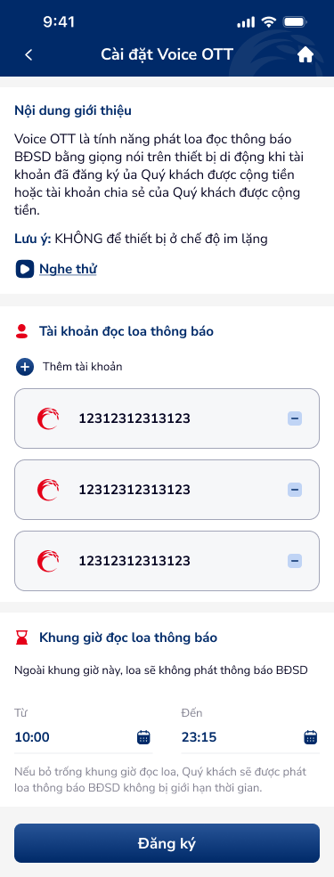
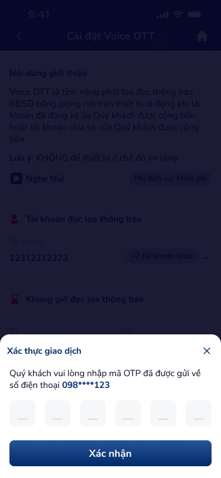
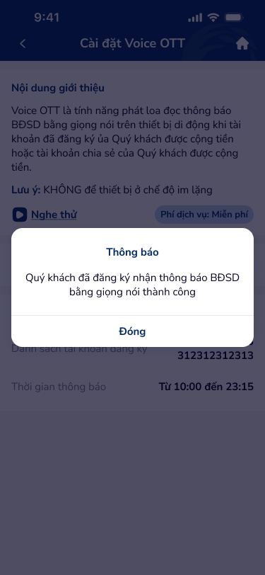

# SCR-DKV-003 — Cài đặt Voice OTT › Xác nhận giao dịch

**Section:** Cài đặt Voice OTT / Đăng ký Voice  
**Screen ID:** SCR-DKV-003  
**Screen Type:** confirm  
**Display Name:** Cài đặt Voice OTT › Xác nhận giao dịch  
**Figma Node:** 142:22753 (base), 142:22983 (OTP overlay), 142:22969 (success popup)

---

## Section 1: Overview

**Mục đích màn hình:**  
Màn hình xác nhận đăng ký Voice OTT với form đã điền đầy đủ. Sau khi nhấn "Đăng ký", hệ thống hiển thị bottom sheet OTP để xác thực giao dịch. Sau khi nhập OTP thành công, popup thành công xuất hiện và chuyển sang màn hình chi tiết.

**Người dùng mục tiêu:**  
Khách hàng đã hoàn thành cấu hình form và đang xác nhận đăng ký dịch vụ.

**Luồng trước:**  
SCR-DKV-002 (Form đăng ký) → nhấn "Đăng ký"

**Luồng sau:**  
SCR-DKV-004 (Chi tiết đã đăng ký) sau khi đóng popup thành công

---

## Section 2: Wireframes

---

## Section 3: Screen Content (OCR)

**Text nodes (form filled base):**
- Header: "Cài đặt Voice OTT"
- Intro box: "Nội dung giới thiệu", "Nghe thử"
- Section 1: "Tài khoản đọc loa thông báo", "12312312313123", "Thêm tài khoản"
- Section 2: "Khung giờ đọc loa thông báo"
- Warning: "Ngoài khung giờ này, loa sẽ không phát thông báo BĐSD"
- Time values: "10:00", "23:15"
- Helper: "Nếu bỏ trống khung giờ đọc loa, Quý khách sẽ được phát loa thông báo BĐSD không bị giới hạn thời gian."
- CTA: "Đăng ký"

**Text nodes (OTP overlay):**
- Sheet title: "Xác thực giao dịch"
- Instruction: "Quý khách vui lòng nhập mã OTP đã được gửi về số điện thoại 098****123"
- OTP input: 6 ô digit-input (44×44px each)
- CTA: "Xác nhận"

**Text nodes (success popup):**
- Popup title: "Thông báo"
- Message: "Quý khách đã đăng ký nhận thông báo BĐSD bằng giọng nói thành công"
- CTA: "Đóng"

**Icon inventory:**
- `back_arrow` (header-left): navigate back
- `play_listen` (intro-box): play voice sample
- `add_account_plus`: add more accounts
- `time_picker_start/end`: modify time
- `otp_input_cells_6` (6 digit-input instances, 44×44px): OTP entry
- `close_popup`: dismiss success

---

## Section 4: UX Signals

**Flow:** Filled form → OTP authentication → Success → Detail view  
**User Story:** Là khách hàng, tôi muốn xác nhận đăng ký bằng OTP để đảm bảo an toàn giao dịch  
**NFR:** OTP SMS delivery < 30s; auto-focus on first cell; 6-digit OTP; PII masking (098****123); resend timer

**UX Laws auto-matched:**
- **Fitts's Law** (trigger: OTP cells 44px, confirm CTA)
- **Hick's Law** (trigger: step-by-step không có nhiều lựa chọn tại OTP)
- **Peak-End Rule** (trigger: last interaction = success popup → phải positive)

**UX Context:** OTP bottom sheet phủ lên form đã điền. Form visible phía sau tạo context rõ ràng. Số điện thoại masked (PII). 6 ô OTP riêng biệt. Success popup là last impression trước detail view.

---

## Section 5: DDL References

**Component matches:**
- `otp-input-1`: OTP cells (states: `digits`, `activeIndex`, `canResend`, `timeLeft`)
  - Expected: `canResend` state + "Gửi lại" / resend timer UI
  - Expected: auto-focus progression between cells
  - Expected: paste support for OTP
- `app-header-1`: header
- `text-input-1`: time fields (Từ/Đến)

**Guidelines:**
- UXG-165: Touch targets ≥44px (OTP cells — đúng 44×44)
- UXG-199: PII masking cho sensitive data
- UXG-243: Error message cho OTP sai
- UXG-189: Resend timer countdown display

**Product context:** Banking — Security-first, Trust paramount (OTP critical flow)
