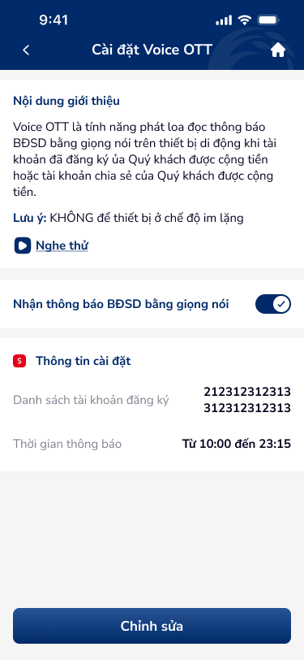

# SCR-DKV-004 — Cài đặt Voice OTT › Chi tiết

**Section:** Cài đặt Voice OTT / Đăng ký Voice  
**Screen ID:** SCR-DKV-004  
**Screen Type:** detail  
**Display Name:** Cài đặt Voice OTT › Chi tiết  
**Figma Node:** 142:22835 (base), 142:22848 (variant: playing state)

---

## Section 1: Overview

**Mục đích màn hình:**  
Màn hình xem thông tin đã đăng ký Voice OTT. Hiển thị: toggle bật/tắt nhận thông báo giọng nói, danh sách tài khoản đã đăng ký, khung giờ thông báo. Có thể nghe thử voice sample (2 trạng thái: idle / đang phát). Nút "Chỉnh sửa" cho phép quay về form chỉnh sửa.

**Người dùng mục tiêu:**  
Khách hàng đã đăng ký Voice OTT và muốn xem/toggle/chỉnh sửa cài đặt.

**Luồng trước:**  
SCR-DKV-003 (Đóng popup thành công) → hoặc re-entry từ menu

**Luồng sau:**  
SCR-DKV-002 (Form chỉnh sửa) sau khi nhấn "Chỉnh sửa"

---

## Section 2: Wireframes

---

## Section 3: Screen Content (OCR)

**Text nodes (base view):**
- Header: "Cài đặt Voice OTT"
- Intro box: "Nội dung giới thiệu", "Nghe thử"
- Toggle label: "Nhận thông báo BĐSD bằng giọng nói"
- Section: "Thông tin cài đặt"
- Sub-section: "Danh sách tài khoản đăng ký"
- Accounts: "212312312313", "312312312313"
- Sub-section: "Thời gian thông báo"
- Time range: "Từ 10:00 đến 23:15"
- CTA: "Chỉnh sửa"

**Text nodes (variant — playing state):**
- "Đang phát" (replaces "Nghe thử" when playing voice sample)

**Icon inventory:**
- `back_arrow` (header-left): navigate back
- `toggle_switch` (voice enable row): toggle Voice OTT on/off
- `play_listen` (intro-box, idle): play voice sample preview
- `playing_wave` (intro-box, variant): stop playing
- `edit_button` (bottom CTA): navigate to edit form

---

## Section 4: UX Signals

**Flow:** View settings → Toggle/Edit; Sample voice (Nghe thử → Đang phát)  
**User Story:** Là khách hàng đã đăng ký, tôi muốn xem thông tin cài đặt hiện tại và dễ dàng bật/tắt hoặc chỉnh sửa  
**NFR:** Toggle instant response (<100ms); Play voice sample streaming; Edit flow pre-fills form with current data

**UX Laws auto-matched:**
- **Fitts's Law** (trigger: toggle switch size 44×24, edit CTA)
- **Hick's Law** (trigger: minimal choices — toggle + edit only)

**UX Context:** Read-only view với 1 primary action (Chỉnh sửa) và 1 toggle. Voice sample preview có 2 states (Nghe thử / Đang phát). Toggle ở top cho quick enable/disable without entering edit mode.

---

## Section 5: DDL References

**Component matches:**
- `app-header-1`: header (back + title)
- `receipt-preview-1`: thông tin cài đặt layout (sections + items pattern)

**Component gaps expected:**
- Toggle component: DDL `toggle-1` if available — verify 44×24px size, correct color states
- Voice sample player: NOT in DDL standard components — custom implementation

**Guidelines:**
- UXG-165: Toggle touch target ≥44px (toggle is 44×24 — width ok, height borderline)
- UXG-243: Clear labeling for toggle states (on/off)
- UXG-189: "Đang phát" state feedback visible

**Product context:** Banking — Clear information architecture, trust in displayed data accuracy
