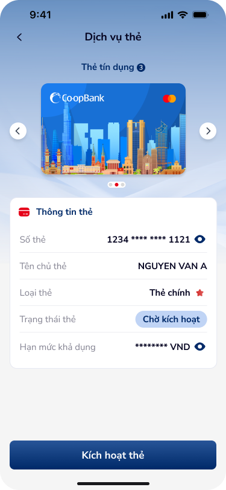
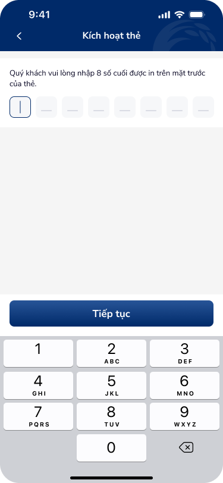
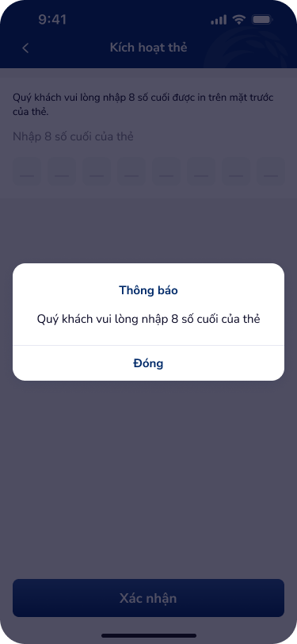

# SCR-KHT-001 — Kích hoạt thẻ › Form nhập thông tin

**Screen ID:** SCR-KHT-001  
**Display Name:** Kích hoạt thẻ › Form nhập thông tin  
**Screen Type:** Form nhập thông tin  
**Domain:** Banking  
**Artboards (6):** danh-sach-the-21.png, kich-hoat-the-1.png, kich-hoat-the-2.png, kich-hoat-the-case-loi-1.png, kich-hoat-the-case-loi-2.png, kich-hoat-the-case-loi-3.png

---

## Section 1 — Overview

### 1.1 Mục tiêu màn hình
Màn hình cho phép người dùng khởi động và thực hiện bước đầu tiên của luồng kích hoạt thẻ tín dụng/ghi nợ bằng cách nhập 8 số cuối in trên mặt trước của thẻ vật lý. Entry point từ màn hình Dịch vụ thẻ khi trạng thái thẻ là "Chờ kích hoạt".

### 1.2 User Story
> **Là** khách hàng vừa nhận thẻ mới,  
> **Tôi muốn** nhập 8 số cuối của thẻ để kích hoạt,  
> **Để** sử dụng thẻ cho các giao dịch thanh toán.

### 1.3 Entry & Exit
- **Entry:** Màn hình Dịch vụ thẻ (Danh sách thẻ) → tap "Kích hoạt thẻ" khi thẻ ở trạng thái "Chờ kích hoạt"
- **Exit success:** → SCR-KHT-002 (Xác thực OTP)
- **Exit error:** Hiển thị modal "Thông báo" với nút "Đóng" → quay lại form

### 1.4 NFR (Non-Functional Requirements)
- Keypad custom (không dùng system keyboard) để tránh lộ số trên clipboard
- Mask số thẻ sau khi nhập đủ (hiển thị dạng ••••••XX)
- Session timeout chuẩn banking: 5 phút không hoạt động

---

## Section 2 — Screen Wireframes

**Artboard References:**

| Artboard | Role | File |
|:---|:---|:---|
| Danh sách thẻ 21 | Entry point — card info + CTA | `ui/danh-sach-the-21.png` |
| Kích hoạt thẻ 1 | Form trống — initial state | `ui/kich-hoat-the-1.png` |
| Kích hoạt thẻ 2 | Variant — đang nhập | `ui/kich-hoat-the-2.png` |
| Case lỗi 1 | Modal: chưa nhập gì | `ui/kich-hoat-the-case-loi-1.png` |
| Case lỗi 2 | Modal: nhập chưa đủ 8 số | `ui/kich-hoat-the-case-loi-2.png` |
| Case lỗi 3 | Modal: số thẻ không chính xác | `ui/kich-hoat-the-case-loi-3.png` |

  

---

## Section 3 — Text Content & OCR

### 3.1 Text Inventory (OCR Full Table)

| Text | Type | Artboard | State |
|:---|:---|:---|:---|
| Dịch vụ thẻ | header | danh-sach-the-21.png | normal |
| Thông tin thẻ | label | danh-sach-the-21.png | normal |
| Số thẻ | label | danh-sach-the-21.png | normal |
| 1234 **** **** 1121 | body | danh-sach-the-21.png | masked |
| Tên chủ thẻ | label | danh-sach-the-21.png | normal |
| NGUYEN VAN A | body | danh-sach-the-21.png | normal |
| Loại thẻ | label | danh-sach-the-21.png | normal |
| Thẻ chính | body | danh-sach-the-21.png | normal |
| Trạng thái thẻ | label | danh-sach-the-21.png | normal |
| Chờ kích hoạt | status_badge | danh-sach-the-21.png | pending |
| Hạn mức khả dụng | label | danh-sach-the-21.png | normal |
| ******** VND | body | danh-sach-the-21.png | masked |
| Kích hoạt thẻ | button | danh-sach-the-21.png | active |
| Kích hoạt thẻ | header | kich-hoat-the-1.png | normal |
| Quý khách vui lòng nhập 8 số cuối được in trên mặt trước của thẻ. | body | kich-hoat-the-1.png | normal |
| Nhập 8 số cuối của thẻ | input_placeholder | kich-hoat-the-2.png | active |
| Tiếp tục | button | kich-hoat-the-1.png | active |
| Xác nhận | button | kich-hoat-the-2.png | active |
| Thông báo | modal_header | kich-hoat-the-case-loi-1.png | normal |
| Quý khách vui lòng nhập 8 số cuối của thẻ | body | kich-hoat-the-case-loi-1.png | error |
| Đóng | button | kich-hoat-the-case-loi-1.png | normal |
| Quý khách vui lòng nhập 8 số cuối của thẻ | body | kich-hoat-the-case-loi-2.png | error |
| 8 số cuối của thẻ không chính xác. Quý khách vui lòng nhập lại. | body | kich-hoat-the-case-loi-3.png | error |

### 3.2 Screen Context
Biên giao diện khởi đầu luồng Kích hoạt thẻ. Bao gồm màn hình thẻ "Chờ kích hoạt", form nhập 8 số cuối với custom keypad, và 3 dạng modal error validation.

---

## Section 4 — UX Signal Analysis (Phase 4e)

### 4.1 Consumer Payload
```json
{
  "text_list": ["Kích hoạt thẻ", "Nhập 8 số cuối thẻ", "Tiếp tục", "Chờ kích hoạt", "Thông báo", "Đóng"],
  "context_hints": "Card activation form. Custom numeric keypad. Modal error validation.",
  "ocr_icons": ["back_arrow", "eye_hide", "keyboard_delete", "card_icon"]
}
```

### 4.2 UX Signals Detected

| Signal | Category | Severity | DDL Ref |
|:---|:---|:---|:---|
| Modal interruption thay vì inline error | Error Handling | Major | UXG-inline-error |
| Custom keypad — tốt cho security | Input Pattern | Positive | numpad-1 |
| Mask số thẻ (****) — chuẩn bảo mật | Security | Positive | — |
| Thiếu progress indicator cho multi-step flow | Navigation | Minor | step-indicator-1 |
| "Tiếp tục" vs "Xác nhận" — không nhất quán CTA | Consistency | Minor | UXG-cta-label |

### 4.3 UX Improvements
1. Thay thế modal error bằng inline error message dưới input field
2. Thêm step indicator (Bước 1/3) để user biết họ đang ở đâu trong flow
3. Đồng nhất CTA label: dùng "Tiếp tục" hoặc "Xác nhận" nhất quán
4. Cải thiện contrast badge "Chờ kích hoạt" để dễ nhận diện hơn

---

## Section 5 — Component DDL Links

| Component | DDL ID | Purpose | Match Screen |
|:---|:---|:---|:---|
| Numeric keypad | `numpad-1` | Custom keypad nhập số thẻ | kich-hoat-the-1.png |
| Text input | `text-input-1` | Input field 8 số cuối | kich-hoat-the-1.png |
| App header | `app-header-1` | Header + back button | all |

---

## Section 6 — Flow Connections

```
[ENTRY] Dịch vụ thẻ ──"Kích hoạt thẻ"──→ SCR-KHT-001
SCR-KHT-001 ──"Tiếp tục" (valid)──→ SCR-KHT-002
SCR-KHT-001 ──error modal──→ SCR-KHT-001 (self-loop overlay)
```

**Auto-triggered UX Laws:** Fitts's Law (keypad target size), Hick's Law (decision at CTA)
