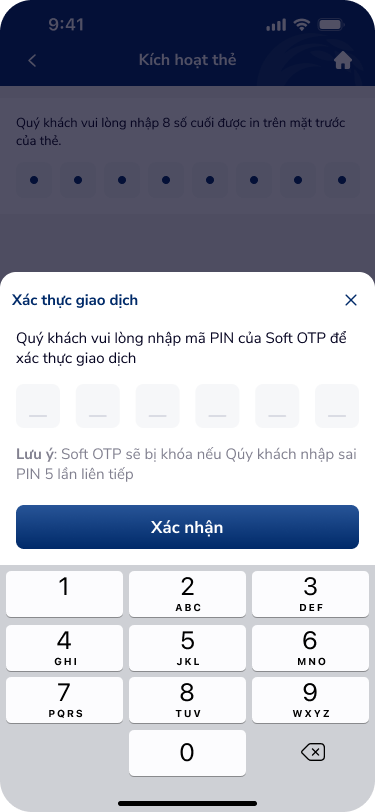
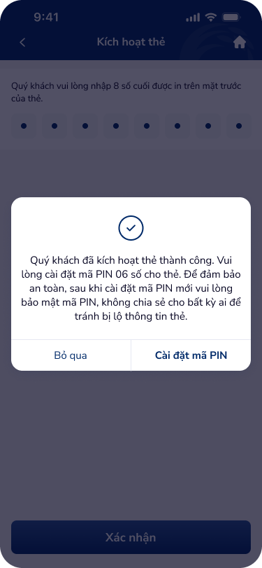

# SCR-KHT-002 — Kích hoạt thẻ › Xác nhận giao dịch

**Screen ID:** SCR-KHT-002  
**Display Name:** Kích hoạt thẻ › Xác nhận giao dịch  
**Screen Type:** Xác nhận giao dịch  
**Domain:** Banking  
**Artboards (2):** kich-hoat-the-3.png, kich-hoat-the-4.png

---

## Section 1 — Overview

### 1.1 Mục tiêu màn hình
Xác thực giao dịch kích hoạt thẻ bằng mã PIN Soft OTP (bottom sheet overlay), sau đó hiển thị kết quả kích hoạt thành công kèm lời nhắc và CTA cài đặt mã PIN thẻ.

### 1.2 User Story
> **Là** khách hàng đã nhập 8 số cuối thẻ,  
> **Tôi muốn** nhập mã PIN Soft OTP để xác thực,  
> **Để** hoàn tất kích hoạt thẻ và nhận lời nhắc cài đặt PIN thẻ.

### 1.3 Entry & Exit
- **Entry:** SCR-KHT-001 → tap "Tiếp tục"
- **Exit CTA:** "Cài đặt mã PIN" → SCR-KHT-003
- **Exit skip:** "Bỏ qua" → Quay về danh sách thẻ

### 1.4 NFR
- Soft OTP bị khóa sau 5 lần nhập sai — hiển thị cảnh báo rõ ràng
- PIN keypad custom (không dùng system keyboard)
- Success state tự động clear sau X giây hoặc khi user tap outside

---

## Section 2 — Screen Wireframes

| Artboard | Role | File |
|:---|:---|:---|
| Kích hoạt thẻ 3 | OTP bottom sheet overlay | `ui/kich-hoat-the-3.png` |
| Kích hoạt thẻ 4 | Success modal + PIN setup CTA | `ui/kich-hoat-the-4.png` |

 

---

## Section 3 — Text Content & OCR

### 3.1 Text Inventory (OCR Full Table)

| Text | Type | Artboard | State |
|:---|:---|:---|:---|
| Kích hoạt thẻ | header | kich-hoat-the-3.png | normal |
| Quý khách vui lòng nhập 8 số cuối được in trên mặt trước của thẻ. | body | kich-hoat-the-3.png | normal |
| Xác thực giao dịch | modal_header | kich-hoat-the-3.png | normal |
| Quý khách vui lòng nhập mã PIN của Soft OTP để xác thực giao dịch | body | kich-hoat-the-3.png | normal |
| Lưu ý: Soft OTP sẽ bị khóa nếu Quý khách nhập sai PIN 5 lần liên tiếp | warning | kich-hoat-the-3.png | normal |
| Xác nhận | button | kich-hoat-the-3.png | active |
| Quý khách đã kích hoạt thẻ thành công. | modal_success_body | kich-hoat-the-4.png | success |
| Vui lòng cài đặt mã PIN 06 số cho thẻ. | body | kich-hoat-the-4.png | normal |
| Bỏ qua | button | kich-hoat-the-4.png | secondary |
| Cài đặt mã PIN | button | kich-hoat-the-4.png | primary |

### 3.2 Screen Context
Bước xác thực giao dịch bằng Soft OTP (bottom sheet overlay với custom keypad) và màn hình thành công kích hoạt thẻ kèm CTA đặt PIN.

---

## Section 4 — UX Signal Analysis (Phase 4e)

### 4.1 Consumer Payload
```json
{
  "text_list": ["Xác thực giao dịch", "Soft OTP", "Bị khóa sau 5 lần sai", "Kích hoạt thành công", "Cài đặt mã PIN", "Bỏ qua"],
  "context_hints": "Soft OTP authentication bottom sheet. Success modal with branch.",
  "ocr_icons": ["close_x", "backspace", "checkmark_success", "home_icon"]
}
```

### 4.2 UX Signals Detected

| Signal | Category | Severity | DDL Ref |
|:---|:---|:---|:---|
| Warning lockout passive (không countdown) | Security UX | Major | UXG-security-feedback |
| OTP input: không hiện số lượng ký tự đã nhập | Input Feedback | Major | otp-input-1 |
| "Bỏ qua" vs "Cài đặt mã PIN" — hierarchy không rõ | CTA Hierarchy | Major | UXG-cta-hierarchy |
| Success modal thiếu link "Tìm hiểu thêm về PIN" | Onboarding | Minor | — |
| Base screen vẫn visible sau OTP overlay | Context | Positive | — |

### 4.3 UX Improvements
1. Thêm countdown timer cho lockout warning ("Còn X lần thử")
2. OTP input hiển thị dots đếm số ký tự đã nhập (6 cells)
3. Primary CTA "Cài đặt mã PIN" nên nổi bật hơn "Bỏ qua" (filled vs outlined)
4. Thêm tùy chọn "Quên PIN Soft OTP?" để hỗ trợ recovery

---

## Section 5 — Component DDL Links

| Component | DDL ID | Purpose |
|:---|:---|:---|
| OTP Input | `otp-input-1` | PIN Soft OTP 6 cells |
| Numeric keypad | `numpad-1` | Custom OTP keypad |
| App header | `app-header-1` | Header + back + home |

---

## Section 6 — Flow Connections

```
SCR-KHT-001 ──"Tiếp tục"──→ SCR-KHT-002
SCR-KHT-002 ──"Cài đặt mã PIN"──→ SCR-KHT-003
SCR-KHT-002 ──"Bỏ qua"──→ [ENTRY — back to list]
```

**Auto-triggered UX Laws:** Fitts's Law (keypad), Hick's Law (2 CTA choices), Zeigarnik Effect (task incomplete feel), Peak-End Rule (success moment critical)
