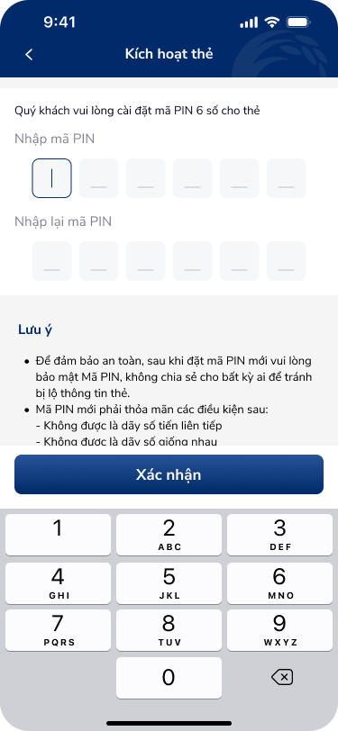
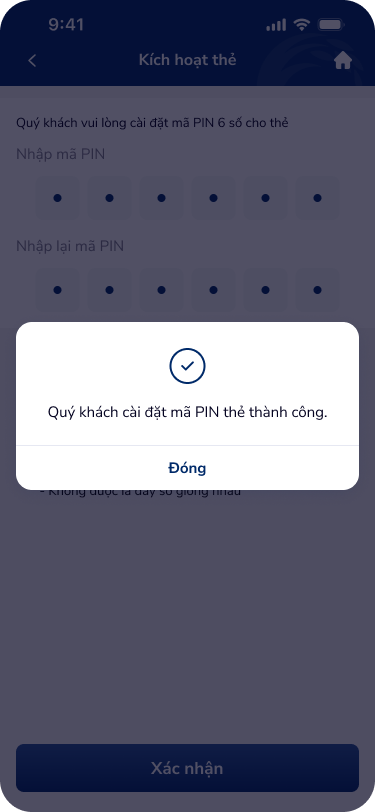
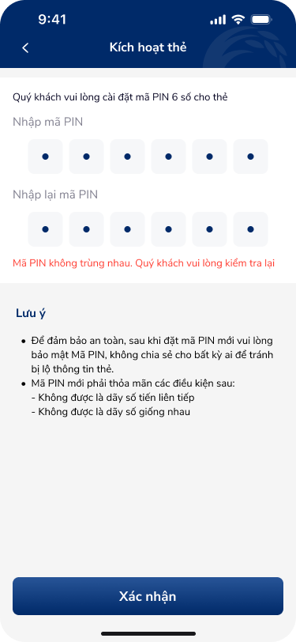

# SCR-KHT-003 — Kích hoạt thẻ › Đặt mã PIN thẻ

**Screen ID:** SCR-KHT-003  
**Display Name:** Kích hoạt thẻ › Đặt mã PIN thẻ  
**Screen Type:** Form nhập thông tin  
**Domain:** Banking  
**Artboards (10):** kich-hoat-the-6.png, kich-hoat-the-7.png, kich-hoat-the-8.png, kich-hoat-the-case-loi-4..10.png

---

## Section 1 — Overview

### 1.1 Mục tiêu màn hình
Form cài đặt mã PIN 6 số cho thẻ vật lý (khác với Soft OTP). User nhập PIN và xác nhận lại. Hệ thống validate theo 2 quy tắc: không được là dãy số liên tiếp, không được là dãy số giống nhau. Cung cấp feedback rõ ràng cho 7 loại lỗi khác nhau.

### 1.2 User Story
> **Là** khách hàng vừa kích hoạt thẻ thành công,  
> **Tôi muốn** cài đặt mã PIN 6 số theo quy tắc bảo mật,  
> **Để** sử dụng thẻ tại ATM và các điểm thanh toán.

### 1.3 Entry & Exit
- **Entry:** SCR-KHT-002 → tap "Cài đặt mã PIN"
- **Exit success:** Modal "Cài đặt mã PIN thành công" → "Đóng" → End/Home
- **Exit error:** Inline validation — user sửa và thử lại (không thoát màn hình)

### 1.4 NFR
- PIN không được lưu trên thiết bị
- Không hiển thị PIN dạng text rõ (dùng dots/asterisk)
- Quy tắc validate phải nhất quán với quy tắc đã hiển thị trong Lưu ý

---

## Section 2 — Screen Wireframes

| Artboard | Role | File |
|:---|:---|:---|
| Kích hoạt thẻ 6 | Form trống | `ui/kich-hoat-the-6.png` |
| Kích hoạt thẻ 7 | Variant: đã nhập | `ui/kich-hoat-the-7.png` |
| Kích hoạt thẻ 8 | Success modal | `ui/kich-hoat-the-8.png` |
| Case lỗi 4 | Error: PIN trùng nhau | `ui/kich-hoat-the-case-loi-4.png` |
| Case lỗi 5 | Error: PIN liên tiếp | `ui/kich-hoat-the-case-loi-5.png` |
| Case lỗi 6 | Error: Chưa nhập PIN | `ui/kich-hoat-the-case-loi-6.png` |
| Case lỗi 7 | Error: PIN thiếu 6 số | `ui/kich-hoat-the-case-loi-7.png` |
| Case lỗi 8 | Error: Xác nhận PIN thiếu 6 số | `ui/kich-hoat-the-case-loi-8.png` |
| Case lỗi 9 | Error: PIN không khớp | `ui/kich-hoat-the-case-loi-9.png` |
| Case lỗi 10 | Error: Chưa nhập lại PIN | `ui/kich-hoat-the-case-loi-10.png` |

  

---

## Section 3 — Text Content & OCR

### 3.1 Text Inventory (OCR Full Table)

| Text | Type | Artboard | State |
|:---|:---|:---|:---|
| Kích hoạt thẻ | header | kich-hoat-the-6.png | normal |
| Quý khách vui lòng cài đặt mã PIN 6 số cho thẻ | body | kich-hoat-the-6.png | normal |
| Nhập mã PIN | input_label | kich-hoat-the-6.png | normal |
| Nhập lại mã PIN | input_label | kich-hoat-the-6.png | normal |
| Xác nhận | button | kich-hoat-the-6.png | active |
| Lưu ý | warning_header | kich-hoat-the-6.png | normal |
| Để đảm bảo an toàn, sau khi đặt mã PIN mới vui lòng bảo mật Mã PIN, không chia sẻ cho bất kỳ ai. | warning_body | kich-hoat-the-6.png | normal |
| - Không được là dãy số tiến liên tiếp | rule_item | kich-hoat-the-6.png | normal |
| - Không được là dãy số giống nhau | rule_item | kich-hoat-the-6.png | normal |
| Mã PIN không được phép là các ký tự trùng nhau. Quý khách vui lòng kiểm tra lại | error | kich-hoat-the-case-loi-4.png | error |
| Mã PIN không được phép là các ký tự liên tiếp. Quý khách vui lòng kiểm tra lại | error | kich-hoat-the-case-loi-5.png | error |
| Quý khách vui lòng nhập mã PIN | error | kich-hoat-the-case-loi-6.png | error |
| Quý khách vui lòng nhập mã PIN bao gồm 6 ký tự số | error | kich-hoat-the-case-loi-7.png | error |
| Quý khách vui lòng nhập lại mã PIN bao gồm 6 ký tự số | error | kich-hoat-the-case-loi-8.png | error |
| Mã PIN không trùng nhau. Quý khách vui lòng kiểm tra lại | error | kich-hoat-the-case-loi-9.png | error |
| Quý khách vui lòng nhập lại mã PIN | error | kich-hoat-the-case-loi-10.png | error |
| Quý khách cài đặt mã PIN thẻ thành công. | modal_success_body | kich-hoat-the-8.png | success |
| Đóng | button | kich-hoat-the-8.png | normal |

### 3.2 Screen Context
Form đặt mã PIN 6 số với đầy đủ 7 validation error states (trùng, liên tiếp, rỗng, thiếu ký tự, không khớp). Cảnh báo bảo mật và quy định PIN được hiển thị sẵn. Success modal sau khi hoàn tất.

---

## Section 4 — UX Signal Analysis (Phase 4e)

### 4.1 Consumer Payload
```json
{
  "text_list": ["Đặt mã PIN 6 số", "Nhập mã PIN", "Nhập lại mã PIN", "Lưu ý bảo mật PIN", "Không được là dãy số liên tiếp/giống nhau", "PIN không trùng nhau", "Cài đặt PIN thành công"],
  "context_hints": "6-digit PIN setup form. Double entry confirmation. Multiple validation rules.",
  "ocr_icons": ["back_chevron", "success_checkmark", "ios_numeric_keyboard"]
}
```

### 4.2 UX Signals Detected

| Signal | Category | Severity | DDL Ref |
|:---|:---|:---|:---|
| Không có Show/Hide PIN toggle | Input UX | Major | otp-input-1 |
| Validation rules hiển thị AFTER error, không real-time | Error Prevention | Major | UXG-real-time-validation |
| 7 error messages — nhiều nhưng đầy đủ | Error Coverage | Neutral | — |
| Thiếu strength indicator cho PIN | Security UX | Minor | — |
| Lưu ý block quá dài, chiếm nhiều space | Information Architecture | Minor | UXG-progressive-disclosure |
| PIN rules: 2 điều kiện tương phản với 7 error cases | Consistency | Warning | — |

### 4.3 UX Improvements
1. Thêm icon "con mắt" (show/hide) cho cả 2 PIN fields
2. Áp dụng real-time validation: checklist gạch đầu dòng đổi màu khi đạt đủ điều kiện
3. Rút gọn Lưu ý ban đầu, dùng progressive disclosure (Xem thêm / Thu gọn)
4. Highlight rõ field nào đang có lỗi (border màu đỏ + error message gắn trực tiếp dưới field)

---

## Section 5 — Component DDL Links

| Component | DDL ID | Purpose |
|:---|:---|:---|
| OTP/PIN Input | `otp-input-1` | 6 PIN cells (nhập + xác nhận) |
| Numeric keypad | `numpad-1` | Custom PIN keypad |
| App header | `app-header-1` | Header + back |

---

## Section 6 — Flow Connections

```
SCR-KHT-002 ──"Cài đặt mã PIN"──→ SCR-KHT-003
SCR-KHT-003 ──validation error──→ SCR-KHT-003 (inline, not overlay)
SCR-KHT-003 ──"Xác nhận" (valid)──→ Success modal → [END]
```

**Auto-triggered UX Laws:** Fitts's Law (PIN cells + keypad), Hick's Law (validation complexity), Peak-End Rule (success modal là điểm kết thúc quan trọng nhất)
