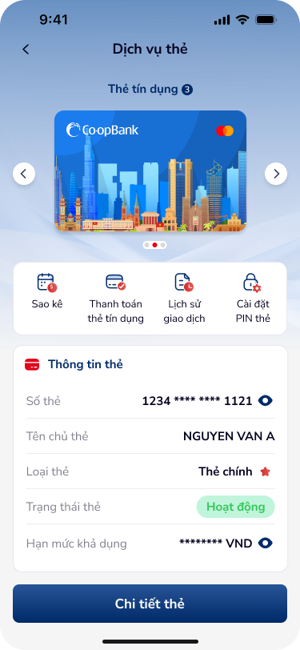

# SCR-TDN-001 — Danh sách thẻ

**Display Name:** Danh sách thẻ › Danh sách  
**Screen ID:** SCR-TDN-001  
**Screen Type:** list  
**Flow Stage:** entry  
**Wireframe:** `ui/danh-sach-the.png`, `ui/danh-sach-the-30.png`

---

## 1. User Flow & Context

**Vị trí trong flow:** Entry point của module Dịch vụ thẻ. Sau khi user chọn tính năng "Dịch vụ thẻ" từ Home Screen.

**Flow từ màn hình này:**
- → **Thanh toán dư nợ** (SCR-TDN-002): Tap tab "Thanh toán thẻ tín dụng"
- → **Sao kê thẻ** (SCR-TDN-006): Tap tab "Sao kê"
- → Lịch sử giao dịch (ngoài scope module này): Tap tab "Lịch sử giao dịch"
- → Cài đặt PIN thẻ (ngoài scope): Tap tab "Cài đặt PIN thẻ"
- → Chi tiết thẻ (ngoài scope): Tap CTA "Chi tiết thẻ"

**User Story:**
> Với tư cách là khách hàng có thẻ tín dụng Co-opBank, tôi muốn xem tổng quan thẻ và truy cập nhanh vào các dịch vụ thẻ (thanh toán dư nợ, sao kê, lịch sử GD, cài đặt PIN) để quản lý thẻ hiệu quả.

**🤖 AI UX Inferences (by ux-signal-inference — scope=screen):**
- `carousel_card_selector`: Màn hình hỗ trợ nhiều thẻ (hiển thị "Thẻ tín dụng ③" = 3 thẻ). Carousel cho phép swipe để chuyển thẻ. Variant "Danh sách thẻ 30" cho thấy có trường hợp danh sách rất dài. DDL ref: `fitts_law` — touch targets carousel arrows phải ≥44px
- `masked_data_reveal`: Eye icon trên "Hạn mức khả dụng" gợi ý toggle reveal/mask. UX nhạy cảm: dữ liệu tài chính cần mask by default. DDL ref: UXG security patterns
- `tab_navigation_4way`: 4 service tabs (Sao kê, Thanh toán, Lịch sử, Cài đặt). Icon + label. Fitts's Law: tab targets phải ≥44px height

---

## 2. Non-Functional Requirements

| # | Yêu cầu | Mức độ |
|---|---------|--------|
| NFR-001 | Carousel swipe thẻ: response < 200ms, animation smooth 60fps | Critical |
| NFR-002 | Mask/Reveal hạn mức: tap-to-reveal instant (< 100ms) | High |
| NFR-003 | Tab switching: instant (< 150ms) | High |
| NFR-004 | Card info load: skeleton screen nếu > 300ms | Medium |
| NFR-005 | Accessibility: tất cả elements có ARIA labels | Medium |

---

## 3. Mô tả màn hình

| # | Element | Loại | Nội dung / Hành vi | DDL Ref |
|---|---------|------|---------------------|---------|
| 1 | NavBar | Navigation | Back arrow (←) + "Dịch vụ thẻ" title | — |
| 2 | Card Carousel | Component | Co-opBank card với carousel navigation (←→), dots indicator | `carousel_card_selector` |
| 3 | Tab "Thẻ tín dụng ③" | Tab | Badge hiển thị số lượng thẻ (3) | `tab_badge` |
| 4 | Service Tabs | Tab group | Sao kê / Thanh toán thẻ tín dụng / Lịch sử GD / Cài đặt PIN | `tab_navigation_4way` |
| 5 | "Thông tin thẻ" | Section header | Phân chia nội dung | — |
| 6 | Số thẻ | Field + icon | "1234 **** **** 1121" + copy icon | `masked_card_number` |
| 7 | Tên chủ thẻ | Field | "NGUYEN VAN A" | — |
| 8 | Loại thẻ | Field | "Thẻ chính ★" | — |
| 9 | Trạng thái thẻ | Badge | "Hoạt động" (green) | `status_badge_active` |
| 10 | Hạn mức khả dụng | Field + eye icon | "******** VND" + reveal toggle | `masked_data_reveal` |
| 11 | "Chi tiết thẻ" | CTA Primary | Full-width bottom button | — |

**OCR UX Gaps identified:**
- Không có loading skeleton cho card info
- Không có error state nếu thẻ bị khóa / hết hạn

---

## 4. Đề xuất cải thiện UX

| Ưu tiên | Vấn đề | Đề xuất |
|---------|--------|---------|
| High | Carousel với 30+ thẻ: navigation khó | Thêm search/filter hoặc danh sách dạng list khi > 5 thẻ |
| Medium | Badge count "③" hardcoded trong Figma | Badge nên dynamic, hiển thị số thực |
| Medium | Hạn mức chỉ mask bằng asterisk | Thêm biometric re-auth trước khi reveal hạn mức |
| Low | Tab labels dài ("Thanh toán thẻ tín dụng") | Rút gọn thành "Thanh toán" với tooltip hoặc icon |

---

## 5. PRD References

- **Figma node:** 142:162593 (main), 142:168163 (30-card variant)
- **Domain:** banking
- **Signal registry:** text-signals-banking.json
