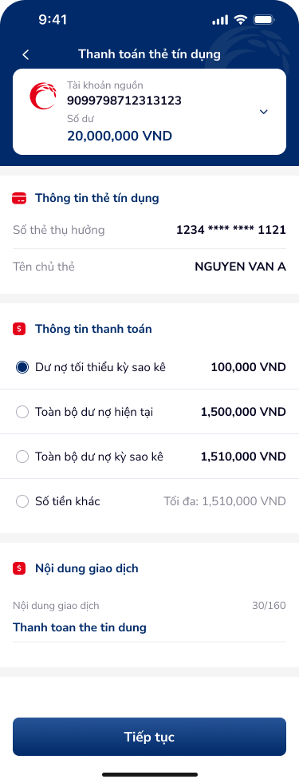

# SCR-TDN-002 — Thanh toán dư nợ (Form chính)

**Display Name:** Thanh toán dư nợ › Form nhập thông tin  
**Screen ID:** SCR-TDN-002  
**Screen Type:** form  
**Flow Stage:** input_entry  
**Wireframe:** `ui/thanh-toan-du-no.png`

---

## 1. User Flow & Context

**Vị trí trong flow:** Bước 1 của luồng thanh toán dư nợ thẻ tín dụng. Hiển thị sau khi user tap tab "Thanh toán thẻ tín dụng" từ SCR-TDN-001.

**Flow từ màn hình này:**
- → **Nhập số tiền tùy chỉnh** (SCR-TDN-003): Khi chọn radio "Số tiền khác" và nhập số tiền
- → **Xác nhận giao dịch** (SCR-TDN-004): Khi chọn option cố định (không phải "Số tiền khác") → tap "Tiếp tục"
- ← Back: Về SCR-TDN-001

**User Story:**
> Với tư cách là khách hàng có dư nợ thẻ tín dụng, tôi muốn chọn số tiền thanh toán (tối thiểu, toàn bộ, hoặc tùy chỉnh) và xem luôn thông tin thẻ thụ hưởng, để nhanh chóng thực hiện thanh toán dư nợ.

**🤖 AI UX Inferences (by ux-signal-inference — scope=screen):**
- `radio_group_payment`: 4 radio options cho loại thanh toán. Pattern quan trọng: option đầu (tối thiểu) được chọn mặc định — phòng ngừa inadvertent payment. DDL ref: UXG form defaults, radio group
- `editable_transaction_note`: Field "Nội dung giao dịch" prefilled "Thanh toán the tin dung" (lỗi chính tả — thiếu dấu). Char counter 30/160. Có thể edit. DDL ref: UXG prefill data
- `account_picker_dropdown`: Tài khoản nguồn có dropdown (▼) — user có thể chuyển tài khoản nguồn. Cần validation số dư đủ cho option được chọn. DDL ref: `UXG account_selection`

---

## 2. Non-Functional Requirements

| # | Yêu cầu | Mức độ |
|---|---------|--------|
| NFR-001 | Balance check: realtime (< 500ms) khi switch tài khoản nguồn | Critical |
| NFR-002 | Radio group: instant visual feedback khi tap (< 100ms) | High |
| NFR-003 | Char counter: update realtime khi nhập | High |
| NFR-004 | "Tiếp tục" CTA: disabled nếu số dư < số tiền chọn | Critical |
| NFR-005 | Số tiền max: dynamic từ API dư nợ hiện tại | High |

---

## 3. Mô tả màn hình

| # | Element | Loại | Nội dung / Hành vi | DDL Ref |
|---|---------|------|---------------------|---------|
| 1 | NavBar | Navigation | Back (←) + "Thanh toán thẻ tín dụng" | — |
| 2 | Tài khoản nguồn | Card + dropdown | STK: 9099798712313123 / Số dư: 20,000,000 VND / ▼ | `account_picker` |
| 3 | "Thông tin thẻ tín dụng" | Section header | — | — |
| 4 | Số thẻ thụ hưởng | Read-only field | "1234 **** **** 1121" (auto-filled từ thẻ đã chọn) | `masked_card_number` |
| 5 | Tên chủ thẻ | Read-only field | "NGUYEN VAN A" | — |
| 6 | "Thông tin thanh toán" | Section header | — | — |
| 7 | Radio: Dư nợ tối thiểu | Radio option (selected) | "Dư nợ tối thiểu kỳ sao kê — 100,000 VND" | `radio_payment_option` |
| 8 | Radio: Toàn bộ dư nợ hiện tại | Radio option | "Toàn bộ dư nợ hiện tại — 1,500,000 VND" | `radio_payment_option` |
| 9 | Radio: Toàn bộ dư nợ kỳ sao kê | Radio option | "Toàn bộ dư nợ kỳ sao kê — 1,510,000 VND" | `radio_payment_option` |
| 10 | Radio: Số tiền khác | Radio option | "Số tiền khác — Tối đa: 1,510,000 VND" | `radio_payment_option_custom` |
| 11 | Nội dung giao dịch | Text field | Prefilled: "Thanh toán the tin dung", counter 30/160 | `transaction_note_field` |
| 12 | "Tiếp tục" | CTA Primary | Full-width, disabled nếu invalid | — |

**OCR UX Gaps identified:**
- Nội dung GD có lỗi chính tả: "the tin dung" → nên là "thẻ tín dụng"
- Missing: visual indicator khi số dư tài khoản < số tiền chọn

---

## 4. Đề xuất cải thiện UX

| Ưu tiên | Vấn đề | Đề xuất |
|---------|--------|---------|
| Critical | Prefill text lỗi chính tả "Thanh toán the tin dung" | Fix: "Thanh toán thẻ tín dụng [số thẻ masked]" |
| High | Không có validation real-time balance | Highlight radio option bị disable nếu số dư không đủ |
| High | "Số tiền khác" không show input field ngay | Khi chọn → expand inline input field (không cần navigate sang screen khác) |
| Medium | Account dropdown không show số dư live | Thêm real-time balance refresh indicator |
| Low | Thẻ thụ hưởng không copyable | Thêm copy icon cho số thẻ thụ hưởng |

---

## 5. PRD References

- **Figma node:** 142:173734
- **Domain:** banking
- **Signal registry:** text-signals-banking.json, radio_group pattern
