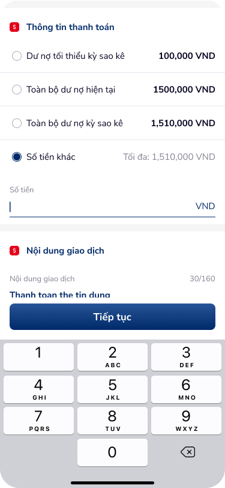
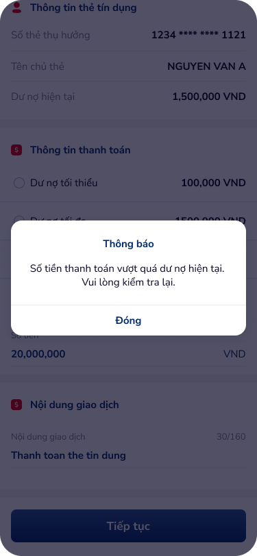

# SCR-TDN-003 — Thanh toán dư nợ - Nhập số tiền

**Display Name:** Thanh toán dư nợ - Nhập số tiền › Form nhập thông tin  
**Screen ID:** SCR-TDN-003  
**Screen Type:** form  
**Flow Stage:** input_amount  
**Wireframe:** `ui/thanh-toan-du-no-nhap-so-tien.png`, `ui/internal-transaction.png`

---

## 1. User Flow & Context

**Vị trí trong flow:** Bước 1b — Nhập số tiền tùy chỉnh. Hiển thị khi user chọn radio "Số tiền khác" trên SCR-TDN-002. Custom numpad bật lên.

**Flow từ màn hình này:**
- → **Xác nhận giao dịch** (SCR-TDN-004): Tap "Tiếp tục" với số tiền hợp lệ
- ↗ **Error overlay** (internal-transaction): Khi nhập số tiền > dư nợ hiện tại
- ← Back: Về SCR-TDN-002

**Overlay included:** `internal-transaction` — Dialog "Thông báo" khi số tiền vượt dư nợ

**User Story:**
> Với tư cách là khách hàng muốn thanh toán một phần dư nợ theo ý muốn, tôi muốn nhập chính xác số tiền (có giới hạn tối đa) và nhận thông báo rõ ràng nếu số tiền không hợp lệ, để không bị giao dịch lỗi.

**🤖 AI UX Inferences (by ux-signal-inference — scope=screen):**
- `custom_numpad_keyboard`: Custom numpad thay keyboard hệ thống. Lý do: format tiền VND cần control chặt. Pattern: chỉ số, không có dấu thập phân, backspace. Risk: thiếu "." separator → khó nhập số lớn (1,510,000). DDL ref: UXG input numeric
- `amount_validation_error`: Overlay "Thông báo" là inline error — không navigate away. Good UX pattern: user giữ nguyên context. Issue: button "Đóng" thay vì "Thử lại" — mất input đã nhập? DDL ref: UXG error recovery
- `max_amount_hint`: "Tối đa: 1,510,000 VND" hiển thị realtime. Nên highlight/red khi user nhập > max. DDL ref: constraint hint pattern

---

## 2. Non-Functional Requirements

| # | Yêu cầu | Mức độ |
|---|---------|--------|
| NFR-001 | Custom numpad: response < 50ms mỗi keystroke | Critical |
| NFR-002 | Amount validation: realtime khi nhập (debounce 300ms) | High |
| NFR-003 | Error overlay: show < 200ms sau khi tap "Tiếp tục" với invalid amount | High |
| NFR-004 | Input format: tự động thêm dấu phẩy (1,000,000) khi nhập | High |
| NFR-005 | Giữ amount input sau khi đóng error dialog | Critical |

---

## 3. Mô tả màn hình

 

| # | Element | Loại | Nội dung / Hành vi | DDL Ref |
|---|---------|------|---------------------|---------|
| 1 | Radio group | Display (read-only) | 4 options, "Số tiền khác" selected | — |
| 2 | "Số tiền" | Text input | Empty field với cursor, suffix "VND" | `amount_input_field` |
| 3 | Max hint | Hint text | "Tối đa: 1,510,000 VND" | `constraint_hint` |
| 4 | Nội dung GD | Text field | Prefilled + counter 30/160 | — |
| 5 | "Tiếp tục" | CTA Primary | Active khi amount > 0 và ≤ max | — |
| 6 | Custom Numpad | Keyboard | 3×3 digits + 0 + backspace (⌫), không có "." | `custom_numpad` |
| 7 | Error Dialog | Overlay | Title: "Thông báo", body: "Số tiền thanh toán vượt quá dư nợ hiện tại. Vui lòng kiểm tra lại.", CTA: "Đóng" | `error_dialog_overlay` |

**OCR UX Gaps:**
- Không có format helper (dấu phẩy ngăn cách hàng nghìn)
- Error dialog "Đóng" — không rõ amount có bị xóa sau dismiss hay không
- Không có visual indicator khi đang validate (loading state)

---

## 4. Đề xuất cải thiện UX

| Ưu tiên | Vấn đề | Đề xuất |
|---------|--------|---------|
| Critical | Amount input không auto-format số | Auto-format: "1000000" → "1,000,000 VND" realtime |
| High | Error dialog button "Đóng" mơ hồ | Đổi thành "Nhập lại" và giữ nguyên input đã nhập |
| High | Không có quick-select buttons | Thêm shortcut: [Tối thiểu] [Toàn bộ] buttons trên numpad |
| Medium | Max hint không đổi màu khi exceed | Highlight red "Tối đa: X VND" + shake animation khi > max |
| Low | Numpad thiếu haptic feedback | Thêm haptic nhẹ mỗi keystroke |

---

## 5. PRD References

- **Figma nodes:** 142:173786 (main), 142:173842 (error overlay)
- **Overlay classification:** internal-transaction → score 6/12, OVERLAY (dimmed bg + partial coverage + error supplementary)
- **Domain:** banking
