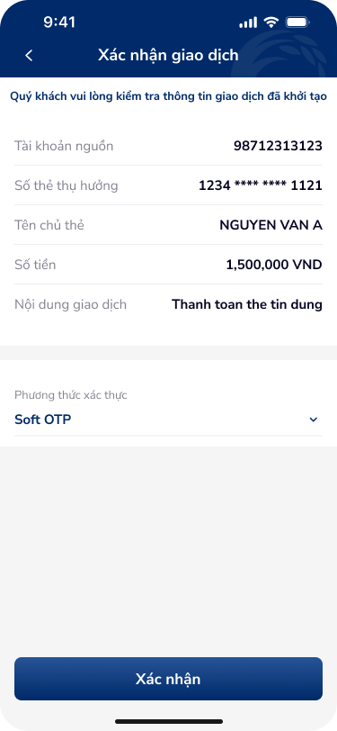
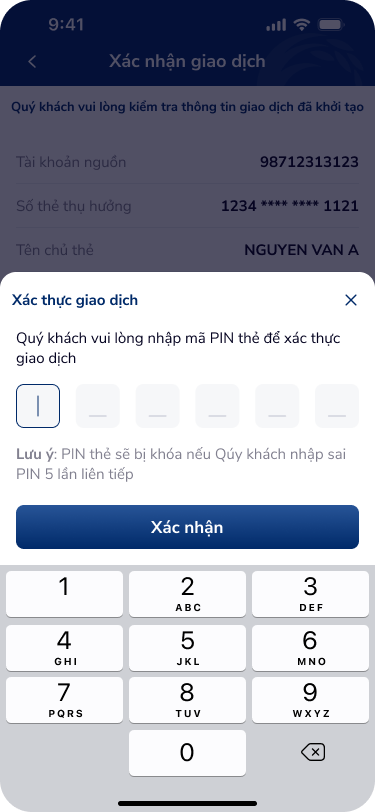

# SCR-TDN-004 — Thanh toán dư nợ - Xác nhận

**Display Name:** Thanh toán dư nợ - Xác nhận › Xác nhận giao dịch  
**Screen ID:** SCR-TDN-004  
**Screen Type:** confirm  
**Flow Stage:** confirm  
**Wireframe:** `ui/thanh-toan-du-no-xac-nhan.png`, `ui/thanh-toan-du-no-xac-thuc.png`

---

## 1. User Flow & Context

**Vị trí trong flow:** Bước 2 — Xác nhận thông tin giao dịch và xác thực PIN. Hiển thị sau khi tap "Tiếp tục" từ SCR-TDN-002 hoặc SCR-TDN-003.

**Flow từ màn hình này:**
- ↗ **PIN Auth overlay** (xac-thuc): Tap "Xác nhận" → bottom sheet PIN input xuất hiện
- → **Kết quả** (SCR-TDN-005): Sau khi nhập PIN đúng → tap "Xác nhận" trên overlay
- ← Back: Về form nhập thông tin

**Overlay included:** `thanh-toan-du-no-xac-thuc` — Bottom sheet PIN authentication (overlay_score=8/12, OVERLAY)

**User Story:**
> Với tư cách là khách hàng, tôi muốn kiểm tra đầy đủ thông tin giao dịch trước khi xác nhận, và xác thực bằng PIN thẻ tín dụng (không phải SmartOTP app), để đảm bảo giao dịch chính xác và bảo mật.

**🤖 AI UX Inferences (by ux-signal-inference — scope=screen):**
- `confirmation_review_screen`: Summary screen — tất cả fields read-only. Pattern: "Quý khách vui lòng kiểm tra thông tin giao dịch đã khởi tạo" = explicit verification prompt. DDL ref: UXG confirmation, trust-critical banking flow
- `multi_factor_auth_selector`: "Phương thức xác thực: Soft OTP" có dropdown (▼) — user có thể đổi method. Implies multiple auth options (Smart OTP, PIN thẻ, biometric). DDL ref: UXG auth method selection
- `pin_security_bottom_sheet`: 6 ô PIN + warning khóa thẻ sau 5 lần: "PIN thẻ sẽ bị khóa nếu nhập sai PIN 5 lần liên tiếp". Security-critical UX: phải clear PIN cells sau fail, show remaining attempts. DDL ref: UXG PIN security, otp-input-1 component

---

## 2. Non-Functional Requirements

| # | Yêu cầu | Mức độ |
|---|---------|--------|
| NFR-001 | PIN input: masked immediately (• per digit), no copy/paste | Critical |
| NFR-002 | Remaining attempts counter: hiển thị sau lần sai đầu tiên | Critical |
| NFR-003 | Auto-clear PIN sau 3 lần sai | High |
| NFR-004 | Auth method switch: validate immediately khi switch (< 500ms) | High |
| NFR-005 | Session timeout: 3 phút không hoạt động → clear form, về Home | High |
| NFR-006 | PIN overlay: không thể screenshot (FLAG_SECURE on Android) | Critical |

---

## 3. Mô tả màn hình

 

**Base screen — Xác nhận giao dịch:**

| # | Element | Loại | Nội dung / Hành vi | DDL Ref |
|---|---------|------|---------------------|---------|
| 1 | NavBar | Navigation | Back (←) + "Xác nhận giao dịch" | — |
| 2 | Instruction banner | Info text | "Quý khách vui lòng kiểm tra thông tin giao dịch đã khởi tạo" (blue) | `confirmation_instruction` |
| 3 | Tài khoản nguồn | Read-only | "98712313123" | — |
| 4 | Số thẻ thụ hưởng | Read-only | "1234 **** **** 1121" (masked) | `masked_card_number` |
| 5 | Tên chủ thẻ | Read-only | "NGUYEN VAN A" | — |
| 6 | Số tiền | Read-only (highlight) | "1,500,000 VND" | `amount_display_large` |
| 7 | Nội dung GD | Read-only | "Thanh toán the tin dung" | — |
| 8 | Phương thức xác thực | Selector + dropdown | "Soft OTP" + ▼ | `auth_method_selector` |
| 9 | "Xác nhận" | CTA Primary | Tap → trigger PIN overlay | — |

**Overlay — Xác thực giao dịch (PIN):**

| # | Element | Loại | Nội dung / Hành vi | DDL Ref |
|---|---------|------|---------------------|---------|
| 10 | Bottom sheet title | Heading | "Xác thực giao dịch" + X close | `bottom_sheet_header` |
| 11 | PIN instruction | Text | "Quý khách vui lòng nhập mã PIN thẻ để xác thực giao dịch" | — |
| 12 | 6-cell PIN input | Input | 6 ô riêng biệt, active ô đầu (cursor visible) | `pin_input_6cell` |
| 13 | Lockout warning | Warning text | "PIN thẻ sẽ bị khóa nếu nhập sai PIN 5 lần liên tiếp" | `pin_lockout_warning` |
| 14 | "Xác nhận" | CTA Primary | Submit PIN | — |
| 15 | Custom Numpad | Keyboard | 3×3 + 0 + backspace | `custom_numpad` |

**OCR UX Gaps:**
- Không hiển thị remaining attempts (trước khi khóa)
- Không có "Quên PIN" / recovery link
- Số tiền "1,500,000 VND" trên confirmation không highlighted to/bold đủ để user chú ý

---

## 4. Đề xuất cải thiện UX

| Ưu tiên | Vấn đề | Đề xuất |
|---------|--------|---------|
| Critical | Không hiện số lần còn lại trước khi khóa PIN | "Còn X lần nhập — sau đó PIN thẻ sẽ bị khóa" sau lần sai đầu |
| Critical | Không có recovery action khi quên PIN | Thêm link "Quên PIN thẻ?" → luồng reset PIN |
| High | Số tiền không nổi bật trên summary | Số tiền lớn, màu khác (đỏ/xanh đậm), font lớn hơn |
| High | Auth method dropdown không clear về options | Show preview dropdown với các options available |
| Medium | PIN overlay có thể bị dismiss accidental (X) | Confirm dialog trước khi dismiss "Bạn có muốn hủy xác thực?" |
| Low | Nội dung GD lỗi "the tin dung" | Fix chính tả (từ input upstream) |

---

## 5. PRD References

- **Figma nodes:** 142:173897 (base), 142:173932 (PIN overlay)
- **Overlay classification:** xac-thuc → score 8/12, OVERLAY (dimmed + X close + partial coverage + supplementary action)
- **DDL component match:** `pin-input` / `otp-input-1` component family
- **Domain:** banking
