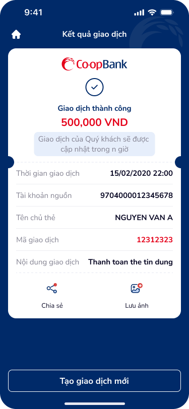

# SCR-TDN-005 — Thanh toán dư nợ - Kết quả

**Display Name:** Thanh toán dư nợ - Kết quả › Kết quả giao dịch  
**Screen ID:** SCR-TDN-005  
**Screen Type:** result  
**Flow Stage:** terminal  
**Wireframe:** `ui/thanh-toan-du-no-ket-qua.png`

---

## 1. User Flow & Context

**Vị trí trong flow:** Terminal screen — kết thúc luồng thanh toán dư nợ thẻ tín dụng.

**Flow từ màn hình này:**
- → **Home**: Tap home icon (⌂) top-left
- → **SCR-TDN-002** (hoặc từ đầu): Tap "Tạo giao dịch mới"
- ↗ Share sheet: Tap "Chia sẻ"
- ↗ Save to gallery: Tap "Lưu ảnh"

**User Story:**
> Với tư cách là khách hàng vừa thanh toán dư nợ thành công, tôi muốn thấy xác nhận rõ ràng và đầy đủ thông tin giao dịch (số tiền, mã GD, thời gian), và có thể lưu/chia sẻ biên lai để tham khảo sau.

**🤖 AI UX Inferences (by ux-signal-inference — scope=screen):**
- `success_receipt_screen`: Pattern receipt chuẩn banking: logo + success icon + amount + transaction details. Issue: amount hiển thị "500,000 VND" nhưng user đã chọn "1,500,000 VND" trên confirm screen — inconsistency cần verify với data thực. DDL ref: UXG result screen, receipt pattern
- `deferred_processing`: "Giao dịch của Quý khách sẽ được cập nhật trong n giờ" — "n giờ" là placeholder chưa dynamic. User uncertainty về thời gian xử lý. DDL ref: UXG processing time communication
- `social_share_action`: Chia sẻ + Lưu ảnh actions — screenshot/share biên lai. Security concern: biên lai chứa thông tin tài khoản, cần blur/mask trước khi share. DDL ref: UXG share security

---

## 2. Non-Functional Requirements

| # | Yêu cầu | Mức độ |
|---|---------|--------|
| NFR-001 | Receipt load: instant (data từ API response đã có) | Critical |
| NFR-002 | "n giờ" → specific time (VD: "2-4 giờ làm việc") | High |
| NFR-003 | Share: mask sensitive account info trước khi generate share image | Critical |
| NFR-004 | Mã GD: copyable (tap to copy) | Medium |
| NFR-005 | Transaction conflict với confirmed amount: verify consistency | Critical |

---

## 3. Mô tả màn hình

| # | Element | Loại | Nội dung / Hành vi | DDL Ref |
|---|---------|------|---------------------|---------|
| 1 | Home icon | Navigation | ⌂ top-left → về Home | — |
| 2 | NavBar title | Heading | "Kết quả giao dịch" | — |
| 3 | Brand logo | Display | Co·opBank logo | — |
| 4 | Success icon | Status | ✓ (green circle checkmark) | `success_state_icon` |
| 5 | Status text | Display | "Giao dịch thành công" | `success_label` |
| 6 | Amount | Display (large) | "500,000 VND" (red/prominent) | `amount_receipt_large` |
| 7 | Processing note | Info | "Giao dịch của Quý khách sẽ được cập nhật trong n giờ" | `deferred_processing_note` |
| 8 | Thời gian GD | Field | "15/02/2020 22:00" | `timestamp` |
| 9 | Tài khoản nguồn | Field | "9704000012345678" | `account_number` |
| 10 | Tên chủ thẻ | Field | "NGUYEN VAN A" | — |
| 11 | Mã giao dịch | Field (highlight) | "12312323" (red color) | `transaction_id` |
| 12 | Nội dung GD | Field | "Thanh toán the tin dung" | — |
| 13 | Chia sẻ | Action | Share sheet | `share_action` |
| 14 | Lưu ảnh | Action | Save to gallery | `save_screenshot` |
| 15 | "Tạo giao dịch mới" | CTA Secondary | Về form thanh toán mới | — |

**OCR UX Gaps:**
- "n giờ" = hardcoded placeholder, không dynamic
- Số tiền "500,000 VND" ≠ "1,500,000 VND" từ confirm screen (data mock inconsistency)
- Mã GD "12312323" không có copy functionality
- Nội dung GD vẫn lỗi chính tả "the tin dung"

---

## 4. Đề xuất cải thiện UX

| Ưu tiên | Vấn đề | Đề xuất |
|---------|--------|---------|
| Critical | "n giờ" placeholder không dynamic | Show thời gian thực tế: "2-4 giờ làm việc" hoặc realtime status |
| Critical | Security: biên lai chia sẻ có thể lộ account number | Mask account number trong share image, thêm watermark |
| High | Mã GD không copyable | Tap mã GD → copy to clipboard + toast "Đã sao chép" |
| High | Amount inconsistency (500k vs 1.5M) | Must match confirmed amount from prev screen |
| Medium | Không có "Xem lịch sử" shortcut | Thêm link "Xem trong lịch sử giao dịch" |
| Low | Chính tả "the tin dung" | Fix từ upstream form |

---

## 5. PRD References

- **Figma node:** 142:173965
- **Domain:** banking
- **UX law match:** Doherty Threshold (< 400ms confirmation response), Hick's Law (3 actions max on result screen)
