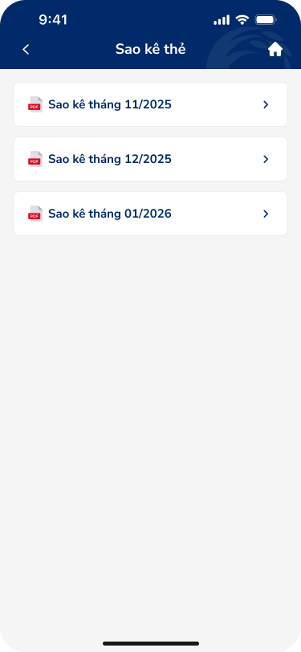

# SCR-TDN-006 — Danh sách sao kê thẻ

**Display Name:** Danh sách sao kê thẻ › Danh sách  
**Screen ID:** SCR-TDN-006  
**Screen Type:** list  
**Flow Stage:** secondary_entry  
**Wireframe:** `ui/danh-sach-sao-ke-the.png`, `ui/danh-sach-sao-ke-the-trong.png`

---

## 1. User Flow & Context

**Vị trí trong flow:** Entry point secondary — Xem lịch sử sao kê thẻ tín dụng theo tháng. Hiển thị sau khi tap tab "Sao kê" từ SCR-TDN-001.

**Flow từ màn hình này:**
- → **Chi tiết sao kê** (SCR-TDN-007): Tap một statement item trong list
- ← Back: Về SCR-TDN-001
- → Home: Tap home icon (⌂)

**Variants:**
- **Populated state:** List có 3 tháng sao kê (11/2025, 12/2025, 01/2026)
- **Empty state:** "Quý khách chưa có sao kê cho thẻ này. Sao kê sẽ được phát hành sau khi kết thúc chu kỳ"

**User Story:**
> Với tư cách là chủ thẻ tín dụng, tôi muốn xem danh sách sao kê thẻ theo tháng để theo dõi chi tiêu và quản lý tài chính.

**🤖 AI UX Inferences (by ux-signal-inference — scope=screen):**
- `pdf_document_list`: Mỗi item có PDF icon → download/view file statement. Pattern: tap → system viewer (SCR-TDN-007). Risk: PDF viewer ngoài app → user mất context app. DDL ref: UXG document access
- `empty_state_informative`: Empty state message chuẩn: giải thích lý do (chưa kết thúc chu kỳ) + set expectation. Good UX. Missing: không có action button trong empty state (e.g., "Xem thẻ khác"). DDL ref: UXG empty state, miller's law
- `monthly_grouping`: Danh sách hiện tại chỉ 3 items, flat list. Khi có nhiều tháng → cần pagination/grouping by year

---

## 2. Non-Functional Requirements

| # | Yêu cầu | Mức độ |
|---|---------|--------|
| NFR-001 | List load: < 500ms, skeleton screen nếu chậm | High |
| NFR-002 | PDF tap: responsive < 300ms, loading indicator khi download | High |
| NFR-003 | Empty state: hiển thị ngay (không flash "loading" rồi empty) | Medium |
| NFR-004 | Pagination: load more khi scroll đến bottom (nếu > 12 tháng) | Medium |

---

## 3. Mô tả màn hình

 

**Populated state:**

| # | Element | Loại | Nội dung / Hành vi | DDL Ref |
|---|---------|------|---------------------|---------|
| 1 | NavBar | Navigation | Back (←) + "Sao kê thẻ" + Home (⌂) | — |
| 2 | Statement item 1 | List row | PDF icon + "Sao kê tháng 11/2025" + > | `document_list_item` |
| 3 | Statement item 2 | List row | PDF icon + "Sao kê tháng 12/2025" + > | `document_list_item` |
| 4 | Statement item 3 | List row | PDF icon + "Sao kê tháng 01/2026" + > | `document_list_item` |

**Empty state:**

| # | Element | Loại | Nội dung / Hành vi | DDL Ref |
|---|---------|------|---------------------|---------|
| 1 | NavBar | Navigation | Same as above | — |
| 2 | Empty state message | Text | "Quý khách chưa có sao kê cho thẻ này. Sao kê sẽ được phát hành sau khi kết thúc chu kỳ" | `empty_state_text` |

**OCR UX Gaps:**
- Không có empty state illustration (chỉ text)
- Không rõ format ngày hiển thị (chỉ tháng/năm — không có ngày phát hành)
- Không có filter/sort option khi list dài
- Empty state không có action button

---

## 4. Đề xuất cải thiện UX

| Ưu tiên | Vấn đề | Đề xuất |
|---------|--------|---------|
| High | Empty state chỉ có text | Thêm illustration + "Chu kỳ kết thúc vào DD/MM" nếu biết |
| High | Không rõ khi nào sao kê phát hành | Hiển thị: "Sao kê tiếp theo dự kiến: 05/03/2026" |
| Medium | List không có metadata (ngày phát hành, số trang?) | Thêm phụ text: "Phát hành: 05/12/2025 · 3 trang" |
| Medium | PDF mở system viewer mất context | Thay bằng in-app PDF viewer với back navigation |
| Low | Không thể download PDF offline | Thêm "Tải xuống" icon per item |

---

## 5. PRD References

- **Figma nodes:** 142:173915 (populated), 142:173927 (empty variant)
- **Domain:** banking
- **Pattern:** `pdf_statement_list`, `empty_state_informative`
