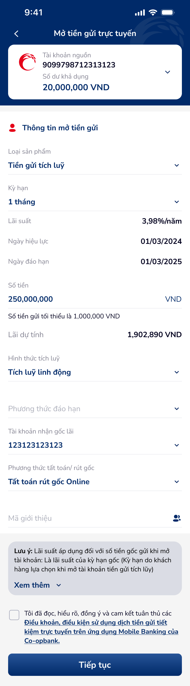
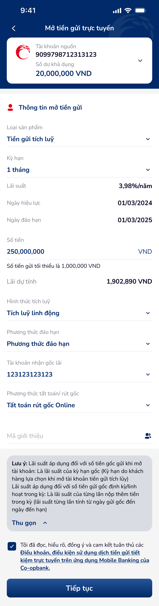
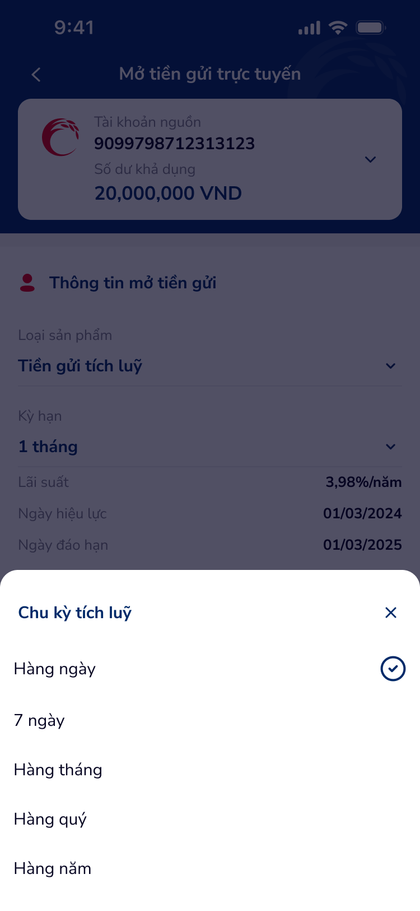
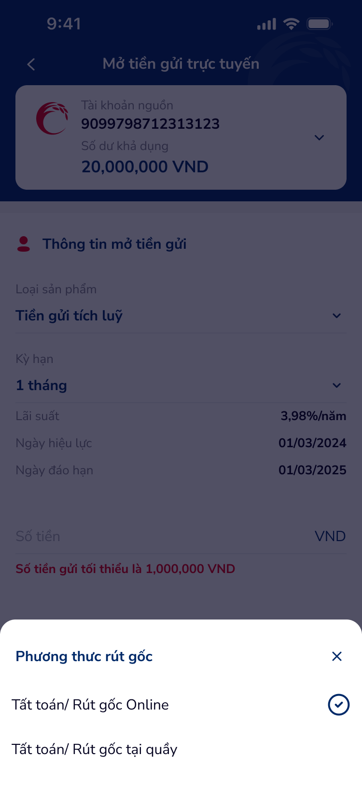

# SCR-TK-002 · Mở tiền gửi trực tuyến - Tích luỹ linh động › Form nhập thông tin

> `SCR-TK-002` · form · 5 artboards (incl. 2 overlays)

---

## 1. Mục đích màn hình

Form mở tiền gửi tích luỹ linh động. Cho phép user nhập thông tin sản phẩm tiết kiệm:
- Chọn tài khoản nguồn
- Chọn loại sản phẩm, kỳ hạn
- Nhập số tiền gửi (min 1,000,000 VND)
- Chọn hình thức tích luỹ (linh động)
- Chọn chu kỳ tích luỹ (popup bottom-sheet: Hàng ngày / 7 ngày / Hàng tháng / Hàng quý / Hàng năm)
- Chọn phương thức rút gốc (popup bottom-sheet: Online / Tại quầy)
- Nhập tài khoản nhận gốc lãi
- Chấp nhận điều khoản

## 2. Wireframes







## 3. Nội dung OCR

| # | Text | Loại | Vị trí |
|:--|:-----|:-----|:-------|
| 1 | Mở tiền gửi trực tuyến | header | top-center |
| 2 | Tài khoản nguồn | label | card-header |
| 3 | 9099798712313123 | value | card-body |
| 4 | Số dư khả dụng | label | card-body |
| 5 | 20,000,000 VND | value | card-body |
| 6 | Thông tin mở tiền gửi | section-header | form-top |
| 7 | Loại sản phẩm | field-label | form-field-1 |
| 8 | Tiền gửi tích luỹ | field-value | form-field-1 |
| 9 | Kỳ hạn | field-label | form-field-2 |
| 10 | 1 tháng | field-value | form-field-2 |
| 11 | Lãi suất | field-label | form-field-3 |
| 12 | 3,98%/năm | field-value | form-field-3 |
| 13 | Ngày hiệu lực | field-label | form-field-4 |
| 14 | 01/03/2024 | field-value | form-field-4 |
| 15 | Ngày đáo hạn | field-label | form-field-5 |
| 16 | 01/03/2025 | field-value | form-field-5 |
| 17 | Số tiền | field-label | form-field-6 |
| 18 | 250,000,000 | field-value | form-field-6 |
| 19 | Số tiền gửi tối thiểu là 1,000,000 VND | helper-text | form-field-6-helper |
| 20 | Lãi dự tính | field-label | form-field-7 |
| 21 | 1,902,890 VND | field-value | form-field-7 |
| 22 | Hình thức tích luỹ | field-label | form-field-8 |
| 23 | Tích luỹ linh động | field-value | form-field-8 |
| 24 | Phương thức đáo hạn | field-label | form-field-9 |
| 25 | Tài khoản nhận gốc lãi | field-label | form-field-10 |
| 26 | 123123123123 | field-value | form-field-10 |
| 27 | Phương thức tất toán/ rút gốc | field-label | form-field-11 |
| 28 | Tất toán/ rút gốc Online | field-value | form-field-11 |
| 29 | Mã giới thiệu | field-label | form-field-12 |
| 30 | Tiếp tục | button | bottom-cta |
| 31 | Tôi đã đọc, hiểu rõ, đồng ý và cam kết tuân thủ các Điều khoản... | checkbox-label | terms |
| 32 | Lưu ý: Lãi suất áp dụng đối với số tiền gốc gửi khi mở tài khoản | info-box | note-section |
| 33 | Xem thêm | link | note-section |
| 34 | Thu gọn | link | note-section-expanded |
| 35 | Chu kỳ tích luỹ | popup-title | bottom-sheet-1 |
| 36 | Phương thức rút gốc | popup-title | bottom-sheet-2 |

## 4. User Flow

```
SCR-TK-001 → [SCR-TK-002]
  ├── Overlay: Popup "Chu kỳ tích luỹ" (5 options)
  ├── Overlay: Popup "Phương thức rút gốc" (2 options)
  └── Tap "Tiếp tục" → SCR-TK-003
```

## 5. DDL References

| Ref | Mô tả |
|:----|:------|
| COMP:text-input-1 | Text input — states: error, errorMessage, disabled, focused |
| UXG-243 | Form usability and validation |
| UXG-101 | Content quality and typography |
| Hick's Law | Decision time increases with number of choices |
| Fitts's Law | CTA size and reachability |
