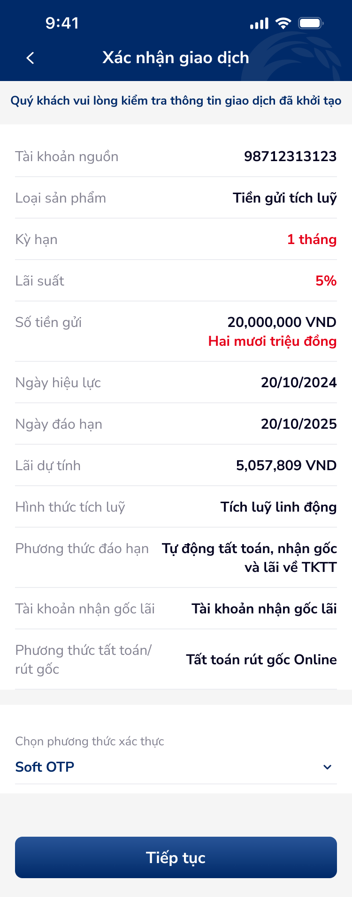
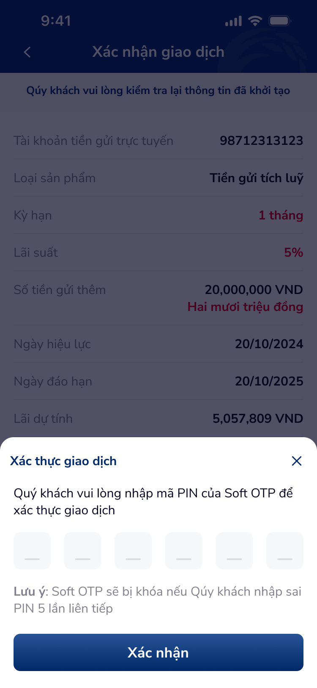

# SCR-TK-003 · Xác nhận giao dịch - Tích luỹ linh động › Xác nhận giao dịch

> `SCR-TK-003` · confirm · 2 artboards (incl. OTP overlay)

---

## 1. Mục đích màn hình

Hiển thị tóm tắt thông tin giao dịch mở tiền gửi để user xác nhận lần cuối trước khi thực hiện. Bao gồm:
- Tổng hợp toàn bộ thông tin đã nhập từ form (tài khoản nguồn, loại sản phẩm, kỳ hạn, lãi suất, số tiền, hình thức tích luỹ, phương thức đáo hạn)
- Chọn phương thức xác thực (Soft OTP)
- Overlay nhập mã PIN OTP 6 ô để hoàn tất giao dịch

## 2. Wireframes




## 3. Nội dung OCR

| # | Text | Loại | Vị trí |
|:--|:-----|:-----|:-------|
| 1 | Xác nhận giao dịch | header | top-center |
| 2 | Quý khách vui lòng kiểm tra thông tin giao dịch đã khởi tạo | instruction | sub-header |
| 3 | Tài khoản nguồn | label | row-1 |
| 4 | 98712313123 | value | row-1 |
| 5 | Loại sản phẩm | label | row-2 |
| 6 | Tiền gửi tích luỹ | value | row-2 |
| 7 | Kỳ hạn · 1 tháng | value-highlight | row-3 |
| 8 | Lãi suất · 5% | value-highlight | row-4 |
| 9 | Số tiền gửi · 20,000,000 VND | value | row-5 |
| 10 | Hai mươi triệu đồng | value-sub | row-5 |
| 11 | Ngày hiệu lực · 20/10/2024 | value | row-6 |
| 12 | Ngày đáo hạn · 20/10/2025 | value | row-7 |
| 13 | Lãi dự tính · 5,057,809 VND | value | row-8 |
| 14 | Hình thức tích luỹ · Tích luỹ linh động | value | row-9 |
| 15 | Phương thức đáo hạn · Tự động tất toán, nhận gốc và lãi về TKTT | value | row-10 |
| 16 | Chọn phương thức xác thực · Soft OTP | label+value | auth-section |
| 17 | Tiếp tục | button | bottom-cta |
| 18 | Xác thực giao dịch | popup-header | otp-overlay |
| 19 | Quý khách vui lòng nhập mã PIN của Soft OTP để xác thực giao dịch | popup-instruction | otp-overlay |
| 20 | Lưu ý: Soft OTP sẽ bị khóa nếu Qúy khách nhập sai PIN 5 lần liên tiếp | warning | otp-overlay |
| 21 | Xác nhận | button | otp-overlay-cta |

## 4. User Flow

```
SCR-TK-002 → [SCR-TK-003]
  ├── Tap "Tiếp tục" → show OTP overlay
  ├── Overlay: OTP 6-digit PIN input
  └── Tap "Xác nhận" (OTP thành công) → SCR-TK-004
```

## 5. DDL References

| Ref | Mô tả |
|:----|:------|
| COMP:otp-input-1 | OTP component — states: activeIndex, canResend, timeLeft, digits, errorCount |
| UXG-165 | Data consistency and completeness |
| UXG-101 | Content quality (typo "Qúy" → "Quý") |
