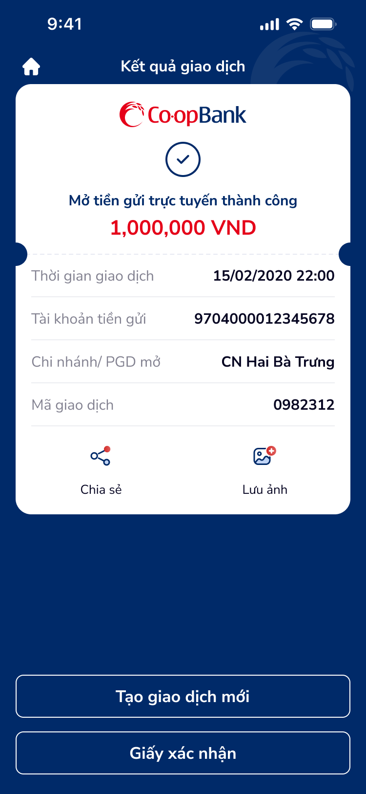

# SCR-TK-004 · Kết quả giao dịch - Tích luỹ linh động › Kết quả giao dịch

> `SCR-TK-004` · result · 1 artboard

---

## 1. Mục đích màn hình

Thông báo kết quả mở tiền gửi trực tuyến thành công. Hiển thị:
- Trạng thái thành công (checkmark + text)
- Số tiền giao dịch
- Thông tin giao dịch: thời gian, tài khoản tiền gửi, chi nhánh, mã giao dịch
- Actions: Chia sẻ, Lưu ảnh
- CTA: Tạo giao dịch mới, Giấy xác nhận

## 2. Wireframes



## 3. Nội dung OCR

| # | Text | Loại | Vị trí |
|:--|:-----|:-----|:-------|
| 1 | Kết quả giao dịch | header | top-center |
| 2 | Co·opBank | brand-logo | card-top |
| 3 | Mở tiền gửi trực tuyến thành công | status-text | card-center |
| 4 | 1,000,000 VND | amount | card-center |
| 5 | Thời gian giao dịch · 15/02/2020 22:00 | label+value | card-row-1 |
| 6 | Tài khoản tiền gửi · 9704000012345678 | label+value | card-row-2 |
| 7 | Chi nhánh/ PGD mở · CN Hai Bà Trưng | label+value | card-row-3 |
| 8 | Mã giao dịch · 0982312 | label+value | card-row-4 |
| 9 | Chia sẻ | action-label | action-1 |
| 10 | Lưu ảnh | action-label | action-2 |
| 11 | Tạo giao dịch mới | button-primary | bottom-cta-1 |
| 12 | Giấy xác nhận | button-secondary | bottom-cta-2 |

## 4. User Flow

```
SCR-TK-003 → [SCR-TK-004]
  ├── Tap "Tạo giao dịch mới" → SCR-TK-001
  ├── Tap "Giấy xác nhận" → (external: PDF/receipt)
  ├── Tap ic_home → Home screen
  ├── Tap "Chia sẻ" → OS share sheet
  └── Tap "Lưu ảnh" → Save screenshot
```

## 5. DDL References

| Ref | Mô tả |
|:----|:------|
| COMP:receipt-preview-1 | Receipt — fields: transactionId, timestamp, amount, status, recipientInfo, senderInfo |
| Peak-End Rule | Success screen = positive peak moment |
| Fitts's Law | CTA hierarchy between primary and secondary actions |
