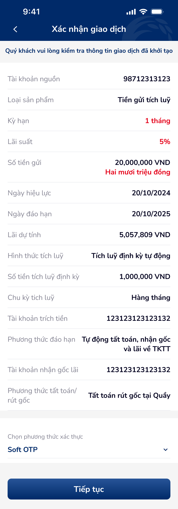
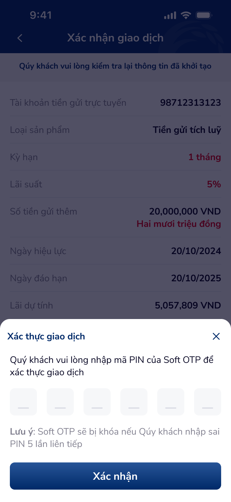

# SCR-TK-006 · Xác nhận giao dịch - Tích luỹ định kỳ tự động › Xác nhận giao dịch

> `SCR-TK-006` · confirm · 2 artboards (incl. OTP overlay)

---

## 1. Mục đích màn hình

Xác nhận giao dịch mở tiền gửi tích luỹ định kỳ tự động. Tương tự SCR-TK-003 nhưng hiển thị thêm:
- Hình thức tích luỹ: Tích luỹ định kỳ tự động
- Số tiền tích luỹ định kỳ: 1,000,000 VND
- Chu kỳ tích luỹ: Hàng tháng
- Tài khoản trích tiền
- Phương thức tất toán: Tất toán rút gốc tại Quầy

## 2. Wireframes




## 3. Nội dung OCR

| # | Text | Loại | Vị trí |
|:--|:-----|:-----|:-------|
| 1 | Xác nhận giao dịch | header | top-center |
| 2 | Quý khách vui lòng kiểm tra thông tin giao dịch đã khởi tạo | instruction | sub-header |
| 3 | Tài khoản nguồn · 98712313123 | label+value | row-1 |
| 4 | Loại sản phẩm · Tiền gửi tích luỹ | label+value | row-2 |
| 5 | Kỳ hạn · 1 tháng | value-highlight | row-3 |
| 6 | Lãi suất · 5% | value-highlight | row-4 |
| 7 | Số tiền gửi · 20,000,000 VND · Hai mươi triệu đồng | value | row-5 |
| 8 | Hình thức tích luỹ · Tích luỹ định kỳ tự động | value | row-9 |
| 9 | Số tiền tích luỹ định kỳ · 1,000,000 VND | value | row-10 |
| 10 | Chu kỳ tích luỹ · Hàng tháng | value | row-11 |
| 11 | Tài khoản trích tiền · 123123123123132 | value | row-12 |
| 12 | Phương thức tất toán/ rút gốc · Tất toán rút gốc tại Quầy | value | row-14 |
| 13 | Chọn phương thức xác thực · Soft OTP | label+value | auth-section |
| 14 | Tiếp tục | button | bottom-cta |
| 15 | Xác thực giao dịch | popup-header | otp-overlay |
| 16 | Xác nhận | button | otp-overlay-cta |

## 4. User Flow

```
SCR-TK-005 → [SCR-TK-006]
  ├── Tap "Tiếp tục" → show OTP overlay
  └── Tap "Xác nhận" (OTP thành công) → SCR-TK-007
```

## 5. DDL References

| Ref | Mô tả |
|:----|:------|
| COMP:otp-input-1 | OTP component — states thiếu tương tự SCR-TK-003 |
| UXG-165 | Data consistency (lãi suất form vs confirm) |
| UXG-101 | Typo "Qúy" → "Quý" |
