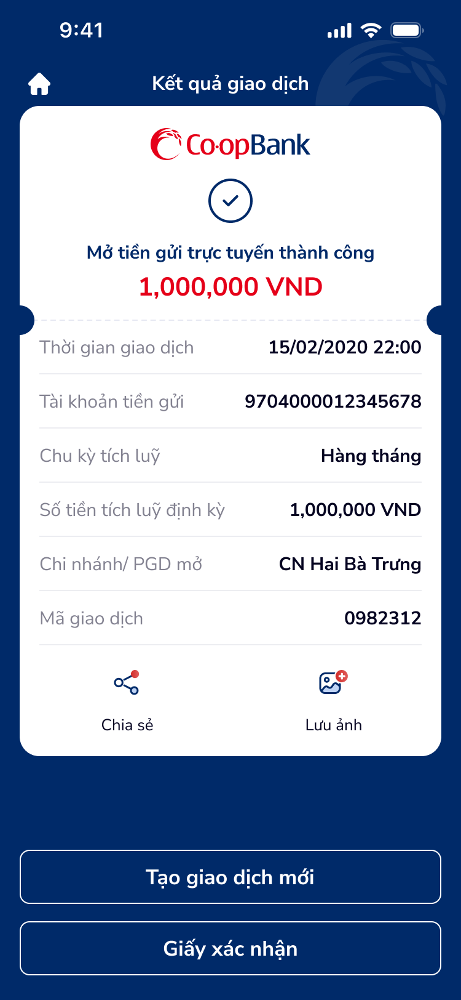

# SCR-TK-007 · Kết quả giao dịch - Tích luỹ định kỳ tự động › Kết quả giao dịch

> `SCR-TK-007` · result · 1 artboard

---

## 1. Mục đích màn hình

Kết quả mở tiền gửi tích luỹ định kỳ tự động thành công. Tương tự SCR-TK-004 nhưng hiển thị thêm:
- Chu kỳ tích luỹ: Hàng tháng
- Số tiền tích luỹ định kỳ: 1,000,000 VND

## 2. Wireframes



## 3. Nội dung OCR

| # | Text | Loại | Vị trí |
|:--|:-----|:-----|:-------|
| 1 | Kết quả giao dịch | header | top-center |
| 2 | Co·opBank | brand-logo | card-top |
| 3 | Mở tiền gửi trực tuyến thành công | status-text | card-center |
| 4 | 1,000,000 VND | amount | card-center |
| 5 | Thời gian giao dịch · 15/02/2020 22:00 | label+value | card-row-1 |
| 6 | Tài khoản tiền gửi · 9704000012345678 | label+value | card-row-2 |
| 7 | Chu kỳ tích luỹ · Hàng tháng | label+value | card-row-3 |
| 8 | Số tiền tích luỹ định kỳ · 1,000,000 VND | label+value | card-row-4 |
| 9 | Chi nhánh/ PGD mở · CN Hai Bà Trưng | label+value | card-row-5 |
| 10 | Mã giao dịch · 0982312 | label+value | card-row-6 |
| 11 | Chia sẻ | action-label | action-1 |
| 12 | Lưu ảnh | action-label | action-2 |
| 13 | Tạo giao dịch mới | button-primary | bottom-cta-1 |
| 14 | Giấy xác nhận | button-secondary | bottom-cta-2 |

## 4. User Flow

```
SCR-TK-006 → [SCR-TK-007]
  ├── Tap "Tạo giao dịch mới" → SCR-TK-001
  ├── Tap "Giấy xác nhận" → (external: PDF/receipt)
  ├── Tap ic_home → Home screen
  ├── Tap "Chia sẻ" → OS share sheet
  └── Tap "Lưu ảnh" → Save screenshot
```

## 5. DDL References

| Ref | Mô tả |
|:----|:------|
| COMP:receipt-preview-1 | Receipt — thiếu tài khoản nguồn, lãi suất, kỳ hạn |
| Peak-End Rule | Success = positive peak |
| Fitts's Law | CTA hierarchy between primary/secondary |
