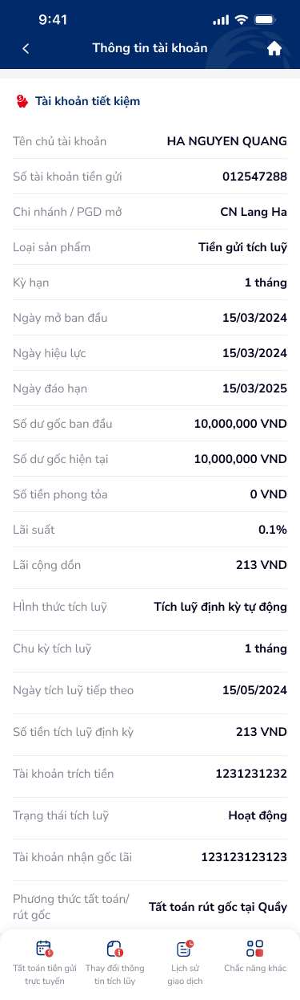

# SCR-TK-001 — Thông tin tài khoản tiết kiệm › Chi tiết

## 1. Tổng quan màn hình

| Thuộc tính | Giá trị |
|:---|:---|
| **Screen ID** | SCR-TK-001 |
| **Tên màn hình** | Thông tin tài khoản tiết kiệm |
| **Loại** | Chi tiết (detail) |
| **Figma Node** | 154:187260 |
| **Kích thước** | 375 × 1246 |

**Mô tả:** Màn hình chi tiết hiển thị toàn bộ thông tin tài khoản tiết kiệm tích luỹ, bao gồm thông tin chủ tài khoản, số dư, lãi suất, kỳ hạn, hình thức tích luỹ, và các chức năng liên quan qua bottom navigation.

## 2. Wireframe

## 3. Nội dung chi tiết

### 3.1 Header
- Back button (←)
- Title: "Thông tin tài khoản"
- Home button (🏠)

### 3.2 Thông tin tài khoản
| Trường | Giá trị |
|:---|:---|
| Tên chủ tài khoản | HA NGUYEN QUANG |
| Số tài khoản tiền gửi | 012547288 |
| Chi nhánh / PGD mở | CN Lang Ha |
| Loại sản phẩm | Tiền gửi tích luỹ |
| Kỳ hạn | 1 tháng |
| Ngày mở ban đầu | 15/03/2024 |
| Ngày hiệu lực | 15/03/2024 |
| Ngày đáo hạn | 15/03/2025 |
| Số dư gốc ban đầu | 10,000,000 VND |
| Số dư gốc hiện tại | 10,000,000 VND |
| Số tiền phong tỏa | 0 VND |
| Lãi suất | 0.1% |
| Lãi cộng dồn | 213 VND |
| Hình thức tích luỹ | Tích luỹ định kỳ tự động |
| Chu kỳ tích luỹ | 1 tháng |
| Ngày tích luỹ tiếp theo | 15/05/2024 |
| Số tiền tích luỹ định kỳ | 213 VND |
| Tài khoản trích tiền | 1231231232 |
| Trạng thái tích luỹ | Hoạt động |
| Tài khoản nhận gốc lãi | 123123123123 |
| Phương thức tất toán/rút gốc | Tất toán rút gốc tại Quầy |

### 3.3 Bottom Navigation
| Tab | Icon | Chức năng |
|:---|:---|:---|
| Tab 1 | 📋 | Tất toán tiền gửi trực tuyến |
| Tab 2 | 🔄 | Thay đổi thông tin tích luỹ |
| Tab 3 | 📜 | Lịch sử giao dịch |
| Tab 4 | ⚙️ | Chức năng khác |

## 4. Luồng người dùng (User Flow)

- **Entry:** Từ danh sách tài khoản tiết kiệm → tap vào 1 tài khoản
- **Exit:** Tap bottom nav "Thay đổi thông tin tích luỹ" → SCR-TK-002
- **Back:** ← quay về danh sách tài khoản

## 5. Yêu cầu phi chức năng (NFR)

- Dữ liệu tài khoản phải load real-time từ core banking
- Mask/truncate số tài khoản nếu cần (PII protection)
- Scrollable content (screen dài 1246px)
- Loading state khi fetch data
