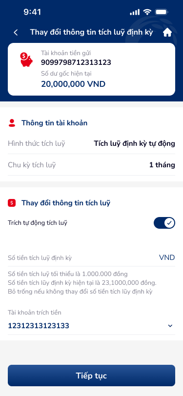
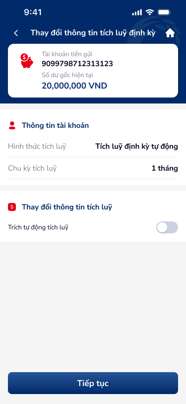
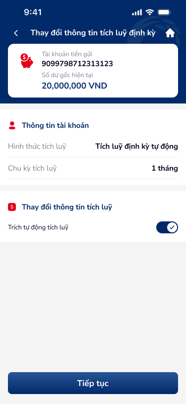
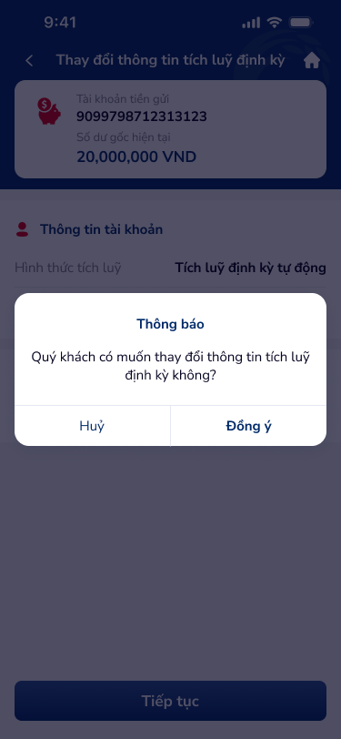

# SCR-TK-002 — Thay đổi thông tin tích luỹ định kỳ › Form nhập thông tin

## 1. Tổng quan màn hình

| Thuộc tính | Giá trị |
|:---|:---|
| **Screen ID** | SCR-TK-002 |
| **Tên màn hình** | Thay đổi thông tin tích luỹ định kỳ |
| **Loại** | Form nhập thông tin (form) |
| **Figma Nodes** | 154:187354, 154:187390, 154:187404, 154:187418 |
| **Số variants** | 4 (toggle ON+input, toggle OFF, toggle ON no-input, popup xác nhận) |

**Mô tả:** Form cho phép khách hàng thay đổi thông tin tích luỹ định kỳ: bật/tắt trích tự động, thay đổi số tiền tích luỹ, chọn tài khoản trích tiền. Có popup xác nhận trước khi thực hiện.

## 2. Wireframe

### Variant 1: Toggle ON + Input fields

### Variant 2: Toggle OFF

### Variant 3: Toggle ON, không input

### Variant 4: Popup xác nhận (overlay)

## 3. Nội dung chi tiết

### 3.1 Header
- Back button (←)
- Title: "Thay đổi thông tin tích luỹ định kỳ"
- Home button (🏠)

### 3.2 Account Card (Blue gradient)
| Trường | Giá trị |
|:---|:---|
| Tài khoản tiền gửi | 9099798712313123 |
| Số dư gốc hiện tại | 20,000,000 VND |

### 3.3 Thông tin tài khoản (Read-only)
| Trường | Giá trị |
|:---|:---|
| Hình thức tích luỹ | Tích luỹ định kỳ tự động |
| Chu kỳ tích luỹ | 1 tháng |

### 3.4 Thay đổi thông tin tích luỹ (Editable)
| Element | Type | Mô tả |
|:---|:---|:---|
| Trích tự động tích luỹ | Toggle switch | ON: hiển thị input fields, OFF: ẩn input fields |
| Số tiền tích luỹ định kỳ | Text input (VND) | Min: 1,000,000 VND. Helper: "Số tiền tích lũy định kỳ hiện tại là 23,100,000 đồng. Bỏ trống nếu không thay đổi" |
| Tài khoản trích tiền | Dropdown selector | Chọn tài khoản nguồn trích tiền (12312313123133) |
| Tiếp tục | Primary button | Submit form → mở popup xác nhận |

### 3.5 Popup xác nhận (Overlay)
- **Title:** "Thông báo"
- **Body:** "Quý khách có muốn thay đổi thông tin tích luỹ định kỳ không?"
- **Actions:** Huỷ (secondary) | Đồng ý (primary)
- **Background:** Dimmed/blur

## 4. Luồng người dùng (User Flow)

- **Entry:** Từ SCR-TK-001 → tap bottom nav "Thay đổi thông tin tích luỹ"
- **Toggle ON:** Hiển thị input fields (số tiền, tài khoản trích tiền)
- **Toggle OFF:** Ẩn input fields
- **Submit:** Tap "Tiếp tục" → popup xác nhận → "Đồng ý" → SCR-TK-003
- **Cancel:** Popup "Huỷ" → đóng popup, quay lại form

## 5. Yêu cầu phi chức năng (NFR)

- Validate số tiền tích luỹ ≥ 1,000,000 VND
- Toggle state phải persist khi navigate back
- Dropdown tài khoản trích tiền load từ danh sách tài khoản thanh toán
- Popup xác nhận phải có blur background
- Input field phải format number với dấu phân cách nghìn
