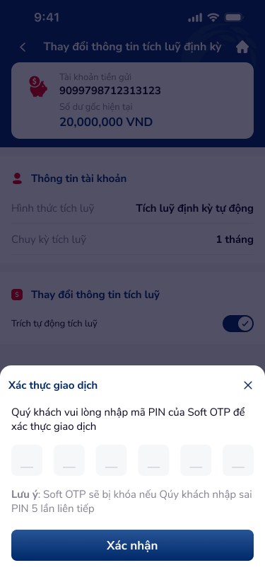

# SCR-TK-003 — Xác thực giao dịch › Xác nhận giao dịch

## 1. Tổng quan màn hình

| Thuộc tính | Giá trị |
|:---|:---|
| **Screen ID** | SCR-TK-003 |
| **Tên màn hình** | Xác thực giao dịch |
| **Loại** | Xác nhận giao dịch (confirm) |
| **Figma Node** | 154:187450 |
| **Kích thước** | 375 × 812 |

**Mô tả:** Bottom sheet xác thực giao dịch bằng Soft OTP (6-digit PIN), hiển thị trên nền form thay đổi thông tin (dimmed). Cảnh báo khoá OTP nếu nhập sai 5 lần liên tiếp.

## 2. Wireframe

## 3. Nội dung chi tiết

### 3.1 Base Screen (Dimmed)
- Header: "Thay đổi thông tin tích luỹ định kỳ"
- Account card + thông tin tài khoản (read-only, dimmed)

### 3.2 Bottom Sheet — Xác thực giao dịch
| Element | Type | Mô tả |
|:---|:---|:---|
| Title bar | Header | "Xác thực giao dịch" + Close button (×) |
| Instruction | Text | "Quý khách vui lòng nhập mã PIN của Soft OTP để xác thực giao dịch" |
| PIN Input | 6 digit cells | 6 ô nhập OTP PIN riêng biệt |
| Warning | Text (orange) | "Lưu ý: Soft OTP sẽ bị khoá nếu Quý khách nhập sai PIN 5 lần liên tiếp" |
| Xác nhận | Primary button | Submit OTP → SCR-TK-004 |

## 4. Luồng người dùng (User Flow)

- **Entry:** Từ SCR-TK-002 → popup "Đồng ý"
- **Input:** Nhập 6 digit PIN Soft OTP
- **Submit:** Tap "Xác nhận" → verify OTP → SCR-TK-004 (success) hoặc error
- **Close:** Tap × → đóng bottom sheet, quay lại SCR-TK-002

## 5. Yêu cầu phi chức năng (NFR)

- Auto-focus ô digit đầu tiên khi bottom sheet mở
- Auto-tab sang ô tiếp theo sau mỗi digit nhập
- Support paste 6-digit từ clipboard
- Backspace xoá digit và focus ô trước
- Khoá OTP sau 5 lần nhập sai liên tiếp
- Loading state khi verify OTP
- Error state hiển thị khi OTP sai (shake animation + red border)
- Timeout handling cho OTP session
