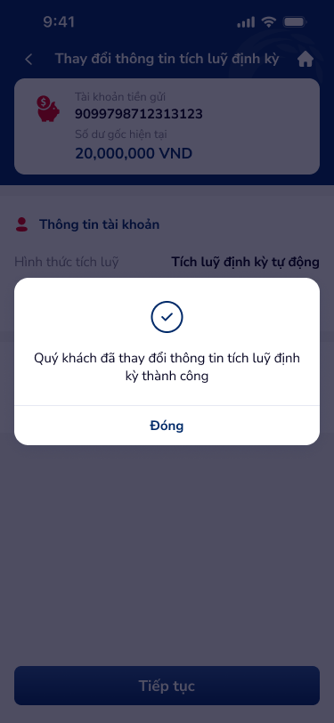

# SCR-TK-004 — Kết quả thay đổi › Kết quả giao dịch

## 1. Tổng quan màn hình

| Thuộc tính | Giá trị |
|:---|:---|
| **Screen ID** | SCR-TK-004 |
| **Tên màn hình** | Kết quả thay đổi |
| **Loại** | Kết quả giao dịch (result) |
| **Figma Node** | 154:187434 |
| **Kích thước** | 375 × 812 |

**Mô tả:** Popup hiển thị kết quả thành công sau khi thay đổi thông tin tích luỹ định kỳ. Có checkmark icon và nút Đóng. Base screen dimmed.

## 2. Wireframe

## 3. Nội dung chi tiết

### 3.1 Base Screen (Dimmed)
- Header: "Thay đổi thông tin tích luỹ định kỳ"
- Account card + thông tin tài khoản (read-only, dimmed)

### 3.2 Success Popup
| Element | Type | Mô tả |
|:---|:---|:---|
| Checkmark | Icon (✓) | Circle checkmark xanh — biểu thị thành công |
| Message | Text | "Quý khách đã thay đổi thông tin tích luỹ định kỳ thành công" |
| Đóng | Text button (blue) | Đóng popup → quay về SCR-TK-001 |

## 4. Luồng người dùng (User Flow)

- **Entry:** Từ SCR-TK-003 → OTP verified thành công
- **Exit:** Tap "Đóng" → quay về SCR-TK-001 (chi tiết tài khoản, data refreshed)

## 5. Yêu cầu phi chức năng (NFR)

- Popup hiển thị ngay sau khi OTP verify thành công
- Data tài khoản phải refresh khi quay về SCR-TK-001
- Success animation (checkmark appear) nên có
- Không cho phép dismiss bằng tap outside (phải dùng nút Đóng)
- Log transaction kết quả cho audit trail
