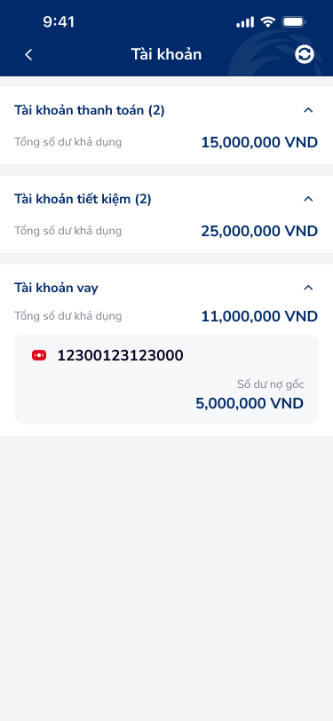

# SCR-TAV-001 · Tài khoản › Danh sách

## 1. Metadata

| Field | Value |
|-------|-------|
| screen_id | SCR-TAV-001 |
| display_name_vi | Tài khoản › Danh sách |
| screen_type | list |
| figma_node_id | 142:17847 |
| wireframe_image | account.png |
| section | tài khoản vay |

## 2. Flow

- **Triggered by:** Home navigation → Tài khoản tab
- **Navigates to:** SCR-TAV-002 (tap vào account row "12300123123000" trong section Tài khoản vay)
- **User Story:** Là người dùng, tôi muốn xem tổng quan tất cả các loại tài khoản (thanh toán, tiết kiệm, vay) để biết tổng số dư và trạng thái từng nhóm.

## 3. Content Inventory (OCR)

### Text Nodes
| # | Text | Role |
|---|------|------|
| 1 | Tài khoản | Page title (header) |
| 2 | Tài khoản thanh toán (2) | Section header — accordion |
| 3 | Tổng số dư khả dụng | Label |
| 4 | 15,000,000 VND | Value — thanh toán balance |
| 5 | Tài khoản tiết kiệm (2) | Section header — accordion |
| 6 | Tổng số dư khả dụng | Label |
| 7 | 25,000,000 VND | Value — tiết kiệm balance |
| 8 | Tài khoản vay | Section header — accordion (expanded) |
| 9 | Tổng số dư khả dụng | Label |
| 10 | 11,000,000 VND | Value — vay total |
| 11 | 12300123123000 | Account number — loan account row |
| 12 | Số dư nợ gốc | Label — nested in account row |
| 13 | 5,000,000 VND | Value — outstanding principal |

### Icons
| Icon | Position | Role |
|------|----------|------|
| caret-arrow-up | Header each section | Expand/collapse accordion |
| back arrow | Header left | Back navigation |
| refresh icon | Header right | Refresh data |

## 4. UX Signal Inference (Phase 4e)

### Consumer Payload
```json
{
  "text_list": ["Tài khoản thanh toán (2)", "Tài khoản tiết kiệm (2)", "Tài khoản vay", "Tổng số dư khả dụng", "12300123123000", "Số dư nợ gốc", "5,000,000 VND"],
  "context_hint": "Account overview screen — multi-type accordion list (payment, savings, loan). User sees all account categories with expand/collapse and balance summary.",
  "ocr_icons": ["caret-arrow-up", "refresh"]
}
```

### UX Signals Detected
| Signal | Category | DDL Ref | Severity |
|--------|----------|---------|---------|
| Accordion expand/collapse không có loading state | Feedback | UXG-061 | Major |
| Balance hiển thị dạng số thuần, thiếu context currency prominence | Hierarchy | UXG-022 | Minor |
| Account number `12300123123000` dài — không có masking | Privacy | UXG-189 | Minor |
| Không có empty state nếu user chưa có khoản vay | Error prevention | UXG-074 | Major |
| Refresh icon thiếu tooltip/label | Accessibility | UXG-213 | Minor |

## 5. PRD Requirements

### Functional Requirements
- FR-001: Hiển thị danh sách tài khoản nhóm theo loại (Thanh toán / Tiết kiệm / Vay)
- FR-002: Mỗi nhóm có accordion expand/collapse với tổng số dư
- FR-003: Khi expand phần Vay → hiển thị danh sách các khoản vay dạng balance-card
- FR-004: Tap vào account row → navigate tới SCR-TAV-002 (Thông tin tài khoản vay)
- FR-005: Refresh action → reload data

### Non-Functional Requirements
- NFR-001: Load time ≤ 2s (Doherty Threshold)
- NFR-002: Account number masking theo tiêu chuẩn bảo mật ngân hàng

### Edge Cases
- EC-001: User không có khoản vay → empty state với CTA "Tìm hiểu sản phẩm vay"
- EC-002: API lỗi → error state với retry action
- EC-003: Số dư âm → visual indicator khác biệt (red)

