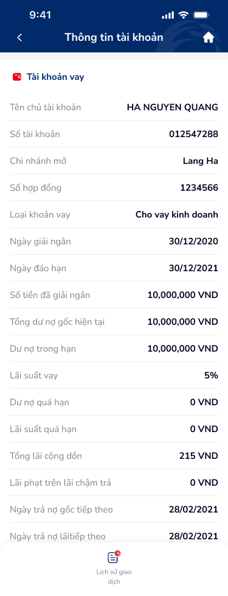

# SCR-TAV-002 · Thông tin tài khoản vay › Chi tiết

## 1. Metadata

| Field | Value |
|-------|-------|
| screen_id | SCR-TAV-002 |
| display_name_vi | Thông tin tài khoản vay › Chi tiết |
| screen_type | detail |
| figma_node_id | 142:17860 |
| wireframe_image | account-2.png |
| section | tài khoản vay |

## 2. Flow

- **Triggered by:** SCR-TAV-001 → tap account row "12300123123000"
- **Navigates to:** SCR-TAV-004 (tap CTA "Lịch sử giao dịch" ở bottom)
- **User Story:** Là người dùng, tôi muốn xem đầy đủ thông tin khoản vay của mình (số hợp đồng, loại vay, dư nợ, lãi suất, lịch trả) để quản lý nghĩa vụ tài chính.

## 3. Content Inventory (OCR)

### Text Nodes
| # | Text | Role |
|---|------|------|
| 1 | Thông tin tài khoản | Page title |
| 2 | Tài khoản vay | Section header |
| 3 | Tên chủ tài khoản | Label |
| 4 | HA NGUYEN QUANG | Value — PII |
| 5 | Số tài khoản | Label |
| 6 | 012547288 | Value |
| 7 | Chi nhánh mở | Label |
| 8 | Lang Ha | Value |
| 9 | Số hợp đồng | Label |
| 10 | 1234566 | Value |
| 11 | Loại khoản vay | Label |
| 12 | Cho vay kinh doanh | Value |
| 13 | Ngày giải ngân | Label |
| 14 | 30/12/2020 | Value |
| 15 | Ngày đáo hạn | Label |
| 16 | 30/12/2021 | Value |
| 17 | Số tiền đã giải ngân | Label |
| 18 | 10,000,000 VND | Value |
| 19 | Tổng dư nợ gốc hiện tại | Label |
| 20 | 10,000,000 VND | Value — critical |
| 21 | Dư nợ trong hạn | Label |
| 22 | 10,000,000 VND | Value |
| 23 | Lãi suất vay | Label |
| 24 | 5% | Value |
| 25 | Dư nợ quá hạn | Label |
| 26 | 0 VND | Value |
| 27 | Lãi suất quá hạn | Label |
| 28 | 0 VND | Value |
| 29 | Tổng lãi cộng dồn | Label |
| 30 | 215 VND | Value |
| 31 | Lãi phạt trên lãi chậm trả | Label |
| 32 | 0 VND | Value |
| 33 | Ngày trả nợ gốc tiếp theo | Label |
| 34 | 28/02/2021 | Value — upcoming deadline |
| 35 | Ngày trả nợ lãitiếp theo | Label (typo: thiếu space) |
| 36 | 28/02/2021 | Value |
| 37 | Lịch sử giao dịch | CTA — bottom action |

### Icons
| Icon | Position | Role |
|------|----------|------|
| wallet (red) | Section header left | Loan account identifier |
| back arrow | Header left | Back to SCR-TAV-001 |
| home | Header right | Back to home |
| transaction list | Bottom CTA | Navigate to SCR-TAV-004 |

## 4. UX Signal Inference (Phase 4e)

### Consumer Payload
```json
{
  "text_list": ["Thông tin tài khoản", "Tài khoản vay", "Tổng dư nợ gốc hiện tại", "Ngày trả nợ gốc tiếp theo", "28/02/2021", "Lãi suất vay", "5%", "Lịch sử giao dịch"],
  "context_hint": "Loan account detail screen — read-only. 17 label-value pairs. Single CTA at bottom: Lịch sử giao dịch. PII visible (full name, account number).",
  "ocr_icons": ["wallet", "home", "transaction-list"]
}
```

### UX Signals Detected
| Signal | Category | DDL Ref | Severity |
|--------|----------|---------|---------|
| Typo: "Ngày trả nợ lãitiếp theo" (thiếu space) | Copy quality | UXG-035 | Major |
| 17 dòng thông tin không nhóm theo nhóm logic (định danh / khoản vay / tài chính / lịch trả) | Information architecture | UXG-022 | Major |
| PII toàn màn hình không có masking toggle | Privacy/Security | UXG-189 | Critical |
| Chỉ có 1 CTA action (Lịch sử giao dịch) - thiếu action "Thanh toán" hoặc "Trả nợ" | Task completion | UXG-061 | Critical |
| "Ngày đáo hạn" đã qua (30/12/2021) không có visual alert | Feedback | UXG-074 | Major |
| Không có skeleton loading state | Feedback | UXG-165 | Minor |
| Màn hình dài (978px) - thiếu scroll indicator | Navigation | UXG-243 | Minor |

## 5. PRD Requirements

### Functional Requirements
- FR-001: Hiển thị đầy đủ thông tin khoản vay dạng label-value list
- FR-002: Nhóm thông tin theo nhóm logic (Thông tin định danh / Chi tiết khoản vay / Tình trạng dư nợ / Lịch trả nợ)
- FR-003: CTA "Lịch sử giao dịch" → navigate tới SCR-TAV-004
- FR-004: PII có toggle show/hide masking
- FR-005: Ngày đáo hạn đã qua → hiển thị badge "Đã đáo hạn" màu đỏ

### Non-Functional Requirements
- NFR-001: PII masking by default (chỉ show khi user tap icon eye)
- NFR-002: Số tài khoản format masked: `••••••288`

### Edge Cases
- EC-001: Khoản vay quá hạn → "Dư nợ quá hạn" highlight đỏ + banner cảnh báo top
- EC-002: Ngày đáo hạn < ngày hiện tại → badge "Quá hạn"
- EC-003: "Tổng lãi cộng dồn" = 0 → vẫn hiển thị "0 VND" (không ẩn)

