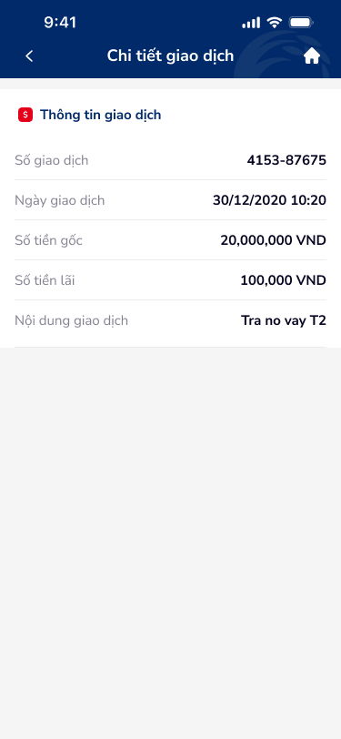

# SCR-TAV-003 · Chi tiết giao dịch › Chi tiết

## 1. Metadata

| Field | Value |
|-------|-------|
| screen_id | SCR-TAV-003 |
| display_name_vi | Chi tiết giao dịch › Chi tiết |
| screen_type | detail |
| figma_node_id | 142:17885 |
| wireframe_image | account-3.png |
| section | tài khoản vay |

## 2. Flow

- **Triggered by:** SCR-TAV-004 → tap vào transaction row (TK thang 1/2/3)
- **Navigates to:** (back) → SCR-TAV-004
- **User Story:** Là người dùng, tôi muốn xem chi tiết một giao dịch cụ thể (số GD, ngày, số tiền gốc, lãi, nội dung) để kiểm tra tính chính xác của giao dịch trả nợ.

## 3. Content Inventory (OCR)

### Text Nodes
| # | Text | Role |
|---|------|------|
| 1 | Chi tiết giao dịch | Page title |
| 2 | Thông tin giao dịch | Section header |
| 3 | Số giao dịch | Label |
| 4 | 4153-87675 | Value — transaction ID |
| 5 | Ngày giao dịch | Label |
| 6 | 30/12/2020 10:20 | Value — datetime |
| 7 | Số tiền gốc | Label |
| 8 | 20,000,000 VND | Value — principal amount |
| 9 | Số tiền lãi | Label |
| 10 | 100,000 VND | Value — interest amount |
| 11 | Nội dung giao dịch | Label |
| 12 | Tra no vay T2 | Value (typo: "Trả nợ" viết tắt không chuẩn) |

### Icons
| Icon | Position | Role |
|------|----------|------|
| transaction (red 'S') | Section header left | Transaction type identifier |
| back arrow | Header left | Back to SCR-TAV-004 |
| home | Header right | Back to home |

## 4. UX Signal Inference (Phase 4e)

### Consumer Payload
```json
{
  "text_list": ["Chi tiết giao dịch", "Số giao dịch", "4153-87675", "Ngày giao dịch", "30/12/2020 10:20", "Số tiền gốc", "20,000,000 VND", "Số tiền lãi", "100,000 VND", "Nội dung giao dịch", "Tra no vay T2"],
  "context_hint": "Transaction detail screen — read-only. 5 label-value pairs for a loan repayment transaction. No actions available.",
  "ocr_icons": ["transaction", "home"]
}
```

### UX Signals Detected
| Signal | Category | DDL Ref | Severity |
|--------|----------|---------|---------|
| Typo: "Tra no vay T2" (thiếu dấu "ả", viết tắt "T2") | Copy quality | UXG-035 | Major |
| Không có action nào (chia sẻ, tải về biên lai) trên màn hình read-only | Task completion | UXG-061 | Major |
| Phần trống lớn ở bottom (màn hình 812px chỉ dùng ~380px) | Layout efficiency | UXG-022 | Minor |
| "Số giao dịch" không có copy-to-clipboard action | Usability | UXG-198 | Minor |
| Không có trạng thái giao dịch (Thành công / Thất bại) | Feedback | UXG-074 | Critical |
| Nội dung giao dịch quá ngắn, thiếu context đầy đủ | Information completeness | UXG-035 | Minor |

## 5. PRD Requirements

### Functional Requirements
- FR-001: Hiển thị chi tiết giao dịch dạng label-value
- FR-002: Thêm trạng thái giao dịch (Thành công / Đang xử lý / Thất bại) với visual badge
- FR-003: "Số giao dịch" có tap-to-copy functionality
- FR-004: CTA "Tải biên lai" / "Chia sẻ" ở bottom action bar
- FR-005: "Nội dung giao dịch" hiển thị đầy đủ, không viết tắt

### Non-Functional Requirements
- NFR-001: Biên lai PDF có thể tải về / chia sẻ qua nền tảng native (iOS Share Sheet, Android Intent)
- NFR-002: Transaction ID có thể copy không qua clipboard API native

### Edge Cases
- EC-001: Giao dịch thất bại → badge "Thất bại" đỏ + reason code
- EC-002: Giao dịch đang xử lý → badge "Đang xử lý" vàng + auto-refresh 30s
- EC-003: Không tải được chi tiết → skeleton + retry

