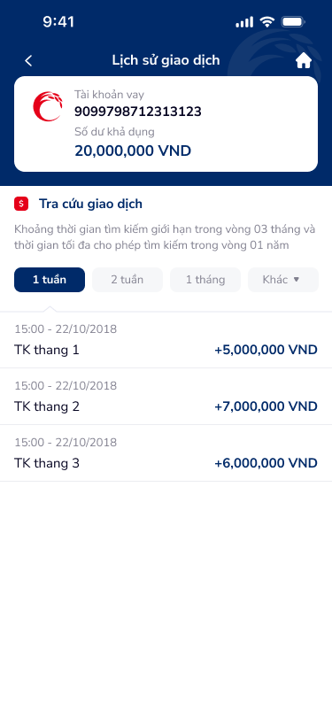

# SCR-TAV-004 · Lịch sử giao dịch › Danh sách

## 1. Metadata

| Field | Value |
|-------|-------|
| screen_id | SCR-TAV-004 |
| display_name_vi | Lịch sử giao dịch › Danh sách |
| screen_type | list |
| figma_node_id | 142:17897 |
| wireframe_image | transaction-history.png |
| section | tài khoản vay |

## 2. Flow

- **Triggered by:** SCR-TAV-002 → tap CTA "Lịch sử giao dịch"
- **Navigates to:** SCR-TAV-003 (tap vào transaction row)
- **User Story:** Là người dùng, tôi muốn tra cứu lịch sử giao dịch của khoản vay theo khoảng thời gian (1 tuần / 2 tuần / 1 tháng / tùy chỉnh) để kiểm soát các khoản trả nợ đã thực hiện.

## 3. Content Inventory (OCR)

### Text Nodes
| # | Text | Role |
|---|------|------|
| 1 | Lịch sử giao dịch | Page title |
| 2 | Tài khoản vay | Balance card — account type label |
| 3 | 90997987123123123 | Balance card — account number |
| 4 | Số dư khả dụng | Balance card — label |
| 5 | 20,000,000 VND | Balance card — available balance |
| 6 | Tra cứu giao dịch | Section header |
| 7 | Khoảng thời gian tìm kiếm giới hạn trong vòng 03 tháng và thời gian tối đa cho phép tìm kiếm trong vòng 01 năm | Help text — search constraint |
| 8 | 1 tuần | Filter chip (active) |
| 9 | 2 tuần | Filter chip |
| 10 | 1 tháng | Filter chip |
| 11 | Khác | Filter chip — custom date range |
| 12 | 15:00 - 22/10/2018 | Transaction timestamp |
| 13 | TK thang 1 | Transaction description |
| 14 | +5,000,000 VND | Transaction amount (credit) |
| 15 | 15:00 - 22/10/2018 | Transaction timestamp |
| 16 | TK thang 2 | Transaction description |
| 17 | +7,000,000 VND | Transaction amount (credit) |
| 18 | 15:00 - 22/10/2018 | Transaction timestamp |
| 19 | TK thang 3 | Transaction description |
| 20 | +6,000,000 VND | Transaction amount (credit) |

### Icons
| Icon | Position | Role |
|------|----------|------|
| CoopBank logo (red circle) | Balance card header | Brand/account identifier |
| Tra cứu icon (red 'S') | Section header left | Search section marker |
| chip x4 (1 tuần active) | Filter bar | Time range selection |
| back arrow | Header left | Back to SCR-TAV-002 |
| home | Header right | Back to home |

## 4. UX Signal Inference (Phase 4e)

### Consumer Payload
```json
{
  "text_list": ["Lịch sử giao dịch", "Tra cứu giao dịch", "Khoảng thời gian tìm kiếm giới hạn trong vòng 03 tháng", "1 tuần", "2 tuần", "1 tháng", "Khác", "TK thang 1", "+5,000,000 VND"],
  "context_hint": "Transaction history search screen with balance card header, time-range chip filters (1 week/2 weeks/1 month/custom), and transaction list. Max search constraint: 3 months per search, 1 year total.",
  "ocr_icons": ["chip-filter", "balance-card", "home"]
}
```

### UX Signals Detected
| Signal | Category | DDL Ref | Severity |
|--------|----------|---------|---------|
| Transaction descriptions "TK thang 1/2/3" là placeholder không thực tế, thiếu proper data | Copy quality | UXG-035 | Major |
| Help text dài 2 dòng ngay dưới search header — cognitive overload | Cognitive load | UXG-022 | Major |
| Không có search/filter theo loại giao dịch (chỉ có filter thời gian) | Feature completeness | UXG-061 | Major |
| Balance card header có account number dài không masked | Privacy | UXG-189 | Critical |
| Chip "Khác" không có date-picker affordance rõ ràng | Affordance | UXG-243 | Minor |
| Transaction amounts không phân biệt credit/debit bằng màu (chỉ dùng +/-) | Visual hierarchy | UXG-022 | Minor |
| Không có empty state cho khoảng thời gian không có giao dịch | Error prevention | UXG-074 | Major |
| Danh sách giao dịch không có lazy loading / pull-to-refresh | Performance | UXG-165 | Minor |

## 5. PRD Requirements

### Functional Requirements
- FR-001: Hiển thị balance card tóm tắt khoản vay ở top
- FR-002: Filter thời gian bằng chip tabs: 1 tuần / 2 tuần / 1 tháng / Tùy chỉnh
- FR-003: Chip "Tùy chỉnh" mở date-picker (from-to date range, max 3 tháng)
- FR-004: Danh sách giao dịch theo timeline (timestamp, description, amount)
- FR-005: Tap vào transaction row → SCR-TAV-003 (Chi tiết giao dịch)
- FR-006: Credit/Debit phân biệt bằng màu xanh/đỏ + dấu +/-

### Non-Functional Requirements
- NFR-001: Account number masked mặc định: `90997••••••23123`
- NFR-002: Tìm kiếm constraint: tối đa 3 tháng/lần, tối đa 1 năm total
- NFR-003: Lazy load — page 20 items, infinite scroll

### Edge Cases
- EC-001: Không có giao dịch trong khoảng thời gian → empty state illustration + "Chưa có giao dịch trong khoảng này"
- EC-002: Chip "Tùy chỉnh" → date range vượt 3 tháng → inline error "Tối đa 3 tháng mỗi lần tra cứu"
- EC-003: API timeout → error state + retry button

