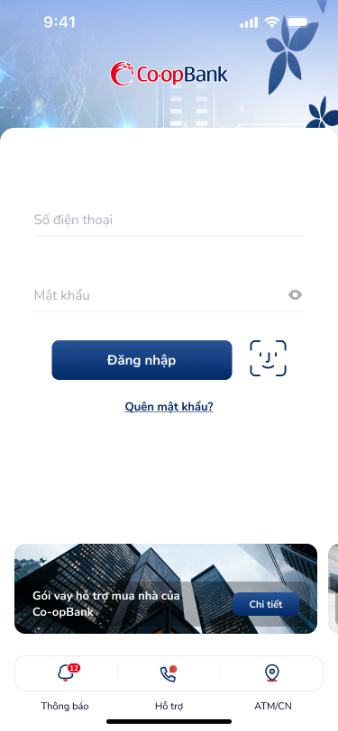
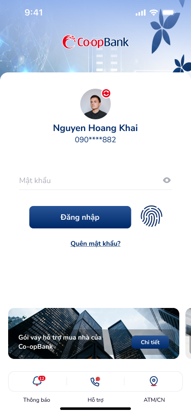
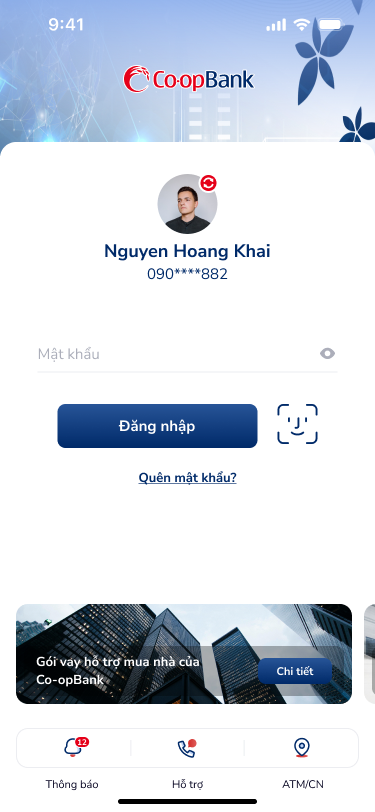
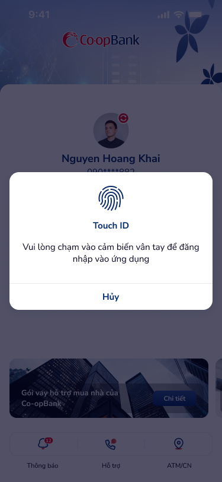

# SCR-LH-001 — Đăng nhập › Form đăng nhập

> **screen_id:** `SCR-LH-001` · **screen_type:** login · **artboards:** 4
> **Variants:** login-with-phone-number, login-with-touch-id, login-with-face-id, popup-touch-id (overlay)

---

## Section 1: User Flow

| Bước | Hành động | Kết quả |
|:---|:---|:---|
| 1 | Mở ứng dụng Co-opBank | Hiển thị màn hình đăng nhập |
| 2 | Nhập số điện thoại (nếu chưa lưu) | Hiển thị field "Số điện thoại" |
| 3 | Nhập mật khẩu | Hiển thị field "Mật khẩu" với eye toggle |
| 4 | Nhấn "Đăng nhập" | Xác thực → chuyển trang chủ |
| 5 | Hoặc nhấn Touch ID / Face ID icon | Hiển thị popup xác thực sinh trắc học |
| 6 | Xác thực thành công | Chuyển trang chủ |
| 7 | Nhấn "Quên mật khẩu?" | Chuyển flow khôi phục mật khẩu |
| 8 | Nhấn "Hủy" trên popup | Đóng popup, quay lại form |

---

## Section 2: User Stories

| ID | User Story | Acceptance Criteria |
|:---|:---|:---|
| US-001 | Là KH đã đăng ký, tôi muốn đăng nhập bằng SĐT + mật khẩu | AC: Hiển thị 2 fields, CTA "Đăng nhập", link "Quên mật khẩu?" |
| US-002 | Là KH đã cấu hình sinh trắc học, tôi muốn đăng nhập bằng Touch ID/Face ID | AC: Hiển thị icon biometric bên cạnh CTA, popup xác thực với nút Hủy |
| US-003 | Là KH quên mật khẩu, tôi muốn khôi phục | AC: Link "Quên mật khẩu?" chuyển đến flow reset |

---

## Section 3: Mô tả màn hình (Wireframe)

### Variant 1: login-with-phone-number

| Thành phần | Loại | Mô tả |
|:---|:---|:---|
| Logo Co-opBank | Image | Header gradient xanh, logo trung tâm |
| Số điện thoại | Text input | Placeholder "Số điện thoại" |
| Mật khẩu | Text input | Placeholder "Mật khẩu" + eye toggle icon |
| Đăng nhập | Button (primary) | CTA chính, width ~200px |
| Face ID icon | Icon button | Bên phải CTA, ~40×40 |
| Quên mật khẩu? | Link | Dưới CTA |
| Banner quảng cáo | Card | "Gói vay hỗ trợ mua nhà của Co-opBank" + "Chi tiết" |
| Bottom bar | Tab bar | 3 items: Thông báo, Hỗ trợ, ATM/CN |

### Variant 2: login-with-touch-id

Tương tự variant phone-number nhưng:
- Có avatar + tên "Nguyen Hoang Khai" + SĐT masked "090****882"
- Chỉ 1 field mật khẩu (SĐT đã lưu)
- Touch ID icon thay vì Face ID

### Variant 3: login-with-face-id

Tương tự variant touch-id nhưng dùng Face ID icon.

### Overlay: popup-touch-id

- Dimmed background (blur) trên login screen
- Popup dialog trung tâm: icon fingerprint + "Touch ID" + mô tả + "Hủy"

---

## Section 4: Database / API

| Entity | Fields | Constraints |
|:---|:---|:---|
| User | phone, password_hash, biometric_enabled, biometric_type | phone: unique, not null |
| Session | token, created_at, expired_at, device_id | TTL-based |
| Biometric | user_id, type (touch/face), public_key | 1:1 with User |

---

## Section 5: NFR

| Loại | Yêu cầu |
|:---|:---|
| Bảo mật | Mật khẩu masked, SĐT masked (090****882), biometric auth trên system popup |
| Hiệu năng | Đăng nhập < 3s, biometric < 1s |
| Trải nghiệm | Lưu SĐT cho lần sau, biometric icon rõ ràng, popup có nút Hủy |
