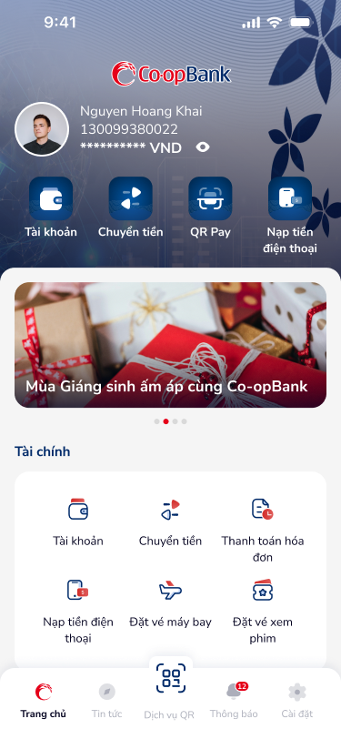
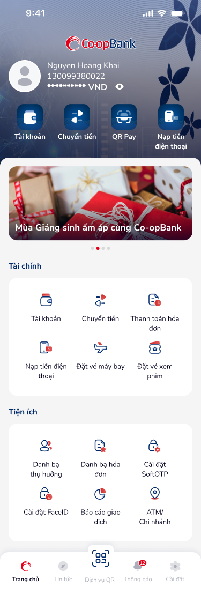
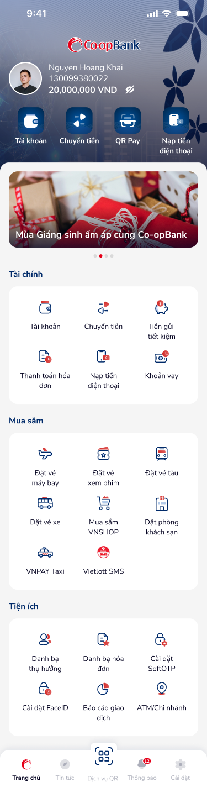
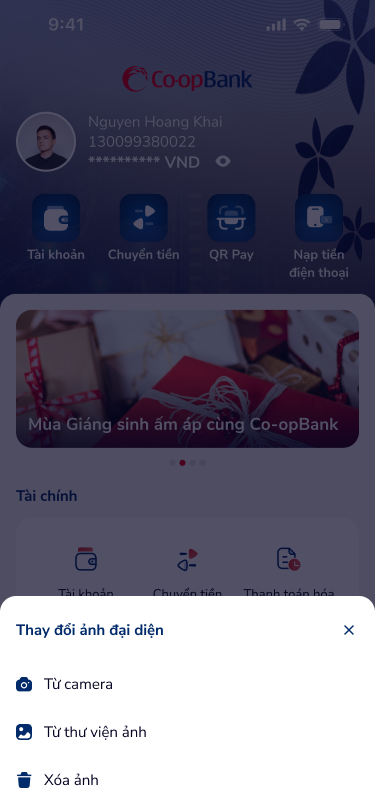

# SCR-LH-002 — Trang chủ › Bảng điều khiển

> **screen_id:** `SCR-LH-002` · **screen_type:** dashboard · **artboards:** 5
> **Variants:** homepage-shorten, homepage-shorten/hidden-balance, homepage-expand (×2), change-avt (overlay)

---

## Section 1: User Flow

| Bước | Hành động | Kết quả |
|:---|:---|:---|
| 1 | Đăng nhập thành công | Hiển thị trang chủ với thông tin tài khoản |
| 2 | Nhấn eye icon | Ẩn/hiện số dư |
| 3 | Nhấn quick action (Tài khoản/Chuyển tiền/QR Pay/Nạp tiền) | Chuyển đến chức năng tương ứng |
| 4 | Cuộn xuống | Hiển thị thêm sections: Tài chính, Mua sắm, Tiện ích |
| 5 | Nhấn tab "Cài đặt" | Chuyển màn Cài đặt |
| 6 | Nhấn avatar | Mở bottom sheet "Thay đổi ảnh đại diện" |
| 7 | Chọn "Từ camera" / "Từ thư viện ảnh" | Mở camera/gallery |
| 8 | Nhấn "Xóa ảnh" | Xóa avatar hiện tại |
| 9 | Nhấn X (close) | Đóng bottom sheet |

---

## Section 2: User Stories

| ID | User Story | Acceptance Criteria |
|:---|:---|:---|
| US-004 | Là KH, tôi muốn xem số dư tài khoản ngay trang chủ | AC: Hiển thị số tài khoản + số dư (VND), có toggle ẩn/hiện |
| US-005 | Là KH, tôi muốn truy cập nhanh các chức năng phổ biến | AC: 4 quick actions với icon + label, vị trí dễ thấy |
| US-006 | Là KH, tôi muốn xem banner khuyến mãi | AC: Slide banner với dot indicator, auto-scroll |
| US-007 | Là KH, tôi muốn thay đổi ảnh đại diện | AC: Tap avatar → bottom sheet 3 options + close X |
| US-008 | Là KH, tôi muốn xem tất cả dịch vụ | AC: Cuộn hiển thị: Tài chính (6), Mua sắm (8), Tiện ích (6) |

---

## Section 3: Mô tả màn hình (Wireframe)

### Variant 1: homepage-shorten (default)

| Thành phần | Loại | Mô tả |
|:---|:---|:---|
| Header gradient | Background | Xanh gradient với logo Co-opBank |
| Avatar + tên + STK | Info card | Nguyen Hoang Khai, 130099380022, 20,000,000 VND |
| Quick actions | Icon grid (4) | Tài khoản, Chuyển tiền, QR Pay, Nạp tiền điện thoại |
| Banner slider | Carousel | "Mùa Giáng sinh ấm áp cùng Co-opBank" + dot slider |
| Tài chính | Service grid (3×2) | 6 items: Tài khoản, Chuyển tiền, Thanh toán hóa đơn, Nạp tiền, Đặt vé máy bay, Đặt vé xem phim |
| Tiện ích | Service grid (3×2) | 6 items |
| Navigation bar | Tab bar (5) | Trang chủ (active), Tin tức, Dịch vụ QR, Thông báo (badge 12), Cài đặt |

### Variant 2: hidden-balance

Tương tự shorten nhưng số dư hiển thị "********* VND" + eye icon.

### Variant 3: homepage-expand

Full-scroll hiển thị thêm section Tiện ích với 6 items.

### Variant 4: homepage-expand-2 (full)

Full-scroll hiển thị tất cả: Tài chính (6), Mua sắm (8), Tiện ích (6).

### Overlay: change-avt

- Bottom sheet overlay dimmed background
- Title: "Thay đổi ảnh đại diện" + close X
- 3 options: Từ camera, Từ thư viện ảnh, Xóa ảnh

---

## Section 4: Database / API

| Entity | Fields | Constraints |
|:---|:---|:---|
| Account | user_id, account_number, balance, currency | balance ≥ 0 |
| Service | id, name, icon, category, order | Categorized: tài chính, mua sắm, tiện ích |
| Banner | id, title, image_url, deep_link, active, order | Carousel-style display |
| Avatar | user_id, image_url, updated_at | Optional |

---

## Section 5: NFR

| Loại | Yêu cầu |
|:---|:---|
| Bảo mật | Số dư có thể ẩn, masked account number partial |
| Hiệu năng | Tải trang chủ < 2s, banner lazy-load |
| Trải nghiệm | Smooth scroll, tab bar luôn hiện, badge notification |
