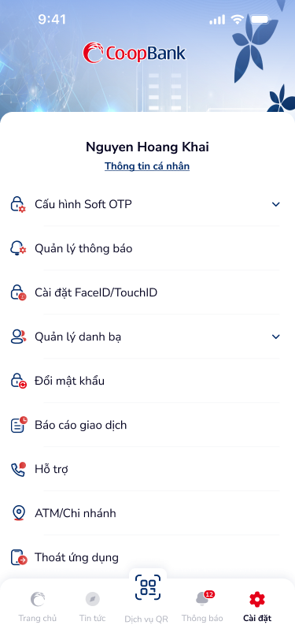
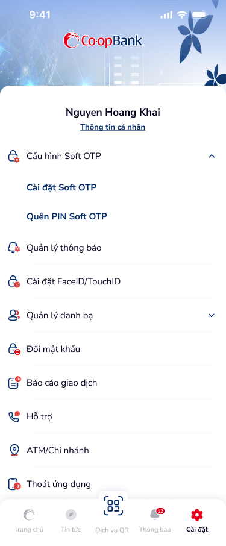

# SCR-LH-003 — Cài đặt › Danh sách

> **screen_id:** `SCR-LH-003` · **screen_type:** settings · **artboards:** 2
> **Variants:** settings (collapsed), settings-2 (Soft OTP expanded)

---

## Section 1: User Flow

| Bước | Hành động | Kết quả |
|:---|:---|:---|
| 1 | Nhấn tab "Cài đặt" từ navigation bar | Hiển thị màn Cài đặt |
| 2 | Xem tên + link "Thông tin cá nhân" | Hiển thị tên user |
| 3 | Nhấn "Thông tin cá nhân" | Chuyển SCR-LH-004 |
| 4 | Nhấn "Cấu hình Soft OTP" (expandable) | Mở rộng: Cài đặt Soft OTP, Quên PIN Soft OTP |
| 5 | Nhấn menu item khác | Chuyển đến chức năng tương ứng |
| 6 | Nhấn "Thoát ứng dụng" | Đăng xuất, quay về login |

---

## Section 2: User Stories

| ID | User Story | Acceptance Criteria |
|:---|:---|:---|
| US-009 | Là KH, tôi muốn quản lý cài đặt tài khoản | AC: Danh sách menu items rõ ràng, icon mỗi item |
| US-010 | Là KH, tôi muốn cấu hình Soft OTP | AC: Expandable section với 2 sub-items |
| US-011 | Là KH, tôi muốn đăng xuất | AC: Mục "Thoát ứng dụng" cuối danh sách |

---

## Section 3: Mô tả màn hình (Wireframe)

### Variant 1: settings (collapsed)

| Thành phần | Loại | Mô tả |
|:---|:---|:---|
| Header gradient | Background | Logo Co-opBank |
| Tên user | Text | "Nguyen Hoang Khai" |
| Thông tin cá nhân | Link (blue) | Dưới tên user |
| Menu list | List (9 items) | Icon + label + chevron (nếu expandable) |
| Navigation bar | Tab bar (5) | Cài đặt (active) |

Menu items: Cấu hình Soft OTP, Quản lý thông báo, Cài đặt FaceID/TouchID, Quản lý danh bạ, Đổi mật khẩu, Báo cáo giao dịch, Hỗ trợ, ATM/Chi nhánh, Thoát ứng dụng

### Variant 2: settings-2 (Soft OTP expanded)

Giống variant 1 nhưng "Cấu hình Soft OTP" expanded → hiện 2 sub-items:
- Cài đặt Soft OTP
- Quên PIN Soft OTP

---

## Section 4: Database / API

| Entity | Fields | Constraints |
|:---|:---|:---|
| Settings | user_id, biometric_enabled, notification_enabled | Per-user |
| SoftOTP | user_id, pin_hash, is_active | Optional setup |

---

## Section 5: NFR

| Loại | Yêu cầu |
|:---|:---|
| Bảo mật | Thoát ứng dụng = clear session + biometric data |
| Trải nghiệm | Expandable sections smooth animation, touch targets ≥ 44px |
