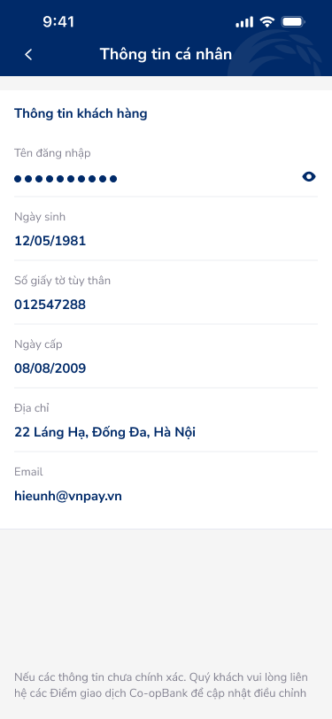

# SCR-LH-004 — Thông tin cá nhân › Chi tiết

> **screen_id:** `SCR-LH-004` · **screen_type:** detail · **artboards:** 1
> **Variants:** basic-infor (read-only)

---

## Section 1: User Flow

| Bước | Hành động | Kết quả |
|:---|:---|:---|
| 1 | Nhấn "Thông tin cá nhân" từ Cài đặt | Hiển thị thông tin KH |
| 2 | Xem thông tin (read-only) | 6 fields hiển thị |
| 3 | Nhấn eye icon (tên đăng nhập) | Toggle hiện/ẩn username |
| 4 | Nhấn back | Quay lại Cài đặt |

---

## Section 2: User Stories

| ID | User Story | Acceptance Criteria |
|:---|:---|:---|
| US-012 | Là KH, tôi muốn xem thông tin cá nhân | AC: Hiển thị 6 fields read-only, header "Thông tin cá nhân" với back arrow |
| US-013 | Là KH, tôi muốn biết cách cập nhật thông tin | AC: Footnote hướng dẫn liên hệ chi nhánh |

---

## Section 3: Mô tả màn hình (Wireframe)

### Variant: basic-infor

| Thành phần | Loại | Mô tả |
|:---|:---|:---|
| Header | App bar | Back arrow + "Thông tin cá nhân" |
| Thông tin khách hàng | Section title | Label chính |
| Tên đăng nhập | Read-only field | Masked (●●●●●●●●●●) + eye toggle |
| Ngày sinh | Read-only field | 12/05/1981 |
| Số giấy tờ tùy thân | Read-only field | 012547288 |
| Ngày cấp | Read-only field | 08/08/2009 |
| Địa chỉ | Read-only field | 22 Láng Hạ, Đống Đa, Hà Nội |
| Email | Read-only field | hieunh@vnpay.vn |
| Footnote | Text | Hướng dẫn liên hệ Điểm giao dịch Co-opBank |

---

## Section 4: Database / API

| Entity | Fields | Constraints |
|:---|:---|:---|
| Customer | username, dob, id_number, id_issued_date, address, email | Read-only in app |

---

## Section 5: NFR

| Loại | Yêu cầu |
|:---|:---|
| Bảo mật | Tên đăng nhập masked mặc định, PII chỉ hiển thị khi authenticated |
| Trải nghiệm | Read-only không có CTA edit — clear footnote hướng dẫn offline alternative |
