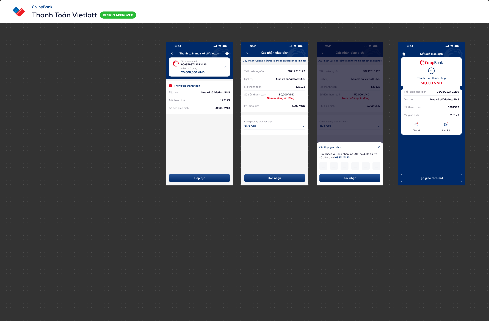

# SCR-TT-002 — Thanh toán Vietlott › Xác nhận giao dịch

> `SCR-TT-002` · confirm · 2 artboards (base + OTP overlay)

## 1. User Flow

| Bước | Hành động | Kết quả |
|------|-----------|---------|
| 1 | Từ SCR-TT-001, nhấn "Tiếp tục" | Hiển thị màn xác nhận giao dịch |
| 2 | Review thông tin: TK nguồn, dịch vụ, mã TT, số tiền, phí | Read-only |
| 3 | Chọn phương thức xác thực (dropdown "SMS OTP") | Chọn SMS OTP |
| 4 | Nhấn "Xác nhận" | Mở OTP bottom-sheet overlay |
| 5 | Nhập 6 số OTP | Các digit cells filled |
| 6 | Nhấn "Xác nhận" trên OTP sheet | Gửi OTP → SCR-TT-003 (Kết quả) |
| 7 | Nhấn X đóng OTP sheet | Quay lại base confirm |
| 8 | Nhấn back arrow | Quay lại SCR-TT-001 |

## 2. User Story

**US-001:** Là khách hàng, tôi muốn xác nhận lại thông tin giao dịch Vietlott trước khi thanh toán.

- AC1: Hiển thị TK nguồn, dịch vụ, mã thanh toán, số tiền (bằng số + bằng chữ)
- AC2: Hiển thị phí giao dịch rõ ràng
- AC3: Banner cảnh báo "vui lòng kiểm tra lại thông tin"

**US-002:** Là khách hàng, tôi muốn xác thực giao dịch bằng SMS OTP.

- AC1: Bottom-sheet OTP với 6 digit input cells
- AC2: Thông báo số điện thoại nhận OTP (masked: 098****123)
- AC3: Nút X để đóng OTP sheet

## 3. Mô tả màn hình (Wireframe)

### Variants

| # | Variant | Ảnh | Mô tả |
|---|---------|-----|-------|
| 1 | Xác nhận giao dịch (base) |  | Banner vàng, review info, SMS OTP dropdown, CTA "Xác nhận" |
| 2 | OTP bottom-sheet overlay |  | Bottom-sheet: title "Xác thực giao dịch", 6 digit cells, X close, CTA "Xác nhận" |

### Thành phần UI

| Thành phần | Loại | Mô tả |
|------------|------|-------|
| Header | Navigation bar | "Xác nhận giao dịch", back arrow |
| Banner | Warning notification | Nền vàng: "Quý khách vui lòng kiểm tra lại thông tin đặt lịch đã khởi tạo" |
| Info rows | Label-value pairs | TK nguồn, Dịch vụ, Mã TT, Số tiền, Phí |
| Amount text | Highlighted value | "50,000 VND" + "Năm mươi nghìn đồng" (red) |
| Auth dropdown | Dropdown | "Chọn phương thức xác thực" → "SMS OTP" với chevron |
| CTA primary | Button | "Xác nhận" full-width |
| OTP sheet | Bottom-sheet overlay | Dimmed bg, rounded top, "Xác thực giao dịch" title, số ĐT masked, 6 cells, X close |

## 4. Database / Entities

| Entity | Fields | Constraints |
|--------|--------|-------------|
| TransactionConfirmation | transaction_id, source_account, service, payment_code, amount, amount_text, fee, auth_method | auth_method IN ("SMS OTP", "Smart OTP", "Face ID") |
| OTPSession | session_id, phone_masked, otp_digits, expires_at, attempts | max_attempts = 3, ttl = 120s |

## 5. NFR

- **Bảo mật:** OTP masked phone, max 3 attempts, session timeout 120s
- **Hiệu năng:** OTP auto-focus first cell
- **Trải nghiệm:** Số tiền bằng chữ (red) giúp double-check
