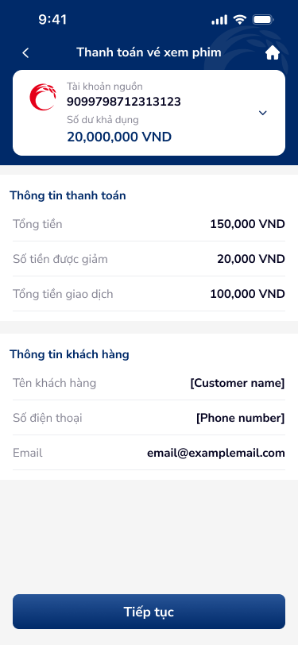

# SCR-TT-004 — Thanh toán vé xem phim › Form nhập thông tin

> `SCR-TT-004` · form · 1 artboard

## 1. User Flow

| Bước | Hành động | Kết quả |
|------|-----------|---------|
| 1 | User chọn vé xem phim từ SDK (phim, rạp, suất, ghế) | Chuyển sang thanh toán |
| 2 | Xem tài khoản nguồn | Hiển thị TK + số dư |
| 3 | Xem thông tin thanh toán (Tổng tiền, Giảm giá, Tổng GD) | Read-only từ SDK |
| 4 | Xem thông tin khách hàng (Tên, SĐT, Email) | Prefilled từ SDK |
| 5 | Nhấn "Tiếp tục" | Chuyển sang SCR-TT-005 |
| 6 | Nhấn back / home | Quay lại SDK / Về home |

## 2. User Story

**US-001:** Là khách hàng, tôi muốn xem tổng hợp thông tin đặt vé xem phim trước khi thanh toán.

- AC1: Thông tin thanh toán: Tổng tiền, Số tiền giảm, Tổng tiền giao dịch
- AC2: Thông tin khách hàng: Tên, SĐT, Email
- AC3: Tài khoản nguồn có thể đổi (chevron dropdown)

## 3. Mô tả màn hình (Wireframe)

### Variants

| # | Variant | Ảnh | Mô tả |
|---|---------|-----|-------|
| 1 | Form thanh toán vé xem phim |  | Account card, 2 sections info, CTA sticky |

### Thành phần UI

| Thành phần | Loại | Mô tả |
|------------|------|-------|
| Header | Navigation bar | "Thanh toán vé xem phim", back + home |
| Account card | Card component | Logo CoopBank, số TK, số dư 20M VND, chevron |
| Section 1: Thông tin TT | Info section | Tổng tiền 150K, Giảm 20K, Tổng GD 100K VND |
| Section 2: Thông tin KH | Info section | Tên: [Customer name], SĐT: [Phone number], Email |
| CTA primary | Button | "Tiếp tục" full-width sticky |

## 4. Database / Entities

| Entity | Fields | Constraints |
|--------|--------|-------------|
| MoviePayment | id, total_amount, discount_amount, final_amount, customer_name, phone, email, source_account_id | final_amount = total - discount |

## 5. NFR

- **Bảo mật:** Dữ liệu KH từ SDK session, không persist
- **Hiệu năng:** SDK prefill toàn bộ, zero input required
- **Trải nghiệm:** Placeholder text "[Customer name]" cần thay realistic data trong production
